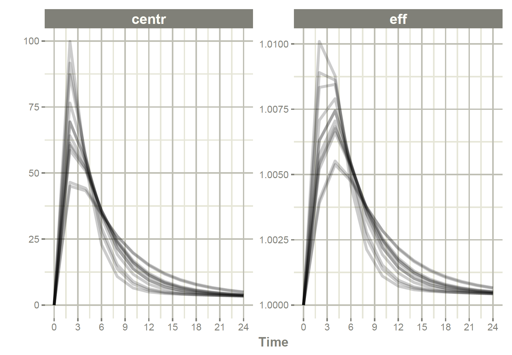

```{r setup, include=FALSE}
knitr::opts_chunk$set(echo = TRUE)
library(rxode2)
```

## `RxODE` vs `rxode2`

Since `rxode2` came out recently, I am getting many questions about what is the difference between `rxode2` and `RxODE`.

I think the biggest reason for the question is -- is this update going to break all the nice things I already do with `RxODE`? Or maybe why should I bother to change?

I feel the same way when I have big changes in things I use. For me, I love the ability to pipe and change data with the `tidyverse`, and similar tools, but hate when they change things that affect my code.

With that in mind, I try to keep changes in behavior small when I modify things like `RxODE` and `rxode2`.

In this case, there were much more changes than usual and for that reason I wanted to change the name of the package to `rxode2`, but I believe **most code will run well on either `RxODE`** **or `rxode2`**. All changes to `rxode2` are listed in the [News/Changelog](https://nlmixr2.github.io/rxode2/news/index.html) on `rxode2`'s website and is kept up to date.

## What are the changes people may notice?

There are some changes that people will notice and may affect some code. In my opinion these are the big changes:

-   The options for `rxControl` and `rxSolve` are more strict. `camelCase` is now always used. Old options like `add.cov` and `transit_abs` are no longer supported, only `addCov` is supported. To me this is an annoyance and really makes things a bit easier to remember.

-   The mnemonic `et(rate=model)` and `et(dur=model)` mnemonics have been removed. `rate` needs to be set to `-1` and `-2` manually instead.

    -   This was done because the code for this was a bit cumbersome and hard to maintain

-   If you use options the prefix changed to `rxode2` instead of `RxODE`.

    -   This was done so that `rxode2` options will not break `RxODE` options if you wish them to be different.

-   Running simulations inside of an `rxode2` block no longer depends on the number of threads used (a good fix that may be visible to some).

-   By default the covariates are now added to the dataset (`addCov=TRUE`) which is different than the behavior of `RxODE` (`addCov=FALSE`).

-   If you use transit compartments by `transit_abs` this is no longer supported. Instead a special `evid=7` is used by all [transit compartment doses](https://nlmixr2.github.io/rxode2/articles/rxode2-transit-compartments.html). This allows mixing with other types of doses into different compartments and better flexibility but will break code.

## Things you are unlikely to notice or miss

-   Various language options (like optionally requiring semi-colons at the end of statements, not allowing `<-` for instance).

## Why bother changing?

### Simulating `nlmixr2`/`rxode2` models directly

To me the biggest advantage to using `rxode2` is you can simulate from `nlmixr2` style models directly. For example, if you wanted to simulate the example `nlmixr2` model you can use the following

```{r simulation}
library(rxode2)
set.seed(42)
rxSetSeed(42)

one.compartment <- function() {
  ini({
    tka <- 0.45 # Log Ka
    tcl <- 1 # Log Cl
    tv <- 3.45    # Log V
    eta.ka ~ 0.6
    eta.cl ~ 0.3
    eta.v ~ 0.1
    add.sd <- 0.7
  })
  # and a model block with the error sppecification and model specification
  model({
    ka <- exp(tka + eta.ka)
    cl <- exp(tcl + eta.cl)
    v <- exp(tv + eta.v)
    d/dt(depot) = -ka * depot
    d/dt(center) = ka * depot - cl / v * center
    cp = center / v
    cp ~ add(add.sd)
  })
}

# Create an event table
et <- et(amt=300) %>%
  et(0,24, by=2) %>%
  et(id=1:12)

# simulate directly from the model
s <- rxSolve(one.compartment, et)

print(s)

plot(s, center)
```

Notice that `nlmixr2` was not called (or even required) to simulate this model.

### Exploring and changing `nlmixr2`/`rxode2` models directly

One of the nice features is you can change the model by simply changing a line or two of code by a feature called "model piping". In the model piping included in `rxode2` not only does it change your model it tells you how it is changed.

Lets assume you want to explore the impact of between subject variability in the model. You could drop the variability by changing a single line `ka <- exp(tka+eta.ka)` to `ka <- exp(tka)`. Model piping allows that to occur easily

```{r piping}
mod2 <- one.compartment %>%
  model(ka <- exp(tka))

print(mod2)

# simulate directly from the model
s <- rxSolve(mod2, et)

print(s)

plot(s, center)
```

Not surprisingly without between subject variability on the `ka` component, there is not much difference in absorption between subjects.

## What about piping a classic `rxode2` model?

Well when `rxode2` 2.0.9 is released, you can also pipe a classic `rxode2` model, which will change it to a `nlmixr2` style model:

```{r pipeClassic, eval=FALSE}

mod1 <- rxode2({
  C2 <- centr/V2;
  C3 <- peri/V3;
  d/dt(depot) <- -KA*depot;
  d/dt(centr) <- KA*depot - CL*C2 - Q*C2 + Q*C3;
  d/dt(peri)  <- Q*C2 - Q*C3;
  d/dt(eff)   <- Kin - Kout*(1-C2/(EC50+C2))*eff;
})

mod2 <-  mod1 %>% 
    model(KA <- exp(tka+eta.ka), 
          append=NA) %>% # Prepend a line by append=NA
    ini(tka    = log(0.294), 
        eta.ka = 0.2,
        CL     = 18.6, 
        V2     = 40.2,              # central 
        Q      = 10.5,  
        V3     = 297,               # peripheral
        Kin    = 1, 
        Kout   = 1, 
        EC50   = 200) %>%
    model(eff(0) <- 1)


print(mod2)

s <- rxSolve(mod2, et)

plot(s, centr, eff)
```



## Why wouldn't I want to switch?

`rxode2` requires R 4.0. This is because the `BH` headers in windows require the R 4.0 toolchains to compile. To remain on CRAN, we needed to have the R 4.0 requirement.

While there may be ways to work-around this in Windows, the new version of `rxode2` *is not tested with R 4.0*, and the old work-around was not straight forward. I cannot recommend you use `rxode2` on any of the R versions before R 4.0; it would be too hard to reproduce.

So, in short, if you don't have R 4.0, I wouldn't recommend switching.
