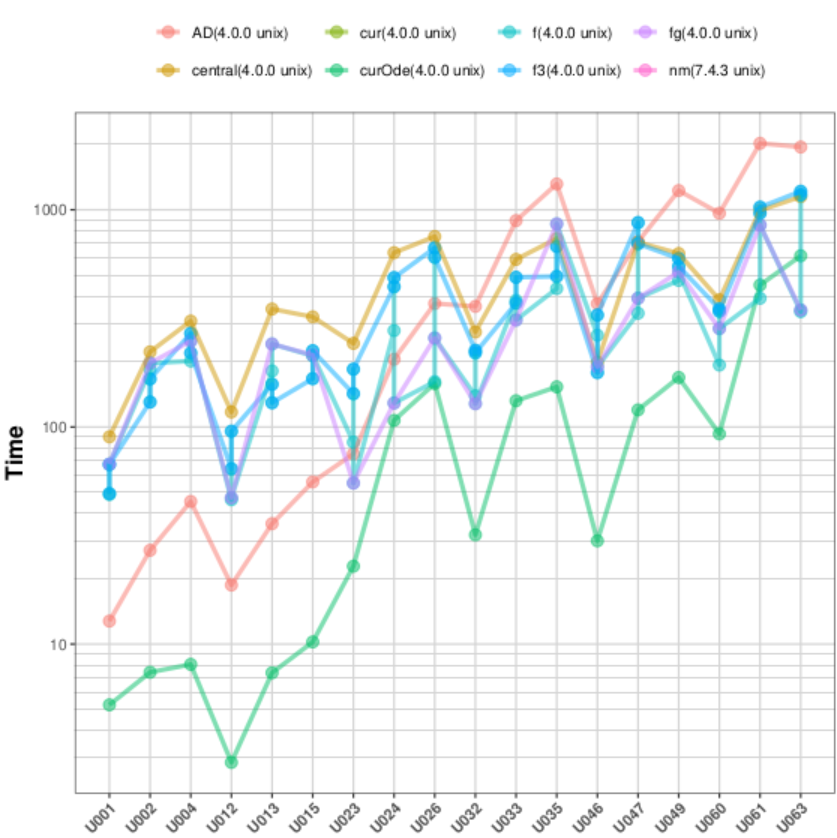
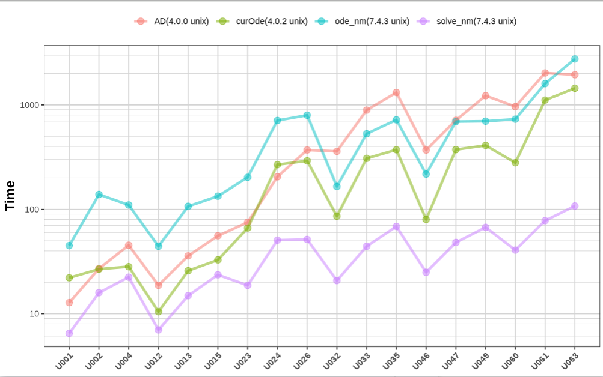
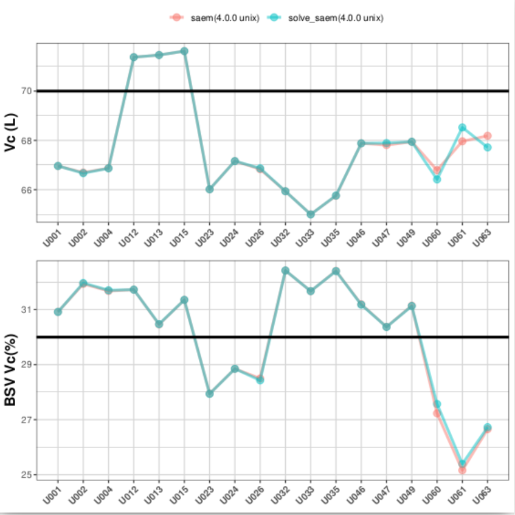

```{r setup, include=FALSE}
knitr::opts_chunk$set(echo = TRUE)

library(nlmixr2)
library(rxode2)
# suppress messages
rxode2:::rxSetSilentErr(1L)
```
## nlmixr2 4.0

We at the `nlmixr2` team are committed to quality results.  This is
seen in line with our vision:

> The vision of nlmixr2 is to develop a R-based open-source nonlinear
> mixed-effects modeling software package that can compete with
> commercial pharmacometric tools and is suitable for regulatory
> submissions.

This release furthers the quality by changing linear compartment
models the [ADVAN](https://doi.org/10.1016/j.vascn.2015.03.004)
solutions to the [WNL](https://doi.org/10.12793/tcp.2019.27.2.43)
solutions.  We also added a few new features to the linear compartment
solutions too (both claim to be something that `NONMEM` is using for the
linear solved systems).

However, since this is a change to the type of linear compartment
solutions, this is a breaking change so it is a new major release.

There are other features that may be of interest (you will see a
different loading with `nlmixr2`), but we will cover them at a later
time.

## Why a new set of linear compartment solutions

The [ADVAN](https://doi.org/10.1016/j.vascn.2015.03.004) compartment
solutions we were using are an excellent linear compartment solution
that takes the last value of all the compartments solved to determine
the next value of each compartment (i.e. not the super-positioning
solutions I learned in graduate school).  This should allow
time-varying covariates to be used correctly in linear compartment
solutions.

To ensure the accuracy of these results we had 5,662 tests related to
the linear compartment solutions in `rxode2`.

Even with these tests passing, there were
[cases](https://github.com/nlmixr2/nlmixr2/discussions/293) where the
linear compartment solution did not seem to be performing well for
optimization.  Of course, this is concerning to us as a team and we
set to fix this issue as soon as we found out.

Our hypothesis was that the strange results were due one of the
following possibilities:

- Floating point arithmetic error that added up over the many
  operations that were performed (especially when optimizing, when
  calculating the derivatives in automatic differentiation from STAN).

- Some strange difference in event handling (since linear compartment
  events were handled differently than ODE events), that made these
  solutions inaccurate when fixes to the ode solving event handling
  was integrated (my guess is this is the culprit).

At the same time CRAN brought the following problems with the
[ADVAN](https://doi.org/10.1016/j.vascn.2015.03.004) linear
compartment solutions to our attention:

 - The linear compartment solutions caused the new Intel compilers to
   crash, meaning those people using the new Intel C compilers for the
   R distribution would not be able to run the linear compartment
   solutions.
 - The linear compartment solutions (with AD) took too much memory and
   CPU power for some of the CRAN maintainers to compile `rxode2`

With these issues, we decided to look for another linear compartment
solution for inclusion in `rxode2` and `nlmixr2est`.

## WNL linear compartment solution in rxode2

After some searching, we found the
[WNL](https://doi.org/10.12793/tcp.2019.27.2.43) linear compartment
solutions, which also took the last solution of the compartments to
solve the current concentrations (also allowing time-varying
covariates). In addition to what was described in the paper, we
modified this to allow:

- Infusions into the depot compartment (as well as the central). The math derivation is [included in the code](https://github.com/nlmixr2/rxode2/blob/90cae4aa72b725c27ee85c6b2c71d4e92662af91/src/linCmt.h#L44-L71)

- Exact steady state solutions (as derived by the
  [ADVAN](https://doi.org/10.1016/j.vascn.2015.03.004) solutions, not
  included in their paper)

There are also other changes that you may observe:

- Whenever a linear compartment solution is used i.e. `cp <-
  linCmt()`, you may access any of the compartments that would be
  defined by the corresponding ODE by name, that is: `depot`,
  `central`, `peripheral1` and `peripheral2` for use in your
  model. (This is a breaking change if you used these names in your
  model)

- You can also dose the `peripheral1` and `peripharal2` compartment
  (as long as those doses are not infusion doses).

- Solving `linCmt()` is now threaded when solving with `rxSolve()` or
  optimizing with `"saem"`, meaning it may speed up your
  solutions. (We found the AD from `stan` to cause R crashes with
  threading, so `"focei"` and any other gradient methods will not be
  run in parallel)

- The `AD` gradients from Stan included in `linCmt()` will only
  calculate based on the derivatives you need (i.e. if you only have
  an `eta` on `Cl` in "focei", only derivatives related to that
  parameter will be calculated).  This actually saves a little time if
  you are not using a model with multiple `eta`s.

Changes you may not see, but should help in stability:

- The linear compartment solutions are no longer separated into `AD`
  derivatives and linear compartment solutions without
  derivatives. They are defined by the exact same code and realized
  with C++'s templates.

- The event handling for `rxode2` is no longer any different between
  linear compartment solutions and ODEs.

- More tests for the accuracy of the linear compartment solutions were
  added (from 5,662 to 15,850 tests).

# More robust validation and speed tests

## `focei` tests

The focei routine has to figure out the linear compartment solution
gradients.  We tested the
linear compartment solutions against the subset of linear comparment
solutions found in [our comparison
paper](https://doi.org/10.1002/psp4.12471).

In this release the default gradient method is the automatic
differentiation of the linear compartment solutions from stan:


These solutions matched, which is great.  However, they are slower
than ODE solving with sensitivities.


Because of this, we tried many different type of finite differences,
which give inaccurate results (especially the central difference):


Even removing the central difference, there is inaccurate results with
the various types of finite differences:


While calculating one gradient is faster with numeric differentiation,
the optimization is actually slower with this approach:



Of course I attempted to see where the bottle-neck for the
optimization speed is using a [code profiling tool](pprof.svg), and it turns the
functions with the most time spent in them are:

| Percent Time | Function |
|---------|---------------|
| 14.0%  | `dl_update_slotinfo` (update/manage storage) |
| 8.8%  | `tls_get_addr`  [thread local storage](https://www.ibm.com/docs/kk/aix/7.1.0?topic=program-using-thread-local-storage) |
| 7.3%   | `update_get_addr` (get memory address) |
| 1.8%  | `linCmtB` (from rxode2) |
| 1.8%  | AD multiplication `*` (from Stan) |
| 1.7%  | `vari_value` (from Stan) |
| 1.6%  | `grad` (from Stan) |
| 1.0%  | `dense_assignment_loop` (from Eigen) |

So, most of the time in the AD linear compartment solutions are
looking up the memory address of values! So, at this point, I don't
think there is much I can do to optimize the `WNL` linear-compartment
AD solutions further.

On the other hand, if, the `advan` solutions got corrupted due to
differences in event handling, perhaps going back to these solutions
(with the new event handling rewrite) will speed up the linear
compartment solutions more.

All these optimizations made me wonder how we compare to `NONMEM`; I
took some time and ran `NONMEM` solved and ODE systems to compare to
`nlmixr2` solved systems:



This shows:

- `nlmixr2`'s one compartment solutions are faster than `NONMEM`'s ODEs
- `nlmixr2`'s two compartment solutions are similar speed as `NONMEM`'s ODEs
- `nlmixr2`'s ODEs are faster than `NONMEM`'s ODEs (as previously reported)
- `NONMEM`'s solved systems are faster than `nlmixr2`


## `saem` tests

The saem routine only uses the non-gradient solutions; We tested the
linear compartment solutions against the subset of linear comparment
solutions found in [our comparison
paper](https://doi.org/10.1002/psp4.12471).

We will focus on the volume compartment comparison since all models
have this in common:



You can see the solutions between ODEs and linear compartment
solutions are almost identical.

Also the speed of linear compartment solutions in `saem` is faster
than the ode solution:


Unlike `focei`, I didn't explore anything else since this is what I expected.
