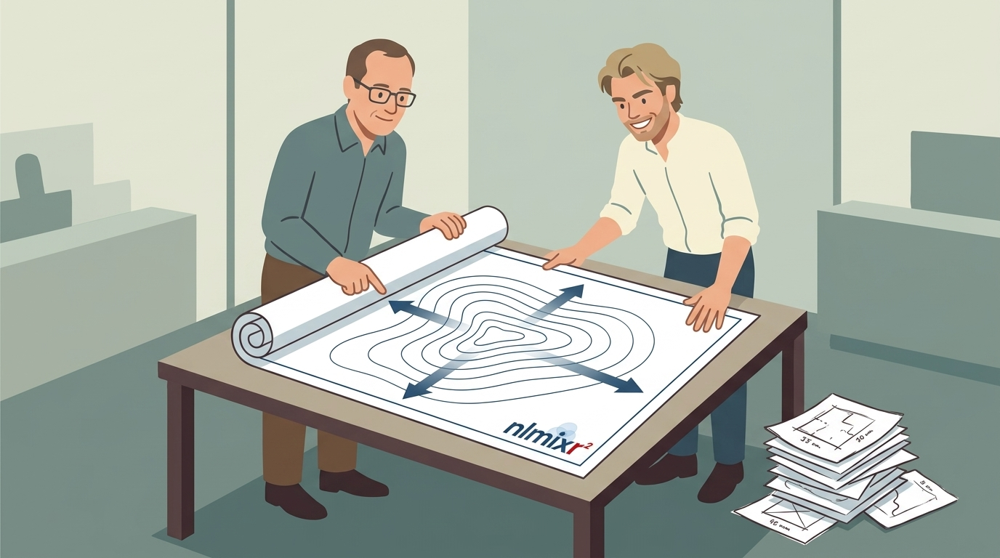
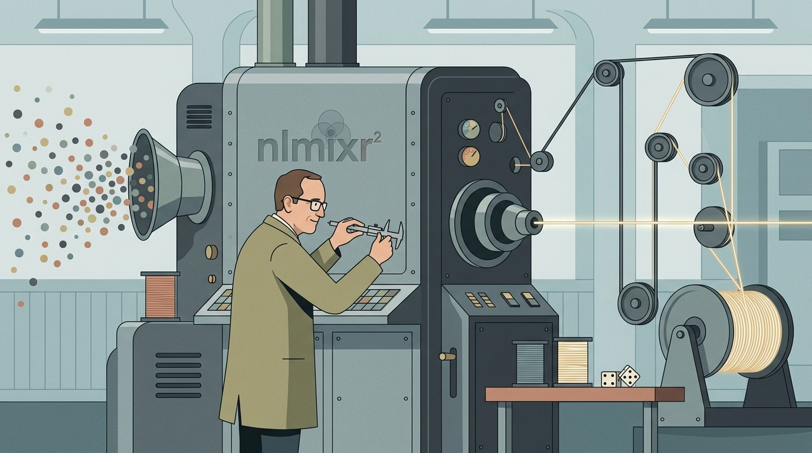
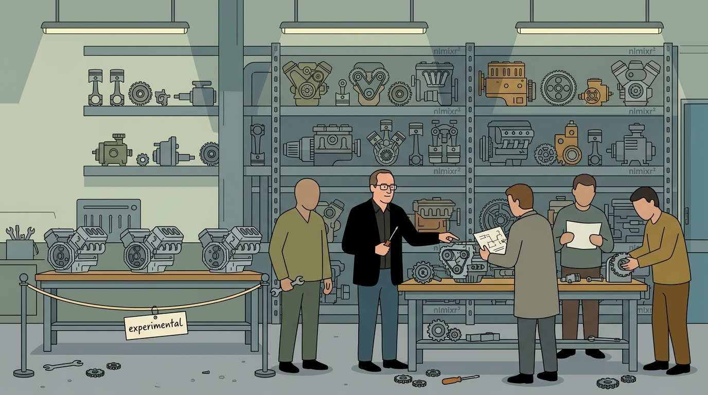

## This release, in five pictures

::: figgrid
<figure>

<figcaption><b>1.</b> `focei` solves in parallel</figcaption>
</figure>
<figure>

<figcaption><b>2.</b> `foceif` gets an exact population gradient</figcaption>
</figure>
<figure>

<figcaption><b>3.</b> The `focei` defaults moved</figcaption>
</figure>
<figure>

<figcaption><b>4.</b> `saem` is more robust</figcaption>
</figure>
<figure>

<figcaption><b>5.</b> Many new ODE solvers, and new engines</figcaption>
</figure>
:::

::: {.notes}
This release covers five main updates:

1. FOCEI solving in parallel.
2. FOCEI fast getting an exact population gradient.
3. Changes to FOCEI defaults.
4. A more robust SAEM.
5. Additional experimental engines and ODE solvers.
:::

## 1. Solving in parallel {.sectionbreak}

{.nostretch}

::: {.notes}
First, Bill, Hidde, and I worked on parallelizing FOCEI.
:::

## In [nlmixr^2^]{.nlmixr} 6 every subject waited its turn; now they solve together

```{=html}
<svg class="dg" viewBox="0 0 1000 380" role="img"
     aria-label="Ten subjects solved one after another on a single thread in nlmixr2 6, versus the same ten subjects spread across four threads in nlmixr2 7.">
  <!-- nlmixr2 6: serial -->
  <text class="lab" x="180" y="92" text-anchor="end">nlmixr<tspan baseline-shift="super" font-size="70%">2</tspan> 6</text>
  <text class="sm"  x="180" y="114" text-anchor="end">one thread</text>
  <g fill="#f3dede" stroke="#b40000" stroke-width="1.5">
    <rect x="200" y="70" width="54" height="36" rx="4"/>
    <rect x="259" y="70" width="54" height="36" rx="4"/>
    <rect x="318" y="70" width="54" height="36" rx="4"/>
    <rect x="377" y="70" width="54" height="36" rx="4"/>
    <rect x="436" y="70" width="54" height="36" rx="4"/>
    <rect x="495" y="70" width="54" height="36" rx="4"/>
    <rect x="554" y="70" width="54" height="36" rx="4"/>
    <rect x="613" y="70" width="54" height="36" rx="4"/>
    <rect x="672" y="70" width="54" height="36" rx="4"/>
    <rect x="731" y="70" width="54" height="36" rx="4"/>
  </g>
  <g class="sm" text-anchor="middle" fill="#b40000">
    <text x="227" y="93">1</text><text x="286" y="93">2</text><text x="345" y="93">3</text>
    <text x="404" y="93">4</text><text x="463" y="93">5</text><text x="522" y="93">6</text>
    <text x="581" y="93">7</text><text x="640" y="93">8</text><text x="699" y="93">9</text>
    <text x="758" y="93">10</text>
  </g>

  <!-- nlmixr2 7: four threads -->
  <text class="lab" x="180" y="228" text-anchor="end">nlmixr<tspan baseline-shift="super" font-size="70%">2</tspan> 7</text>
  <text class="sm"  x="180" y="250" text-anchor="end">four threads</text>
  <g fill="#e6f0da" stroke="#4a7d18" stroke-width="1.5">
    <rect x="200" y="160" width="54" height="32" rx="4"/>
    <rect x="259" y="160" width="54" height="32" rx="4"/>
    <rect x="318" y="160" width="54" height="32" rx="4"/>
    <rect x="200" y="198" width="54" height="32" rx="4"/>
    <rect x="259" y="198" width="54" height="32" rx="4"/>
    <rect x="318" y="198" width="54" height="32" rx="4"/>
    <rect x="200" y="236" width="54" height="32" rx="4"/>
    <rect x="259" y="236" width="54" height="32" rx="4"/>
    <rect x="200" y="274" width="54" height="32" rx="4"/>
    <rect x="259" y="274" width="54" height="32" rx="4"/>
  </g>
  <g class="sm" text-anchor="middle" fill="#4a7d18">
    <text x="227" y="181">1</text><text x="286" y="181">2</text><text x="345" y="181">3</text>
    <text x="227" y="219">4</text><text x="286" y="219">5</text><text x="345" y="219">6</text>
    <text x="227" y="257">7</text><text x="286" y="257">8</text>
    <text x="227" y="295">9</text><text x="286" y="295">10</text>
  </g>

  <!-- finish markers -->
  <line x1="372" y1="150" x2="372" y2="330" stroke="#4a7d18" stroke-width="2" stroke-dasharray="5 4"/>
  <line x1="785" y1="60"  x2="785" y2="330" stroke="#b40000" stroke-width="2" stroke-dasharray="5 4"/>

  <!-- time axis -->
  <line x1="200" y1="330" x2="960" y2="330" stroke="#0f243e" stroke-width="1.5"/>
  <polygon points="960,330 950,325 950,335" fill="#0f243e"/>
  <text class="sm" x="200" y="352">wall clock (schematic)</text>
  <text class="sm" x="378" y="352" fill="#4a7d18">7.0 done</text>
  <text class="sm" x="791" y="352" fill="#b40000">6.x done</text>
</svg>
```

::: {.notes}
In nlmixr2 versions 5 and 6, every subject waited its turn.  Now, they
all solve and optimize together for FOCEI and most of our other
estimation algorithms.  This means if you have a multi-core computer,
your solving speed will be significantly faster.
:::

## 2. Exact gradients, and the `fast` variants {.sectionbreak}

{.nostretch}

::: {.notes}
Next, Hidde and I introduced an exact gradient in the fast variants.
:::

## The old outer gradient paid for one extra solve per parameter, per subject

```{=html}
<svg class="dg" viewBox="0 0 1000 400" role="img"
     aria-label="Finite differences require a grid of solves, one column per parameter and one row per subject, while the analytic gradient needs a single augmented solve covering all subjects.">
  <!-- LEFT: finite differences -->
  <text class="lab red" x="30" y="40">finite differences  (fast=FALSE)</text>
  <g class="sm" text-anchor="middle" fill="#5a6b80">
    <text x="70"  y="78">base</text>
    <text x="140" y="78">+h &#952;&#8321;</text>
    <text x="210" y="78">+h &#952;&#8322;</text>
    <text x="280" y="78">+h &#952;&#8323;</text>
    <text x="350" y="78">+h &#952;&#8324;</text>
  </g>
  <g fill="#f3dede" stroke="#b40000" stroke-width="1.2">
    <rect x="45" y="92"  width="50" height="28" rx="3"/><rect x="115" y="92"  width="50" height="28" rx="3"/>
    <rect x="185" y="92" width="50" height="28" rx="3"/><rect x="255" y="92"  width="50" height="28" rx="3"/>
    <rect x="325" y="92" width="50" height="28" rx="3"/>
    <rect x="45" y="126" width="50" height="28" rx="3"/><rect x="115" y="126" width="50" height="28" rx="3"/>
    <rect x="185" y="126" width="50" height="28" rx="3"/><rect x="255" y="126" width="50" height="28" rx="3"/>
    <rect x="325" y="126" width="50" height="28" rx="3"/>
    <rect x="45" y="160" width="50" height="28" rx="3"/><rect x="115" y="160" width="50" height="28" rx="3"/>
    <rect x="185" y="160" width="50" height="28" rx="3"/><rect x="255" y="160" width="50" height="28" rx="3"/>
    <rect x="325" y="160" width="50" height="28" rx="3"/>
    <rect x="45" y="194" width="50" height="28" rx="3"/><rect x="115" y="194" width="50" height="28" rx="3"/>
    <rect x="185" y="194" width="50" height="28" rx="3"/><rect x="255" y="194" width="50" height="28" rx="3"/>
    <rect x="325" y="194" width="50" height="28" rx="3"/>
    <rect x="45" y="228" width="50" height="28" rx="3"/><rect x="115" y="228" width="50" height="28" rx="3"/>
    <rect x="185" y="228" width="50" height="28" rx="3"/><rect x="255" y="228" width="50" height="28" rx="3"/>
    <rect x="325" y="228" width="50" height="28" rx="3"/>
    <rect x="45" y="262" width="50" height="28" rx="3"/><rect x="115" y="262" width="50" height="28" rx="3"/>
    <rect x="185" y="262" width="50" height="28" rx="3"/><rect x="255" y="262" width="50" height="28" rx="3"/>
    <rect x="325" y="262" width="50" height="28" rx="3"/>
  </g>
  <text class="sm" x="38" y="110" text-anchor="end">id 1</text>
  <text class="sm" x="38" y="280" text-anchor="end">id n</text>
  <text class="t"  x="30" y="322">(p + 1) &#215; n solves</text>
  <text class="sm" x="30" y="346">every column is a whole optimization over the data</text>
  <text class="sm" x="30" y="368">the difference approximates what the solve already knows</text>

  <!-- divider -->
  <line x1="470" y1="30" x2="470" y2="380" stroke="#cfd6e0" stroke-width="1.5"/>

  <!-- RIGHT: analytic -->
  <text class="lab grn" x="520" y="40">analytic  (fast=TRUE)</text>
  <rect x="520" y="70" width="440" height="220" rx="8" fill="#e6f0da" stroke="#4a7d18" stroke-width="2"/>
  <text class="t" x="740" y="102" text-anchor="middle" font-weight="700">one augmented solve</text>
  <g fill="#ffffff" stroke="#4a7d18" stroke-width="1.2">
    <rect x="545" y="122" width="390" height="24" rx="3"/>
    <rect x="545" y="152" width="390" height="24" rx="3"/>
    <rect x="545" y="182" width="390" height="24" rx="3"/>
    <rect x="545" y="212" width="390" height="24" rx="3"/>
  </g>
  <g class="sm" fill="#0f243e">
    <text x="556" y="139">states</text>
    <text x="556" y="169">&#8706;/&#8706;&#952; sensitivities</text>
    <text x="556" y="199">&#8706;/&#8706;&#951; sensitivities</text>
    <text x="556" y="229">2nd order block</text>
  </g>
  <text class="sm grn" x="740" y="262" text-anchor="middle">all subjects, one threaded rxode2 solve</text>
  <text class="t" x="520" y="322">1 solve</text>
  <text class="sm" x="520" y="346">Almquist (2015) sensitivity equations</text>
  <text class="sm" x="520" y="368">exact, so the optimizer is not fighting solver noise</text>
</svg>
```

::: {.notes}
Previously, calculating the outer gradient -- the part of the
optimization problem focused on getting the best population values and
residual parameters -- required taking your base model and optimizing
every individual to get the best empirical Bayesian estimates.  Then,
you had to perform finite differences for each population parameter
and redo the full optimization for every subject.  This resulted in
p plus one, times n total optimizations.

Our new analytic method allows you to skip those redundant optimizations to get
the population gradients.  Based on the Almquist 2015 sensitivity equations,
this exact gradient means you are no longer fighting optimization and solver noise.
:::

## The gradient you have decides the optimizer you want

```{=html}
<svg class="dg" viewBox="0 0 1000 400" role="img"
     aria-label="Two lanes: focei uses finite differences producing a noisy gradient and is paired with the derivative-free bobyqa; foceif uses analytic sensitivities producing an exact gradient and is paired with the gradient-based lbfgsb3c.">
  <defs>
    <marker id="ar" markerWidth="9" markerHeight="9" refX="7" refY="4.5" orient="auto">
      <path d="M0,0 L9,4.5 L0,9 z" fill="#6b7b90"/>
    </marker>
  </defs>

  <!-- lane 1 -->
  <rect x="20" y="50" width="180" height="70" rx="6" fill="#f3dede" stroke="#b40000" stroke-width="2"/>
  <text class="mono red" x="110" y="92" text-anchor="middle" font-weight="700">est = "focei"</text>
  <line x1="205" y1="85" x2="255" y2="85" stroke="#6b7b90" stroke-width="2" marker-end="url(#ar)"/>

  <rect x="260" y="50" width="215" height="70" rx="6" fill="#ffffff" stroke="#b0bccb" stroke-width="1.5"/>
  <text class="t" x="367" y="80" text-anchor="middle">finite differences</text>
  <text class="sm" x="367" y="104" text-anchor="middle">of an ODE solve</text>
  <line x1="480" y1="85" x2="530" y2="85" stroke="#6b7b90" stroke-width="2" marker-end="url(#ar)"/>

  <rect x="535" y="50" width="215" height="70" rx="6" fill="#ffffff" stroke="#b0bccb" stroke-width="1.5"/>
  <text class="t" x="642" y="76" text-anchor="middle">noisy gradient</text>
  <polyline points="565,100 578,92 591,105 604,94 617,106 630,95 643,104 656,93 669,105 682,96 695,103 708,98 720,102"
            fill="none" stroke="#b40000" stroke-width="2"/>
  <line x1="755" y1="85" x2="805" y2="85" stroke="#6b7b90" stroke-width="2" marker-end="url(#ar)"/>

  <rect x="810" y="50" width="170" height="70" rx="6" fill="#f3dede" stroke="#b40000" stroke-width="2"/>
  <text class="mono red" x="895" y="80" text-anchor="middle" font-weight="700">bobyqa</text>
  <text class="sm" x="895" y="104" text-anchor="middle">derivative-free</text>

  <text class="sm" x="20" y="148">a difference across solver noise can point the wrong way</text>

  <!-- divider -->
  <line x1="20" y1="185" x2="980" y2="185" stroke="#cfd6e0" stroke-width="1.5"/>

  <!-- lane 2 -->
  <rect x="20" y="235" width="180" height="70" rx="6" fill="#e6f0da" stroke="#4a7d18" stroke-width="2"/>
  <text class="mono grn" x="110" y="277" text-anchor="middle" font-weight="700">est = "foceif"</text>
  <line x1="205" y1="270" x2="255" y2="270" stroke="#6b7b90" stroke-width="2" marker-end="url(#ar)"/>

  <rect x="260" y="235" width="215" height="70" rx="6" fill="#ffffff" stroke="#b0bccb" stroke-width="1.5"/>
  <text class="t" x="367" y="265" text-anchor="middle">sensitivity equations</text>
  <text class="sm" x="367" y="289" text-anchor="middle">Almquist (2015)</text>
  <line x1="480" y1="270" x2="530" y2="270" stroke="#6b7b90" stroke-width="2" marker-end="url(#ar)"/>

  <rect x="535" y="235" width="215" height="70" rx="6" fill="#ffffff" stroke="#b0bccb" stroke-width="1.5"/>
  <text class="t" x="642" y="265" text-anchor="middle">exact gradient</text>
  <line x1="565" y1="288" x2="715" y2="288" stroke="#4a7d18" stroke-width="2.5"/>
  <line x1="755" y1="270" x2="805" y2="270" stroke="#6b7b90" stroke-width="2" marker-end="url(#ar)"/>

  <rect x="810" y="235" width="170" height="70" rx="6" fill="#e6f0da" stroke="#4a7d18" stroke-width="2"/>
  <text class="mono grn" x="895" y="265" text-anchor="middle" font-weight="700">lbfgsb3c</text>
  <text class="sm" x="895" y="289" text-anchor="middle">gradient-based</text>

  <text class="sm" x="20" y="333">nothing to fight, so a quasi-Newton method is the right tool</text>
  <text class="sm" x="20" y="372">pairing fast=TRUE with a derivative-free outerOpt reverts to fast=FALSE</text>
</svg>
```

::: {.notes}
The gradient dictates the optimizer you want to use.  Standard FOCEI
still uses finite differences for the population values, which results
in a noisy gradient.  Because of this, the default has changed to a
derivative-free method called BOBYQA. Since a gradient is never
calculated, no finite differences are ever used with BOBYQA.  However,
individual optimizations still use exact gradients with n1qn1.

Our fast method uses these exact sensitivity equations and gradients, so we rely
on a Quasi-Newton optimization type -- specifically, L-BFGS-B3c.
:::

## `foceif` starts each individual search from where the last step says the eta went

```{=html}
<svg class="dg" viewBox="0 0 1000 400" role="img"
     aria-label="Contours of the individual objective at the new theta. Starting from the last known best eta takes many n1qn1 steps; starting from the projected eta of Almquist equation 48 takes few.">
  <g transform="translate(660,205) rotate(-22)">
    <ellipse rx="230" ry="150" fill="none" stroke="#cfd6e0" stroke-width="1.5"/>
    <ellipse rx="170" ry="110" fill="none" stroke="#c0cbd8" stroke-width="1.5"/>
    <ellipse rx="110" ry="72"  fill="none" stroke="#aebbcb" stroke-width="1.5"/>
    <ellipse rx="55"  ry="36"  fill="none" stroke="#9aa9bd" stroke-width="1.5"/>
  </g>
  <circle cx="660" cy="205" r="6" fill="#1f497d"/>
  <text class="lab blue" x="678" y="200">EBE at this &#952;</text>
  <text class="sm" x="678" y="222">what the inner problem is looking for</text>

  <!-- old start: last best eta -->
  <circle cx="120" cy="330" r="7" fill="#b40000"/>
  <text class="lab red" x="120" y="366" text-anchor="middle">last best eta</text>
  <text class="sm" x="120" y="386" text-anchor="middle">mceta = -1</text>
  <polyline points="120,330 200,312 268,286 338,272 402,248 462,240 516,224 566,216 612,210"
            fill="none" stroke="#b40000" stroke-width="2" stroke-dasharray="6 4"/>
  <g fill="#b40000">
    <circle cx="200" cy="312" r="3.5"/><circle cx="268" cy="286" r="3.5"/>
    <circle cx="338" cy="272" r="3.5"/><circle cx="402" cy="248" r="3.5"/>
    <circle cx="462" cy="240" r="3.5"/><circle cx="516" cy="224" r="3.5"/>
    <circle cx="566" cy="216" r="3.5"/>
  </g>
  <text class="sm red" x="330" y="332">many n1qn1 steps</text>

  <!-- new start: projected eta -->
  <circle cx="470" cy="82" r="7" fill="#4a7d18"/>
  <text class="lab grn" x="470" y="62" text-anchor="middle">projected eta</text>
  <text class="sm" x="470" y="42" text-anchor="middle">mceta = -2, Almquist Eq. 48</text>
  <polyline points="470,82 545,126 605,168 652,198" fill="none"
            stroke="#4a7d18" stroke-width="2.5" stroke-dasharray="6 4"/>
  <g fill="#4a7d18">
    <circle cx="545" cy="126" r="3.5"/><circle cx="605" cy="168" r="3.5"/>
  </g>
  <text class="sm grn" x="560" y="112">few steps</text>
</svg>
```

::: {.notes}
Because FOCEI fast starts its individual search by projecting where the eta
should be for the next optimization, it takes fewer steps to find the right
empirical Bayesian estimate at a new theta.
:::

## Once the eta moves, the old curvature is the wrong curvature to hand `n1qn1`

```{=html}
<svg class="dg" viewBox="0 0 1000 400" role="img"
     aria-label="With warm equals save a stale Hessian ellipse is misaligned with the current contours and the search zig-zags; with warm equals calc the recalculated Hessian matches the contours and the search goes almost straight in.">
  <!-- LEFT: warm = "save" -->
  <text class="lab red" x="30" y="36">warm = "save"</text>
  <text class="sm" x="30" y="58">curvature carried over from an earlier &#952;</text>
  <g transform="translate(245,235) rotate(-20)">
    <ellipse rx="185" ry="118" fill="none" stroke="#cfd6e0" stroke-width="1.5"/>
    <ellipse rx="130" ry="83"  fill="none" stroke="#bcc8d6" stroke-width="1.5"/>
    <ellipse rx="75"  ry="48"  fill="none" stroke="#a6b4c6" stroke-width="1.5"/>
  </g>
  <g transform="translate(245,235) rotate(48)">
    <ellipse rx="120" ry="52" fill="none" stroke="#b40000" stroke-width="2.5" stroke-dasharray="7 5"/>
  </g>
  <polyline points="70,120 132,190 96,232 176,214 148,266 214,240 200,268 240,238"
            fill="none" stroke="#b40000" stroke-width="2"/>
  <circle cx="70" cy="120" r="5" fill="#b40000"/>
  <circle cx="245" cy="235" r="6" fill="#1f497d"/>
  <text class="sm red" x="30" y="352">the model of the surface disagrees with the surface</text>
  <text class="sm red" x="30" y="374">so the search zig-zags in</text>

  <!-- divider -->
  <line x1="500" y1="20" x2="500" y2="390" stroke="#cfd6e0" stroke-width="1.5"/>

  <!-- RIGHT: warm = "calc" -->
  <text class="lab grn" x="540" y="36">warm = "calc"  (new default)</text>
  <text class="sm" x="540" y="58">curvature recalculated at the current &#952;</text>
  <g transform="translate(755,235) rotate(-20)">
    <ellipse rx="185" ry="118" fill="none" stroke="#cfd6e0" stroke-width="1.5"/>
    <ellipse rx="130" ry="83"  fill="none" stroke="#bcc8d6" stroke-width="1.5"/>
    <ellipse rx="75"  ry="48"  fill="none" stroke="#a6b4c6" stroke-width="1.5"/>
    <ellipse rx="130" ry="83"  fill="none" stroke="#4a7d18" stroke-width="2.5" stroke-dasharray="7 5"/>
  </g>
  <polyline points="580,120 668,178 740,224" fill="none" stroke="#4a7d18" stroke-width="2.5"/>
  <circle cx="580" cy="120" r="5" fill="#4a7d18"/>
  <circle cx="668" cy="178" r="4" fill="#4a7d18"/>
  <circle cx="755" cy="235" r="6" fill="#1f497d"/>
  <text class="sm grn" x="540" y="352">the model matches the surface</text>
  <text class="sm grn" x="540" y="374">same or better solutions, in less time</text>
</svg>
```

::: {.notes}
This efficiency made us rethink what data we need to save between steps.
Previously, we saved the old curvature and sent it to the n1qn1 optimizer.
However, if that curvature was wrong for the new theta, it would take longer
to zig-zag to the minimum.  Now, by recalculating the curvature -- a warm start --
we find the gradient and the minimum much faster.
:::

## 3. New defaults for standard `focei` {.sectionbreak}

{.nostretch}

::: {.notes}
Because of these updates, we have new defaults in standard FOCEI.
:::

## Standard `focei` still differences its gradient, so it now optimizes with `bobyqa`

```{=html}
<svg class="dg" viewBox="0 0 1000 400" role="img"
     aria-label="A noisy objective curve. A close-together finite difference reads the local noise and points uphill, while bobyqa fits a quadratic through widely spaced samples and finds the minimum.">
  <!-- axes -->
  <line x1="60" y1="330" x2="960" y2="330" stroke="#0f243e" stroke-width="1.5"/>
  <line x1="60" y1="330" x2="60" y2="50" stroke="#0f243e" stroke-width="1.5"/>
  <text class="sm" x="960" y="356" text-anchor="end">population parameter</text>
  <text class="sm" x="52" y="60" text-anchor="end">-2LL</text>

  <!-- noisy objective -->
  <polyline fill="none" stroke="#8f9db0" stroke-width="2"
    points="80,110 110,128 140,112 170,146 200,138 230,170 260,158 290,190 320,182 350,214
            380,205 410,232 440,224 470,248 500,240 530,258 560,252 590,264 620,258 650,266
            680,258 710,268 740,256 770,262 800,244 830,252 860,228 890,236 920,208 950,214"/>
  <text class="sm" x="650" y="112">the solve has a noise floor; the objective is not smooth</text>

  <!-- finite difference: two close points straddling a wiggle, slope points uphill -->
  <circle cx="350" cy="214" r="5" fill="#b40000"/>
  <circle cx="380" cy="205" r="5" fill="#b40000"/>
  <line x1="330" y1="220" x2="404" y2="198" stroke="#b40000" stroke-width="2.5"/>
  <polygon points="404,198 393,197 396,206" fill="#b40000"/>
  <text class="sm red" x="365" y="156" text-anchor="middle">finite difference</text>
  <text class="sm red" x="365" y="176" text-anchor="middle">reads the wiggle, not the trend</text>

  <!-- bobyqa: wide samples + fitted quadratic -->
  <path d="M120,120 Q515,395 940,196" fill="none" stroke="#4a7d18" stroke-width="2.5" stroke-dasharray="8 5"/>
  <g fill="#4a7d18">
    <circle cx="140" cy="112" r="5"/><circle cx="290" cy="190" r="5"/>
    <circle cx="740" cy="256" r="5"/><circle cx="860" cy="228" r="5"/>
    <circle cx="920" cy="208" r="5"/>
  </g>
  <text class="sm grn" x="140" y="88">bobyqa fits a quadratic through spread-out samples</text>
  <circle cx="588" cy="280" r="8" fill="none" stroke="#4a7d18" stroke-width="3"/>
  <text class="sm grn" x="612" y="306">and lands on the trend, not on a wiggle</text>
</svg>
```

::: {.notes}
We use BOBYQA to fit a quadratic curve through spread-out samples, which
naturally follows the minimization trend instead of getting stuck in the noise.
This is especially useful for hard or complex surfaces.
:::

## The old optimizer is one control argument away

::: {.smaller}
The pre-7.0 outer optimizer:
:::

``` r
fit <- nlmixr2(one.cmt, theo_sd, est="focei",
               foceiControl(outerOpt="nlminb"))
```

::: rule
:::

::: {.smaller}
As close to 6.x as 7.0 gets -- and it will not be bit-for-bit:
:::

``` r
fit <- nlmixr2(one.cmt, theo_sd, est="focei",
               foceiControl(outerOpt="nlminb",
                            warm="save",
                            sigdig=4,
                            resetThetaP=0.05,
                            resetThetaFinalP=0.15))
```

::: {.notes}
If you prefer the old behavior, nlminb is still available.
:::

## Four defaults moved, which is why `focei` will not reproduce a 6.x fit

```{=html}
<svg class="dg" viewBox="0 0 1000 400" role="img"
     aria-label="Four defaults changed between nlmixr2 6 and 7: outer optimizer nlminb to bobyqa, inner Hessian save to calc, sigdig 4 to 3, and the eta-drift theta reset from on to off. The fast method foceif defaults to lbfgsb3c.">
  <defs>
    <marker id="ar2" markerWidth="9" markerHeight="9" refX="7" refY="4.5" orient="auto">
      <path d="M0,0 L9,4.5 L0,9 z" fill="#6b7b90"/>
    </marker>
  </defs>
  <text class="sm" x="310" y="40" text-anchor="middle" font-weight="700">nlmixr<tspan baseline-shift="super" font-size="70%">2</tspan> 6</text>
  <text class="sm" x="620" y="40" text-anchor="middle" font-weight="700">nlmixr<tspan baseline-shift="super" font-size="70%">2</tspan> 7</text>

  <g>
    <text class="t" x="20" y="90">outer optimizer</text>
    <rect x="200" y="66" width="220" height="34" rx="4" fill="#f3dede" stroke="#b40000" stroke-width="1.5"/>
    <text class="mono red" x="310" y="89" text-anchor="middle">nlminb</text>
    <line x1="432" y1="83" x2="500" y2="83" stroke="#6b7b90" stroke-width="2" marker-end="url(#ar2)"/>
    <rect x="510" y="66" width="220" height="34" rx="4" fill="#e6f0da" stroke="#4a7d18" stroke-width="1.5"/>
    <text class="mono grn" x="620" y="89" text-anchor="middle">bobyqa</text>
    <text class="sm" x="744" y="89">for focei</text>
  </g>
  <g>
    <rect x="510" y="106" width="220" height="34" rx="4" fill="#e6f0da" stroke="#4a7d18" stroke-width="1.5"/>
    <text class="mono grn" x="620" y="129" text-anchor="middle">lbfgsb3c</text>
    <text class="sm" x="744" y="129">for foceif</text>
  </g>

  <g>
    <text class="t" x="20" y="184">inner Hessian</text>
    <rect x="200" y="160" width="220" height="34" rx="4" fill="#f3dede" stroke="#b40000" stroke-width="1.5"/>
    <text class="mono red" x="310" y="183" text-anchor="middle">warm = "save"</text>
    <line x1="432" y1="177" x2="500" y2="177" stroke="#6b7b90" stroke-width="2" marker-end="url(#ar2)"/>
    <rect x="510" y="160" width="220" height="34" rx="4" fill="#e6f0da" stroke="#4a7d18" stroke-width="1.5"/>
    <text class="mono grn" x="620" y="183" text-anchor="middle">warm = "calc"</text>
  </g>

  <g>
    <text class="t" x="20" y="244">tolerances</text>
    <rect x="200" y="220" width="220" height="34" rx="4" fill="#f3dede" stroke="#b40000" stroke-width="1.5"/>
    <text class="mono red" x="310" y="243" text-anchor="middle">sigdig = 4</text>
    <line x1="432" y1="237" x2="500" y2="237" stroke="#6b7b90" stroke-width="2" marker-end="url(#ar2)"/>
    <rect x="510" y="220" width="220" height="34" rx="4" fill="#e6f0da" stroke="#4a7d18" stroke-width="1.5"/>
    <text class="mono grn" x="620" y="243" text-anchor="middle">sigdig = 3</text>
    <text class="sm" x="744" y="236">rtol 1e-3</text>
    <text class="sm" x="744" y="256">atol 1e-6</text>
  </g>

  <g>
    <text class="t" x="20" y="304">eta-drift &#952; reset</text>
    <rect x="200" y="280" width="220" height="34" rx="4" fill="#f3dede" stroke="#b40000" stroke-width="1.5"/>
    <text class="mono red" x="310" y="303" text-anchor="middle">on</text>
    <line x1="432" y1="297" x2="500" y2="297" stroke="#6b7b90" stroke-width="2" marker-end="url(#ar2)"/>
    <rect x="510" y="280" width="220" height="34" rx="4" fill="#e6f0da" stroke="#4a7d18" stroke-width="1.5"/>
    <text class="mono grn" x="620" y="303" text-anchor="middle">off</text>
  </g>

  <text class="sm" x="20" y="358">sigdig now lines up with other open-source tools like SciPy and Octave</text>
</svg>
```

::: {.notes}
You can see from this slide an overview of the changes we made.

1. the default population optimizer was changed

2. the curvature, or Hessian, was calculated before every optimization

3. resetting of thetas to the centered value when etas drift is turned off

4. we changed the default to sigdig=3 to better match many open-source tools.

:::

## 4. Making `saem` more robust {.sectionbreak}

{.nostretch}

::: {.notes}
We also made SAEM significantly more robust.
:::

## `saem` estimates a no-eta parameter directly instead of sampling it

```{=html}
<svg class="dg" viewBox="0 0 1000 400" role="img"
     aria-label="Left: a theta with no random effect drawn stochastically as phi0 with a shrinking variance settles away from the true value. Right: a bounded bobyqa regression inside the ini block bounds converges onto the true value.">
  <!-- LEFT: stochastic phi0 -->
  <text class="lab red" x="30" y="36">nonMuTheta = "eta"</text>
  <text class="sm" x="30" y="58">stochastic phi0 draws, shrinking variance</text>
  <line x1="60" y1="330" x2="450" y2="330" stroke="#0f243e" stroke-width="1.5"/>
  <line x1="60" y1="330" x2="60" y2="80" stroke="#0f243e" stroke-width="1.5"/>
  <line x1="60" y1="160" x2="450" y2="160" stroke="#1f497d" stroke-width="2" stroke-dasharray="7 5"/>
  <text class="sm blue" x="450" y="152" text-anchor="end">truth</text>
  <path d="M75,80 Q260,120 440,196 L440,244 Q260,220 75,300 Z" fill="#f3dede" opacity="0.75"/>
  <g fill="#b40000">
    <circle cx="90"  cy="110" r="4"/><circle cx="118" cy="272" r="4"/><circle cx="146" cy="132" r="4"/>
    <circle cx="174" cy="250" r="4"/><circle cx="202" cy="150" r="4"/><circle cx="230" cy="238" r="4"/>
    <circle cx="258" cy="168" r="4"/><circle cx="286" cy="228" r="4"/><circle cx="314" cy="182" r="4"/>
    <circle cx="342" cy="222" r="4"/><circle cx="370" cy="192" r="4"/><circle cx="398" cy="216" r="4"/>
    <circle cx="426" cy="202" r="4"/>
  </g>
  <line x1="426" y1="202" x2="450" y2="202" stroke="#b40000" stroke-width="2.5"/>
  <text class="sm red" x="30" y="368">settles, but not where the parameter actually is</text>

  <!-- divider -->
  <line x1="500" y1="20" x2="500" y2="390" stroke="#cfd6e0" stroke-width="1.5"/>

  <!-- RIGHT: bounded bobyqa -->
  <text class="lab grn" x="540" y="36">nonMuTheta = "regress"  (new default)</text>
  <text class="sm" x="540" y="58">bounded bobyqa, honoring the ini() bounds</text>
  <line x1="570" y1="330" x2="960" y2="330" stroke="#0f243e" stroke-width="1.5"/>
  <line x1="570" y1="330" x2="570" y2="80" stroke="#0f243e" stroke-width="1.5"/>
  <line x1="570" y1="160" x2="960" y2="160" stroke="#1f497d" stroke-width="2" stroke-dasharray="7 5"/>
  <text class="sm blue" x="960" y="152" text-anchor="end">truth</text>
  <line x1="570" y1="96"  x2="960" y2="96"  stroke="#9bbb59" stroke-width="2"/>
  <line x1="570" y1="290" x2="960" y2="290" stroke="#9bbb59" stroke-width="2"/>
  <text class="sm grn" x="576" y="88">upper</text>
  <text class="sm grn" x="576" y="310">lower</text>
  <polyline points="600,268 640,222 680,192 720,174 760,166 800,162 840,161 880,160 920,160 950,160"
            fill="none" stroke="#4a7d18" stroke-width="2.5"/>
  <g fill="#4a7d18">
    <circle cx="600" cy="268" r="4"/><circle cx="640" cy="222" r="4"/><circle cx="680" cy="192" r="4"/>
    <circle cx="720" cy="174" r="4"/><circle cx="760" cy="166" r="4"/><circle cx="800" cy="162" r="4"/>
    <circle cx="840" cy="161" r="4"/><circle cx="880" cy="160" r="4"/>
  </g>
  <text class="sm grn" x="540" y="368">on three no-eta thetas, the absorption RMSE dropped ~16x</text>
</svg>
```

::: {.notes}
In the previous release, population parameters with no random effect
on them (the stochastic phi0 draws) were continuously sampled until
the variance shrank at the end.  While this usually settled, it could
become biased if it didn't settle exactly where the parameter was.  If
we use a regression bounded by the initial estimates -- in this case,
BOBYQA -- it honors the exact location and drops the error measured by
RMSE by 16-fold.
:::

## A separated random stream is what makes restarting the SA phase possible

```{=html}
<svg class="dg" viewBox="0 0 1000 400" role="img"
     aria-label="Today, wanting more stochastic-approximation iterations means re-running the fit from the beginning. With the chain state at the end of the SA phase well defined, a future release can pick up from there and extend it.">
  <!-- today -->
  <text class="lab red" x="30" y="46">today: want more SA iterations?</text>
  <rect x="30"  y="70" width="150" height="46" rx="4" fill="#eeece1" stroke="#8f9db0" stroke-width="1.5"/>
  <text class="sm" x="105" y="99" text-anchor="middle">burn-in</text>
  <rect x="182" y="70" width="300" height="46" rx="4" fill="#dce6f1" stroke="#4f81bd" stroke-width="1.5"/>
  <text class="sm" x="332" y="99" text-anchor="middle">SA phase</text>
  <rect x="484" y="70" width="200" height="46" rx="4" fill="#eeece1" stroke="#8f9db0" stroke-width="1.5"/>
  <text class="sm" x="584" y="99" text-anchor="middle">smoothing</text>
  <text class="sm red" x="700" y="99">&#8592; throw it away</text>

  <rect x="30"  y="140" width="150" height="46" rx="4" fill="#eeece1" stroke="#8f9db0" stroke-width="1.5"/>
  <text class="sm" x="105" y="169" text-anchor="middle">burn-in</text>
  <rect x="182" y="140" width="470" height="46" rx="4" fill="#dce6f1" stroke="#4f81bd" stroke-width="1.5"/>
  <text class="sm" x="417" y="169" text-anchor="middle">longer SA phase</text>
  <rect x="654" y="140" width="200" height="46" rx="4" fill="#eeece1" stroke="#8f9db0" stroke-width="1.5"/>
  <text class="sm" x="754" y="169" text-anchor="middle">smoothing</text>
  <text class="sm red" x="870" y="169">run it all again</text>

  <line x1="30" y1="222" x2="970" y2="222" stroke="#cfd6e0" stroke-width="1.5"/>

  <!-- future -->
  <text class="lab grn" x="30" y="266">what the new stream allows</text>
  <rect x="30"  y="290" width="150" height="46" rx="4" fill="#eeece1" stroke="#8f9db0" stroke-width="1.5"/>
  <text class="sm" x="105" y="319" text-anchor="middle">burn-in</text>
  <rect x="182" y="290" width="300" height="46" rx="4" fill="#dce6f1" stroke="#4f81bd" stroke-width="1.5"/>
  <text class="sm" x="332" y="319" text-anchor="middle">SA phase</text>
  <circle cx="484" cy="313" r="8" fill="#4a7d18"/>
  <text class="sm grn" x="500" y="285">chain state here is well defined</text>
  <rect x="500" y="290" width="230" height="46" rx="4" fill="#e6f0da" stroke="#4a7d18"
        stroke-width="2" stroke-dasharray="7 5"/>
  <text class="sm grn" x="615" y="319" text-anchor="middle">extend from here</text>
  <rect x="732" y="290" width="200" height="46" rx="4" fill="#eeece1" stroke="#8f9db0" stroke-width="1.5"/>
  <text class="sm" x="832" y="319" text-anchor="middle">smoothing</text>
  <text class="sm" x="30" y="378">the cost today: a saem fit will not reproduce a pre-7.0 run, even with the same seed</text>
</svg>
```

::: {.notes}
We also changed how random number streams function.  By using
thread-safe random streams, every single point in the optimization can
be reproduced while remaining completely independent.  This allows you
to safely extend the chain rather than throwing away previous SAEM
fits.
:::

## 5. Many new ODE solvers, and new engines {.sectionbreak}

{.nostretch}

::: {.notes}
Finally, we've added more experimental ODE solvers.
:::

## AutoSwitch reaches for the stiff solver only when the problem turns stiff

```{=html}
<svg class="dg" viewBox="0 0 1000 400" role="img"
     aria-label="A solution curve with a stiff region in the middle. The solver band underneath shows dop853 running, a stiffness detection flag, ros4 taking over the stiff stretch, and dop853 resuming.">
  <!-- solution curve -->
  <path d="M70,150 C150,120 210,118 260,138 C300,154 320,176 340,196
           C356,212 368,60 384,196 C398,214 410,64 424,196 C440,214 452,66 468,198
           C500,222 540,214 600,204 C700,188 820,176 940,170"
        fill="none" stroke="#1f497d" stroke-width="2.5"/>
  <text class="sm blue" x="70" y="108">solution</text>
  <text class="sm" x="426" y="46" text-anchor="middle">stiff stretch</text>
  <line x1="426" y1="54" x2="426" y2="72" stroke="#8f9db0" stroke-width="1.5"/>

  <!-- solver band -->
  <rect x="70"  y="256" width="270" height="48" rx="4" fill="#dce6f1" stroke="#4f81bd" stroke-width="1.5"/>
  <text class="mono blue" x="205" y="286" text-anchor="middle">dop853</text>
  <rect x="340" y="256" width="150" height="48" rx="4" fill="#f3dede" stroke="#b40000" stroke-width="1.5"/>
  <text class="mono red" x="415" y="286" text-anchor="middle">ros4</text>
  <rect x="490" y="256" width="450" height="48" rx="4" fill="#dce6f1" stroke="#4f81bd" stroke-width="1.5"/>
  <text class="mono blue" x="715" y="286" text-anchor="middle">dop853</text>

  <!-- detection flags -->
  <line x1="340" y1="226" x2="340" y2="252" stroke="#b40000" stroke-width="2"/>
  <polygon points="340,252 335,242 345,242" fill="#b40000"/>
  <text class="sm red" x="332" y="243" text-anchor="end">stiffness detected</text>
  <line x1="490" y1="226" x2="490" y2="252" stroke="#4f81bd" stroke-width="2"/>
  <polygon points="490,252 485,242 495,242" fill="#4f81bd"/>
  <text class="sm blue" x="500" y="243">back to non-stiff</text>

  <!-- axis -->
  <line x1="70" y1="322" x2="940" y2="322" stroke="#0f243e" stroke-width="1.5"/>
  <text class="sm" x="70" y="344">time</text>

  <text class="mono" x="70" y="384">rxSolve(model, ev, method="dop853+ros4")</text>
</svg>
```

::: {.notes}
You can now combine stiff and non-stiff solvers -- similar to lsoda --
using methods like DOP853 and Rosenbrock4. Rosenbrock4 is new, and
there are many new ODE solving methods available for nlmixr2 and
rxode2.
:::

## The new engines are research code and may change without a deprecation cycle

```{=html}
<svg class="dg" viewBox="0 0 1000 400" role="img"
     aria-label="Established methods focei, foce, foceif, saem, agq, laplace and nlme sit on a solid shelf. Experimental engines imp, impmap, qrpem, npag, npb, emvi, fbvi, vae and the mu-referenced focei family sit on a dashed shelf and can change without a major version bump.">
  <!-- established -->
  <rect x="30" y="40" width="940" height="120" rx="8" fill="#e6f0da" stroke="#4a7d18" stroke-width="2"/>
  <text class="lab grn" x="52" y="72">established &#8212; validated, and a change here earns a major version</text>
  <g class="mono" fill="#0f243e">
    <rect x="52"  y="92" width="128" height="44" rx="4" fill="#ffffff" stroke="#4a7d18" stroke-width="1.2"/>
    <text x="116" y="120" text-anchor="middle">focei</text>
    <rect x="192" y="92" width="128" height="44" rx="4" fill="#ffffff" stroke="#4a7d18" stroke-width="1.2"/>
    <text x="256" y="120" text-anchor="middle">foce</text>
    <rect x="332" y="92" width="128" height="44" rx="4" fill="#ffffff" stroke="#4a7d18" stroke-width="1.2"/>
    <text x="396" y="120" text-anchor="middle">saem</text>
    <rect x="472" y="92" width="128" height="44" rx="4" fill="#ffffff" stroke="#4a7d18" stroke-width="1.2"/>
    <text x="536" y="120" text-anchor="middle">agq</text>
    <rect x="612" y="92" width="128" height="44" rx="4" fill="#ffffff" stroke="#4a7d18" stroke-width="1.2"/>
    <text x="676" y="120" text-anchor="middle">laplace</text>
    <rect x="752" y="92" width="128" height="44" rx="4" fill="#ffffff" stroke="#4a7d18" stroke-width="1.2"/>
    <text x="816" y="120" text-anchor="middle">nlme</text>
  </g>

  <!-- experimental -->
  <rect x="30" y="190" width="940" height="180" rx="8" fill="#fdf4e8" stroke="#e08836"
        stroke-width="2.5" stroke-dasharray="9 6"/>
  <text class="lab" x="52" y="222" fill="#a35a12">experimental &#8212; not validated to the same standard</text>
  <g class="mono" fill="#0f243e">
    <rect x="52"  y="240" width="200" height="44" rx="4" fill="#ffffff" stroke="#e08836" stroke-width="1.2"/>
    <text x="152" y="268" text-anchor="middle">imp / impmap</text>
    <rect x="264" y="240" width="200" height="44" rx="4" fill="#ffffff" stroke="#e08836" stroke-width="1.2"/>
    <text x="364" y="268" text-anchor="middle">qrpem</text>
    <rect x="476" y="240" width="200" height="44" rx="4" fill="#ffffff" stroke="#e08836" stroke-width="1.2"/>
    <text x="576" y="268" text-anchor="middle">npag / npb</text>
    <rect x="688" y="240" width="230" height="44" rx="4" fill="#ffffff" stroke="#e08836" stroke-width="1.2"/>
    <text x="803" y="268" text-anchor="middle">emvi / fbvi</text>
    <rect x="52"  y="296" width="200" height="44" rx="4" fill="#ffffff" stroke="#e08836" stroke-width="1.2"/>
    <text x="152" y="324" text-anchor="middle">vae</text>
    <rect x="264" y="296" width="412" height="44" rx="4" fill="#ffffff" stroke="#e08836" stroke-width="1.2"/>
    <text x="470" y="324" text-anchor="middle">mfocei / ifocei family</text>
  </g>
  <text class="sm" x="700" y="325" fill="#a35a12">check the results independently</text>
</svg>
```

::: {.notes}
We've also introduced new experimental optimization methods like IMP, QRPEM, and
new FOCEI variants.
:::

## Where this lands

:::: columns
::: {.column width="52%"}
- `focei` solves in parallel on every OpenMP-enabled platform
- `foceif` gets an exact population gradient from one augmented solve
- The defaults moved, deliberately, based on speed and accuracy of
  optimization. Unfortunately this means 6.x numbers will not come back in this release.
- `saem` is more accurate on parameters without a random effect
:::

::: {.column width="48%" .checks}
- The covariance step you gave up on is worth trying again (especially with analytic)
- Tell us where the experimental engines break
:::
::::

::: {.notes}
To summarize: FOCEI solves in parallel on every OpenMP-enabled platform, FOCEI
fast utilizes an exact population gradient, our defaults have moved to BOBYQA
for better accuracy on noisy parameters, SAEM is more robust, and we have many
new ODE solvers to test.
:::

## Thank you {.thanks}

::: {.notes}
Thank you for letting me share this release with you!
:::
