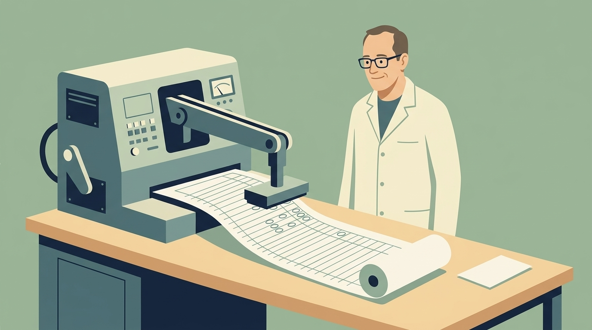
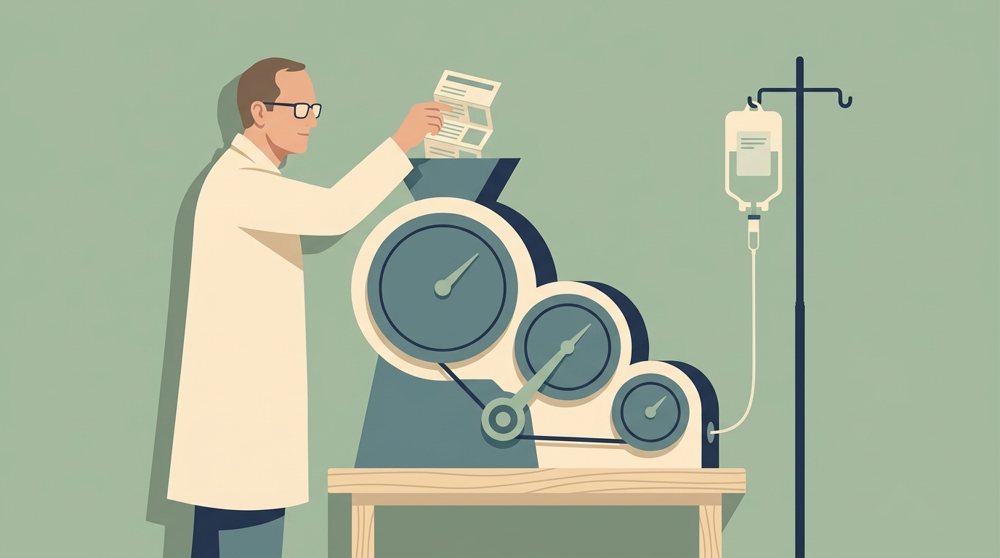
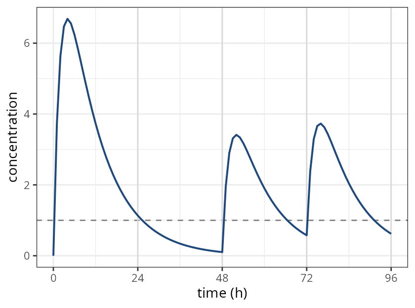
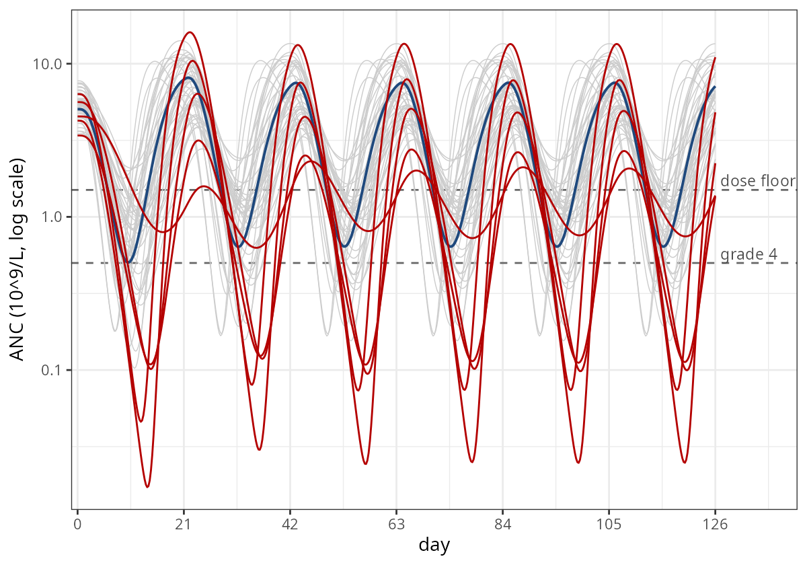
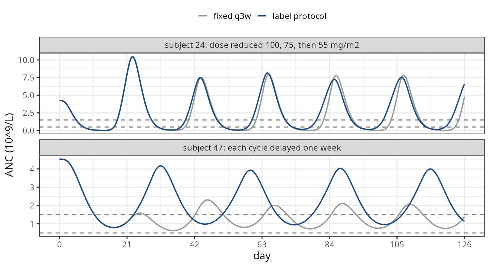

## This talk, in four pictures

::: figgrid
<figure>

<figcaption><b>1.</b> The solver can now write the event history</figcaption>
</figure>
<figure>

<figcaption><b>2.</b> A dose-modification protocol only matters for the patients in the tail</figcaption>
</figure>
<figure>

<figcaption><b>3.</b> Writing the Taxotere label into the model</figcaption>
</figure>
<figure>

<figcaption><b>4.</b> Notes from actually using it</figcaption>
</figure>
:::

::: {.notes}
There are four parts to this talk.

First, the idea: the solver can now add doses while it runs.

Second, a real model where that matters.

Third, how to write a adaptive dose modification protocol

And fourth, a few things to keep in mind while using it.
:::

## 1. The solver can now write the event history {.sectionbreak}

{.nostretch}

::: {.notes}
So let's start with the idea.
:::

## Until now, every dose had to be known before the solver took its first step

```{=html}
<svg class="dg" viewBox="0 0 1000 470" role="img"
     aria-label="Two pipelines. Before: an event table with every dose fixed feeds the solver, which produces concentrations, and nothing flows back. Now: an event table holding only observation times feeds the solver, and a loop arrow from the solver back into the event history shows the model pushing doses while it solves.">
  <defs>
    <marker id="ah" viewBox="0 0 10 10" refX="9" refY="5" markerWidth="8" markerHeight="8" orient="auto-start-reverse">
      <path d="M0,0 L10,5 L0,10 z" fill="#1f497d"/>
    </marker>
    <marker id="ahr" viewBox="0 0 10 10" refX="9" refY="5" markerWidth="8" markerHeight="8" orient="auto-start-reverse">
      <path d="M0,0 L10,5 L0,10 z" fill="#b40000"/>
    </marker>
  </defs>

  <text class="lab" x="20" y="40">before</text>
  <rect x="20" y="60" width="270" height="100" rx="8" fill="#eef3f9" stroke="#1f497d" stroke-width="2"/>
  <text class="lab blue" x="155" y="98" text-anchor="middle">event table</text>
  <text class="t" x="155" y="128" text-anchor="middle">every dose written in advance</text>
  <line x1="290" y1="110" x2="385" y2="110" stroke="#1f497d" stroke-width="3" marker-end="url(#ah)"/>
  <rect x="390" y="60" width="220" height="100" rx="8" fill="#ffffff" stroke="#1f497d" stroke-width="2"/>
  <text class="lab blue" x="500" y="116" text-anchor="middle">rxSolve()</text>
  <line x1="610" y1="110" x2="705" y2="110" stroke="#1f497d" stroke-width="3" marker-end="url(#ah)"/>
  <rect x="710" y="60" width="270" height="100" rx="8" fill="#ffffff" stroke="#1f497d" stroke-width="2"/>
  <text class="lab blue" x="845" y="98" text-anchor="middle">trajectory</text>
  <text class="t" x="845" y="128" text-anchor="middle">can't change the doses</text>

  <line x1="20" y1="205" x2="980" y2="205" stroke="#b40000" stroke-width="2" stroke-dasharray="14 5 3 5"/>

  <text class="lab" x="20" y="250">now</text>
  <rect x="20" y="270" width="270" height="100" rx="8" fill="#eef3f9" stroke="#1f497d" stroke-width="2"/>
  <text class="lab blue" x="155" y="308" text-anchor="middle">event table</text>
  <text class="t" x="155" y="338" text-anchor="middle">observation times only</text>
  <line x1="290" y1="320" x2="385" y2="320" stroke="#1f497d" stroke-width="3" marker-end="url(#ah)"/>
  <rect x="390" y="270" width="220" height="100" rx="8" fill="#f7eeee" stroke="#b40000" stroke-width="2"/>
  <text class="lab red" x="500" y="308" text-anchor="middle">rxSolve()</text>
  <text class="mono" x="500" y="340" text-anchor="middle">if (...) bolus()</text>
  <line x1="610" y1="320" x2="705" y2="320" stroke="#1f497d" stroke-width="3" marker-end="url(#ah)"/>
  <rect x="710" y="270" width="270" height="100" rx="8" fill="#ffffff" stroke="#1f497d" stroke-width="2"/>
  <text class="lab blue" x="845" y="308" text-anchor="middle">trajectory</text>
  <text class="t" x="845" y="338" text-anchor="middle">decides the next dose</text>
  <path d="M 845 370 C 845 425, 500 425, 500 374" fill="none" stroke="#b40000" stroke-width="3" marker-end="url(#ahr)"/>
  <text class="t red" x="672" y="455" text-anchor="middle">the model pushes a dose while it solves</text>
</svg>
```

::: {.notes}
In the past, every simulation started the same way. You wrote
down the doses first, and then you solved.

That's fine for a fixed schedule. It isn't fine for adaptive dosing.
Real protocols let clinical endpoints decide: hold this cycle, cut the
dose one level, draw an extra sample.

So the dose a patient receives on day forty two is a function of the
trajectory. You can't write it into an event table,
because you don't know it until you've solved.

Now you can modify an individual's event history while the model is
being solved.
:::

## A decision in the model block pushes a dose while the model solves

:::: columns
::: {.column width="50%"}
```r
model({
  d/dt(depot)   <- -ka*depot
  d/dt(central) <-  ka*depot -
                    cl/v*central
  cp <- central/v
  # every 24 h, top up if below target
  if (t > 0 && t %% 24 == 0 && cp < 1) {
    bolus(50)
  }
})
```

::: rule
:::

Needs `rxode2` >= 5.1.7
:::

::: {.column width="50%"}
{.nostretch .plot}
:::
::::

::: {.notes}
Here's the idea.

The decision logic goes inside the model block. It runs at the times
the solver visits, and when the condition is met, you push a new event.

In this case, every twenty four hours we check whether the
concentration is below one, and if it is, we give another bolus.

On the right you can see it working. At twenty four hours the
concentration is just above the target -- nothing happens. At forty
eight and seventy two hours it has dropped below the minimum
concentration. This makes the model dose based on the condition.

:::

## Every helper pushes an ordinary event

::: bigtable
| helper | `evid` | what it pushes |
|---|---|---|
| `bolus()` | 1 | a bolus dose, optionally with `ii` / `addl` / `ss` |
| `infuse()` | 1 | a fixed-**rate** infusion |
| `infuseDur()` | 1 | a fixed-**duration** infusion |
| `reset()` | 3 | a system reset |
| `replace()` | 5 | set a compartment to a value |
| `multiply()` | 6 | scale a compartment |
| `phantom()` | 7 | `tad()` / `podo()` bookkeeping without mass |
| `obs()` | 0 | extra observation rows |
| `evid_()` | any | the low-level interface |
:::

::: {.notes}
All of the helpers push a standard event, so there's nothing exotic downstream.

You can give a bolus, an infusion by rate or by duration, reset the
system, replace or multiply a compartment, add phantom doses for
transit models, or even add extra observations. And if none of those
fit, E-V-I-D underscore is the low level interface.
:::

## A condition is only tested where the solver stops, so anchor it to a visit

```{=html}
<svg class="dg" viewBox="0 0 1000 440" role="img"
     aria-label="Two schematic timelines of observation rows from 0 to 96 hours. In the top timeline, the bare condition cp less than 1 fires a dose on nearly every row once the concentration falls below 1 after 24 hours, shown as a long run of red dots. In the bottom timeline the condition anchored to t modulo 24 equals 0 fires only at 48, 72 and 96 hours. A note says the last one at 96 hours has no row after it, so the dose is never seen, and that maxExtra caps runaway firing.">
  <text class="mono" x="20" y="50">if (cp &lt; 1) bolus(50)</text>
  <line x1="80" y1="110" x2="940" y2="110" stroke="#1f497d" stroke-width="2"/>
  <g id="ticks1" stroke="#1f497d" stroke-width="2">
    <line x1="80" y1="100" x2="80" y2="120"/><line x1="115.8" y1="104" x2="115.8" y2="116"/><line x1="151.7" y1="104" x2="151.7" y2="116"/><line x1="187.5" y1="104" x2="187.5" y2="116"/><line x1="223.3" y1="104" x2="223.3" y2="116"/><line x1="259.2" y1="104" x2="259.2" y2="116"/><line x1="295" y1="100" x2="295" y2="120"/><line x1="330.8" y1="104" x2="330.8" y2="116"/><line x1="366.7" y1="104" x2="366.7" y2="116"/><line x1="402.5" y1="104" x2="402.5" y2="116"/><line x1="438.3" y1="104" x2="438.3" y2="116"/><line x1="474.2" y1="104" x2="474.2" y2="116"/><line x1="510" y1="100" x2="510" y2="120"/><line x1="545.8" y1="104" x2="545.8" y2="116"/><line x1="581.7" y1="104" x2="581.7" y2="116"/><line x1="617.5" y1="104" x2="617.5" y2="116"/><line x1="653.3" y1="104" x2="653.3" y2="116"/><line x1="689.2" y1="104" x2="689.2" y2="116"/><line x1="725" y1="100" x2="725" y2="120"/><line x1="760.8" y1="104" x2="760.8" y2="116"/><line x1="796.7" y1="104" x2="796.7" y2="116"/><line x1="832.5" y1="104" x2="832.5" y2="116"/><line x1="868.3" y1="104" x2="868.3" y2="116"/><line x1="904.2" y1="104" x2="904.2" y2="116"/><line x1="940" y1="100" x2="940" y2="120"/>
  </g>
  <g fill="#b40000">
    <circle cx="80" cy="85" r="8"/>
    <circle cx="330.8" cy="85" r="8"/><circle cx="366.7" cy="85" r="8"/><circle cx="402.5" cy="85" r="8"/><circle cx="438.3" cy="85" r="8"/><circle cx="474.2" cy="85" r="8"/><circle cx="510" cy="85" r="8"/><circle cx="545.8" cy="85" r="8"/><circle cx="581.7" cy="85" r="8"/><circle cx="617.5" cy="85" r="8"/><circle cx="653.3" cy="85" r="8"/><circle cx="689.2" cy="85" r="8"/><circle cx="725" cy="85" r="8"/><circle cx="760.8" cy="85" r="8"/><circle cx="796.7" cy="85" r="8"/><circle cx="832.5" cy="85" r="8"/><circle cx="868.3" cy="85" r="8"/><circle cx="904.2" cy="85" r="8"/><circle cx="940" cy="85" r="8"/>
  </g>
  <text class="sm" x="80" y="145" text-anchor="middle">0 h</text>
  <text class="sm" x="295" y="145" text-anchor="middle">24</text>
  <text class="sm" x="510" y="145" text-anchor="middle">48</text>
  <text class="sm" x="725" y="145" text-anchor="middle">72</text>
  <text class="sm" x="940" y="145" text-anchor="middle">96</text>
  <text class="t red" x="80" y="178">a dose at t = 0 on top of the real one, then one on almost every row</text>

  <line x1="20" y1="210" x2="980" y2="210" stroke="#b40000" stroke-width="2" stroke-dasharray="14 5 3 5"/>

  <text class="mono" x="20" y="255">if (t &gt; 0 &amp;&amp; t %% 24 == 0 &amp;&amp; cp &lt; 1) bolus(50)</text>
  <line x1="80" y1="315" x2="940" y2="315" stroke="#1f497d" stroke-width="2"/>
  <use href="#ticks1" transform="translate(0,205)"/>
  <circle cx="295" cy="290" r="8" fill="none" stroke="#5a6b80" stroke-width="2"/>
  <circle cx="510" cy="290" r="8" fill="#1f497d"/>
  <circle cx="725" cy="290" r="8" fill="#1f497d"/>
  <circle cx="940" cy="290" r="8" fill="none" stroke="#b40000" stroke-width="2.5" stroke-dasharray="4 3"/>
  <text class="sm" x="80" y="350" text-anchor="middle">0 h</text>
  <text class="sm" x="295" y="350" text-anchor="middle">24: cp above 1</text>
  <text class="sm" x="510" y="350" text-anchor="middle">48</text>
  <text class="sm" x="725" y="350" text-anchor="middle">72</text>
  <text class="sm" x="940" y="350" text-anchor="middle">96: no row after it</text>
  <text class="t blue" x="80" y="390">one decision per visit</text>
  <text class="mono" x="80" y="425">mtime(check48) &lt;- 48</text>
  <text class="mono" x="520" y="425">rxSolve(..., maxExtra = 500)</text>
</svg>
```

::: {.notes}
There's one thing to keep in mind. The condition is only tested at the
times the solver actually stops at.

And a condition like concentration below one stays true almost all the
time. On its own, it fires on nearly every observation. It even fires
at time zero, where the concentration is still zero. This is a problem
when the dose is already in the event table. That's why this model is
gated to check when t is greater than zero.

To be useful, it needs to be anchored to a time seen in the event
table. Or you can pin it with modeled time assignments.

To stop yourself from dosing far more often than you expect, set
max extra. It limits how many events can be added per problem.

And at the very end, a dose that would be added at the last time has no
row after it. Make sure your observations span the entire simulation you need.
:::

## 2. A protocol only matters for the patients in the tail {.sectionbreak}

{.nostretch}

::: {.notes}
So now let's look at a model that actually needs this.
:::

## Docetaxel neutropenia is a PK model driving a transit chain with feedback

```{=html}
<svg class="dg" viewBox="0 0 1000 400" role="img"
     aria-label="A three-compartment docetaxel PK model, central with two peripherals, gives the concentration Cp. Cp inhibits proliferating cells through a linear drug effect of one minus slope times Cp. Proliferating cells mature through three transit compartments into circulating neutrophils, with the rate k-tr equal to 4 over the mean transit time. A dashed feedback arrow from circulating neutrophils back to proliferation is labeled Circ0 over Circ to the power gamma.">
  <defs>
    <marker id="ah2" viewBox="0 0 10 10" refX="9" refY="5" markerWidth="8" markerHeight="8" orient="auto-start-reverse">
      <path d="M0,0 L10,5 L0,10 z" fill="#1f497d"/>
    </marker>
    <marker id="ahr2" viewBox="0 0 10 10" refX="9" refY="5" markerWidth="8" markerHeight="8" orient="auto-start-reverse">
      <path d="M0,0 L10,5 L0,10 z" fill="#b40000"/>
    </marker>
  </defs>
  <!-- PK -->
  <text class="lab" x="30" y="35">PK: Ozawa, Minami &amp; Sato (2007)</text>
  <rect x="200" y="60" width="160" height="70" rx="8" fill="#eef3f9" stroke="#1f497d" stroke-width="2"/>
  <text class="lab blue" x="280" y="102" text-anchor="middle">central</text>
  <rect x="30" y="60" width="130" height="70" rx="8" fill="#fff" stroke="#1f497d" stroke-width="2"/>
  <text class="t" x="95" y="102" text-anchor="middle">periph1</text>
  <rect x="400" y="60" width="130" height="70" rx="8" fill="#fff" stroke="#1f497d" stroke-width="2"/>
  <text class="t" x="465" y="102" text-anchor="middle">periph2</text>
  <line x1="162" y1="88" x2="198" y2="88" stroke="#1f497d" stroke-width="2" marker-start="url(#ah2)" marker-end="url(#ah2)"/>
  <line x1="362" y1="88" x2="398" y2="88" stroke="#1f497d" stroke-width="2" marker-start="url(#ah2)" marker-end="url(#ah2)"/>
  <text class="t" x="600" y="80">1-hour infusion, 100 mg/m²</text>
  <text class="t" x="600" y="110">into central</text>

  <!-- drug effect -->
  <line x1="280" y1="132" x2="280" y2="215" stroke="#b40000" stroke-width="3" marker-end="url(#ahr2)"/>
  <text class="t red" x="295" y="180">Cp inhibits: 1 − slope · Cp</text>

  <!-- PD chain -->
  <text class="lab" x="30" y="205">PD: Friberg et al. (2002)</text>
  <g stroke="#1f497d" stroke-width="2">
    <rect x="200" y="220" width="140" height="70" rx="8" fill="#f7eeee" stroke="#b40000"/>
    <rect x="380" y="220" width="110" height="70" rx="8" fill="#fff"/>
    <rect x="530" y="220" width="110" height="70" rx="8" fill="#fff"/>
    <rect x="680" y="220" width="110" height="70" rx="8" fill="#fff"/>
    <rect x="830" y="220" width="140" height="70" rx="8" fill="#eef3f9"/>
  </g>
  <text class="lab red" x="270" y="262" text-anchor="middle">Prol</text>
  <text class="t" x="435" y="262" text-anchor="middle">Tr1</text>
  <text class="t" x="585" y="262" text-anchor="middle">Tr2</text>
  <text class="t" x="735" y="262" text-anchor="middle">Tr3</text>
  <text class="lab blue" x="900" y="262" text-anchor="middle">Circ = ANC</text>
  <g stroke="#1f497d" stroke-width="2.5">
    <line x1="340" y1="255" x2="378" y2="255" marker-end="url(#ah2)"/>
    <line x1="490" y1="255" x2="528" y2="255" marker-end="url(#ah2)"/>
    <line x1="640" y1="255" x2="678" y2="255" marker-end="url(#ah2)"/>
    <line x1="790" y1="255" x2="828" y2="255" marker-end="url(#ah2)"/>
  </g>
  <text class="sm" x="585" y="210" text-anchor="middle">each step at k<tspan baseline-shift="sub" font-size="11">tr</tspan> = 4 / MTT</text>
  <path d="M 900 292 C 900 380, 270 380, 270 294" fill="none" stroke="#1f497d" stroke-width="2.5" stroke-dasharray="8 5" marker-end="url(#ah2)"/>
  <text class="t blue" x="585" y="390" text-anchor="middle">rebound feedback: (Circ<tspan baseline-shift="sub" font-size="13">0</tspan> / Circ)<tspan baseline-shift="super" font-size="14">γ</tspan></text>
</svg>
```

::: {.notes}
One of the standard places you need adaptive dosing is cancer treatment,
and chemotherapy induced neutropenia.

The classic example is the Freiberg model.

This example is for docetaxel estimates from Ozawa, et al, from the
Friberg model fit to Japanese cancer patients.

The typical dosing schedule is six cycles of one hundred milligrams per meter squared every three
weeks.
:::

## On a fixed schedule, the typical patient is fine, but some are not

:::: columns
::: {.column width="70%"}
{.nostretch .plot}
:::

::: {.column width="30%"}
[typical patient]{style="color:#1f497d"}: nadir 0.50, recovered before every cycle

::: rule
:::

[50 simulated patients]{style="color:#b40000"}:

- **9 of 300** doses given at ANC < 1.5
- **19 cycles** at grade 4 for over a week
- all in **5** patients
:::
::::

::: {.notes}
For the typical patient, the nadir sits just above the grade four line,
and the count is back over one point five well before the next cycle.

But as with all mixed effects models, some patients are different. If
we simulate fifty subjects on the same fixed schedule, nine of the three
hundred planned doses land on a day when the neutrophil count is below
fifteen hundred. And nineteen cycles sit at grade four for more than a
week.

All of that happens in five patients, the red lines. Dose adjustment really
matters for them.
:::

## The label's dose modifications depend on the patient

```{=html}
<svg class="dg" viewBox="0 0 1000 420" role="img"
     aria-label="A flowchart of the Taxotere dose modification rules. A weekly visit with a cycle due asks whether ANC is at least 1.5. If not, hold and reassess in 7 days, looping back to the visit. If yes, ask whether there were more than 7 days at grade 4 since the last dose. If yes, step down one dose level from 100 to 75 to 55 milligrams per square meter. Either way, infuse the dose and schedule the next cycle in 21 days.">
  <defs>
    <marker id="ah3" viewBox="0 0 10 10" refX="9" refY="5" markerWidth="8" markerHeight="8" orient="auto-start-reverse">
      <path d="M0,0 L10,5 L0,10 z" fill="#1f497d"/>
    </marker>
  </defs>
  <rect x="30" y="160" width="190" height="90" rx="8" fill="#eef3f9" stroke="#1f497d" stroke-width="2"/>
  <text class="lab blue" x="125" y="198" text-anchor="middle">weekly visit,</text>
  <text class="lab blue" x="125" y="224" text-anchor="middle">cycle due</text>

  <polygon points="380,130 490,205 380,280 270,205" fill="#fff" stroke="#1f497d" stroke-width="2"/>
  <text class="lab" x="380" y="212" text-anchor="middle">ANC ≥ 1.5?</text>
  <line x1="220" y1="205" x2="268" y2="205" stroke="#1f497d" stroke-width="2.5" marker-end="url(#ah3)"/>

  <rect x="270" y="330" width="220" height="70" rx="8" fill="#f7eeee" stroke="#b40000" stroke-width="2"/>
  <text class="lab red" x="380" y="360" text-anchor="middle">hold</text>
  <text class="t" x="380" y="385" text-anchor="middle">reassess in 7 days</text>
  <line x1="380" y1="280" x2="380" y2="328" stroke="#1f497d" stroke-width="2.5" marker-end="url(#ah3)"/>
  <text class="sm" x="392" y="310">no</text>
  <path d="M 270 365 H 125 V 252" fill="none" stroke="#b40000" stroke-width="2.5" stroke-dasharray="8 5" marker-end="url(#ah3)"/>

  <polygon points="650,110 790,205 650,300 510,205" fill="#fff" stroke="#1f497d" stroke-width="2"/>
  <text class="lab" x="650" y="195" text-anchor="middle">&gt; 7 days at</text>
  <text class="lab" x="650" y="222" text-anchor="middle">grade 4?</text>
  <line x1="490" y1="205" x2="508" y2="205" stroke="#1f497d" stroke-width="2.5" marker-end="url(#ah3)"/>
  <text class="sm" x="492" y="190">yes</text>

  <rect x="560" y="20" width="410" height="60" rx="8" fill="#f7eeee" stroke="#b40000" stroke-width="2"/>
  <text class="lab red" x="765" y="58" text-anchor="middle">step down: 100 → 75 → 55 mg/m²</text>
  <line x1="650" y1="110" x2="650" y2="82" stroke="#1f497d" stroke-width="2.5" marker-end="url(#ah3)"/>
  <text class="sm" x="662" y="102">yes</text>
  <path d="M 900 80 V 158" fill="none" stroke="#1f497d" stroke-width="2.5" marker-end="url(#ah3)"/>

  <rect x="820" y="160" width="160" height="90" rx="8" fill="#eef3f9" stroke="#1f497d" stroke-width="2"/>
  <text class="lab blue" x="900" y="198" text-anchor="middle">infuse</text>
  <text class="t" x="900" y="226" text-anchor="middle">next due +21 d</text>
  <line x1="790" y1="205" x2="818" y2="205" stroke="#1f497d" stroke-width="2.5" marker-end="url(#ah3)"/>
  <text class="sm" x="795" y="232">no</text>
</svg>
```

::: {.notes}
The label tells you what to do.

Don't dose below fifteen hundred cells per cubic millimeter. In our
model, that means hold, and reassess in a week.

And after neutrophils under five hundred for more than a week, step the
dose down from one hundred to seventy five, and then to fifty five if
it happens again.

That's three coupled rules, and none of them can be written into an
event table, because the answer depends on the solution.
:::

## 3. Writing the label into the model {.sectionbreak}

{.nostretch}

::: {.notes}
So let's write the label into the model.
:::

## Sticky variables give the protocol a memory without adding states

:::: columns
::: {.column width="42%"}
```r
if (is.na(level)) {
  level   <- 1      # 100 mg/m2
  nextDue <- 21*24  # h
  dayLow  <- 0
}
```

::: rule
:::

- Start `NA` for each subject
- Keep their last value between rows
- Updating one is an ordinary assignment
:::

::: {.column width="58%"}
```{=html}
<svg class="dg" viewBox="0 0 560 420" role="img"
     aria-label="A table of solver rows over time for one subject. At time 0 level, nextDue and dayLow start as NA and are initialised to 1, 504 and 0. On the following rows the values carry over unchanged, drawn as arrows, until the visit row at 504 hours where the model assigns nextDue to 672 because the cycle was held.">
  <defs>
    <marker id="ah4" viewBox="0 0 10 10" refX="9" refY="5" markerWidth="7" markerHeight="7" orient="auto-start-reverse">
      <path d="M0,0 L10,5 L0,10 z" fill="#5a6b80"/>
    </marker>
  </defs>
  <g class="lab">
    <text x="60" y="40" text-anchor="middle">time</text>
    <text x="190" y="40" text-anchor="middle">level</text>
    <text x="330" y="40" text-anchor="middle">nextDue</text>
    <text x="470" y="40" text-anchor="middle">dayLow</text>
  </g>
  <line x1="10" y1="55" x2="550" y2="55" stroke="#1f497d" stroke-width="2"/>

  <rect x="10" y="65" width="540" height="60" fill="#f7eeee"/>
  <text class="t" x="60" y="102" text-anchor="middle">0</text>
  <text class="t" x="190" y="102" text-anchor="middle"><tspan class="sm">NA →</tspan> <tspan class="red">1</tspan></text>
  <text class="t" x="330" y="102" text-anchor="middle"><tspan class="sm">NA →</tspan> <tspan class="red">504</tspan></text>
  <text class="t" x="470" y="102" text-anchor="middle"><tspan class="sm">NA →</tspan> <tspan class="red">0</tspan></text>

  <text class="t" x="60" y="172" text-anchor="middle">6</text>
  <text class="t" x="190" y="172" text-anchor="middle">1</text>
  <text class="t" x="330" y="172" text-anchor="middle">504</text>
  <text class="t" x="470" y="172" text-anchor="middle">0</text>

  <text class="t" x="60" y="232" text-anchor="middle">⋮</text>
  <text class="t" x="190" y="232" text-anchor="middle">1</text>
  <text class="t" x="330" y="232" text-anchor="middle">504</text>
  <text class="t" x="470" y="232" text-anchor="middle">0</text>

  <g stroke="#5a6b80" stroke-width="1.5">
    <line x1="215" y1="112" x2="215" y2="152" marker-end="url(#ah4)"/>
    <line x1="215" y1="182" x2="215" y2="212" marker-end="url(#ah4)"/>
    <line x1="215" y1="242" x2="215" y2="272" marker-end="url(#ah4)"/>
    <line x1="375" y1="112" x2="375" y2="152" marker-end="url(#ah4)"/>
    <line x1="375" y1="182" x2="375" y2="212" marker-end="url(#ah4)"/>
    <line x1="375" y1="242" x2="375" y2="272" marker-end="url(#ah4)"/>
  </g>

  <rect x="10" y="275" width="540" height="60" fill="#eef3f9"/>
  <text class="t" x="60" y="312" text-anchor="middle">504</text>
  <text class="t" x="190" y="312" text-anchor="middle">1</text>
  <text class="lab blue" x="330" y="312" text-anchor="middle">672</text>
  <text class="t" x="470" y="312" text-anchor="middle">0</text>

  <text class="sm" x="280" y="375" text-anchor="middle">carried forward unless assigned (dayLow accumulates each row);</text>
  <text class="sm" x="280" y="398" text-anchor="middle">at the visit, ANC &lt; 1.5 moves nextDue a week</text>
</svg>
```
:::
::::

::: {.notes}
The protocol needs a memory: how long this cycle has been at grade
four, which dose level we're on, and when the next cycle is due.

We track this with sticky variables. Rather than being recomputed
from nothing at each time point, they keep whatever value you last gave
them, and they start out as missing for each new individual.

That gives the standard idiom. Test for missing to initialise, then
update in place.

:::

## The protocol is piped onto the model, so the PK and PD are never rewritten

:::: {.columns .codecols}
::: {.column width="50%"}
```r
doceProtocol <- doce |>
  model({
    if (is.na(level)) {
      level   <- 1
      nextDue <- 21*24
      dayLow  <- 0
      lastT   <- 0
    }
    dayLow <- dayLow +
      (anc < 0.5)*(time - lastT)/24
    lastT  <- time

    newLevel <- level
    if (dayLow > 7) newLevel <- level + 1
    if (newLevel > 3) newLevel <- 3
    mgm2 <- 100
    if (newLevel > 1.5) mgm2 <- 75
    if (newLevel > 2.5) mgm2 <- 55
    doseMg  <- mgm2*bsa
    startMg <- 100*bsa
```
:::

::: {.column width="50%"}
```r
    if (t == 0) {
      infuseDur(startMg, 1, central)
    }
    if (t > 0 && t < 126*24 &&
        t %% 168 == 0 && t >= nextDue) {
      if (anc >= 1.5) {
        infuseDur(doseMg, 1, central)
        level   <- newLevel
        dayLow  <- 0
        nextDue <- t + 21*24
      } else {
        nextDue <- t + 7*24 # hold
      }
    }
  }, append = TRUE, auto = FALSE) |>
  ini(bsa <- 1.8)

rxSolve(doceProtocol,
        et(seq(0, 126*24, by = 6)) |>
          et(id = 1:50),
        params = pop, maxExtra = 500)
```
:::
::::

::: {.notes}
None of this touches the PK or the PD. So rather than copying the model
and risking a typo, we pipe the protocol onto the model we already have

On the left is the memory and the dose level for the cycle we're about
to start. On the right, cycle one at time zero, then a weekly
assessment. If the count is at least one point five, infuse and move
the next due time three weeks out. Otherwise hold for a week.

Notice the event table at the bottom has no doses at all. Every dose is
pushed by the model.
:::

## The label protocol gives no dose below 1.5, and cuts long grade 4 cycles from 19 to 5

::: bigtable
| 50 patients, 126 days | fixed q3w | label protocol |
|---|---:|---:|
| doses given at ANC < 1.5 | 9 | **0** |
| lowest ANC at a dose (10^9^/L) | 1.10 | **1.72** |
| cycles with > 7 days at grade 4 | 19 | **5** |
| later doses at a reduced level | 0 | 20 (17 at 75, 3 at 55) |
| cycles held a week | 0 | 4 (one patient) |
:::

::: {.notes}
So what did the protocol buy?

No dose is now given below fifteen hundred. The lowest count at any
administration is one point seven two.

Twenty of the two hundred forty nine later doses are given at a reduced
level, seventeen at seventy five and three at fifty five. One patient
had cycles held.

And counting three week windows the same way as before, the number
spent at grade four for more than a week falls from nineteen to five.
:::

## Every decision the model made can be read back out of the solution

:::: columns
::: {.column width="40%"}
```r
popAdapt |>
  group_by(id) |>
  mutate(step =
    c(0, diff(nextDue)))

# step == 504: dose given
# step == 168: cycle held
```

::: rule
:::

`nextDue` changes on the row the decision was made, so that row's ANC is
the one the protocol acted on
:::

::: {.column width="60%"}
```{=html}
<svg class="dg" viewBox="0 0 640 440" role="img"
     aria-label="A staircase plot of nextDue against time for subject 47. At day 21, 49, 77 and 105 it takes a small step of one week, marked held in red. At day 28, 56, 84 and 112 it takes a large step of three weeks, marked dosed in navy.">
  <line x1="60" y1="390" x2="620" y2="390" stroke="#0f243e" stroke-width="1.5"/>
  <line x1="60" y1="390" x2="60" y2="40" stroke="#0f243e" stroke-width="1.5"/>
  <text class="sm" x="340" y="430" text-anchor="middle">day</text>
  <text class="sm" x="22" y="215" text-anchor="middle" transform="rotate(-90 22 215)">nextDue (day)</text>
  <g class="sm" text-anchor="middle">
    <text x="60" y="410">0</text><text x="186" y="410">28</text><text x="312" y="410">56</text>
    <text x="438" y="410">84</text><text x="564" y="410">112</text>
  </g>
  <g class="sm" text-anchor="end">
    <text x="52" y="375">21</text><text x="52" y="230">77</text><text x="52" y="84">133</text>
  </g>
  <path d="M60,370 H154.5 V352 H186 V297.4 H280.5 V279.2 H312 V224.6 H406.5 V206.4 H438 V151.8 H532.5 V133.6 H564 V79 H627"
        fill="none" stroke="#1f497d" stroke-width="3"/>
  <g fill="#b40000">
    <circle cx="154.5" cy="352" r="6"/><circle cx="280.5" cy="279.2" r="6"/>
    <circle cx="406.5" cy="206.4" r="6"/><circle cx="532.5" cy="133.6" r="6"/>
  </g>
  <g fill="#1f497d">
    <circle cx="186" cy="297.4" r="6"/><circle cx="312" cy="224.6" r="6"/>
    <circle cx="438" cy="151.8" r="6"/><circle cx="564" cy="79" r="6"/>
  </g>
  <text class="t red" x="66" y="330">+168 h: held</text>
  <text class="t blue" x="198" y="332">+504 h: dosed</text>
  <text class="lab" x="340" y="30" text-anchor="middle">subject 47</text>
</svg>
```
:::
::::

::: {.notes}
One nice thing is that the model's decisions can be read straight back
out of the solution.

Here's subject forty seven. Every cycle, the count isn't quite high
enough on day twenty one, so the model holds for a week, and then doses.

Because it's a sticky variable, it changes on the same row the decision
was made and each row  tracks why the patient decision was made.
:::

## A protocol changes two things: when the dose is given and how much

{.nostretch .plot}

::: {.notes}
The two panels show the two things a protocol can change.

Subject forty seven is about when. This patient is slow to recover, and
on the fixed schedule the count is under one point five on every
planned dosing day from cycle two onward. On the protocol, the cycles
are twenty eight days apart instead of twenty one.

Subject twenty four is about how much. This patient clears docetaxel
slowly and is sensitive to it, and is the only one in the trial to
walk the whole ladder, from one hundred to seventy five to fifty five.
Reducing the dose doesn't lift the nadir, but it shortens the time
spent there, from about nine days at grade four to under six.

Either way, the grey and blue curves are the same model, the same
parameters, and the same one hundred twenty six days. The only
difference is that in the blue one, the event history was written by
the solver.
:::

## 4. Notes from actually using it {.sectionbreak}

{.nostretch}

::: {.notes}
Finally, a few notes from actually using this.
:::

## Most surprises come from where and how often the logic runs

:::: columns
::: {.column width="50%" .checks}
- **Decision times must exist.** Put the visit in `et()`, or pin it
  with `mtime()`
- **Guard against re-triggering.** `anc >= 1.5` is true for weeks;
  `t %% 168 == 0` makes it one decision
- **Set `maxExtra`.** Find out the condition fires 4000 times, not 6
:::

::: {.column width="50%" .checks}
- **At the last output time** the pushed event is dropped, but sticky
  assignments still happen
- **Reading decisions back** with `step == 504` needs visits on the
  output grid; `by = 5` silently reports zero doses
- **The dose `amt` wants a symbol today:** compute `doseMg <- mgm2*bsa`
  on its own line
:::
::::

::: {.notes}
A few things that will save you some time.

The decision times must exist.

Guard against re triggering. A count above one point five is true for
weeks. Anchoring it to a weekly visit turns a standing condition into a
single decision.

Set max extra. It's a cheap way to find out keep your your condition from fires
four thousand times instead of six.

At the last output time, the pushed event is dropped -- make sure you
are tracking the appropriate study duration.

Reading decisions back out uses equality on a floating point
number.

And for now, the dose amount wants a single symbol, not an expression.
That may change in the future.
:::

## Protocol rules are now part of the model, so they can be part of the trial simulation

:::: columns
::: {.column width="50%"}
- `linCmt()` works too, and `odeToLin()` converts a *linear* ODE model
  with adaptive dosing to the analytic form
- The [adaptive dosing
  vignette](https://nlmixr2.github.io/rxode2/articles/adaptive-dosing.html)
  covers every helper, phantom dosing and adaptive sampling
:::

::: {.column width="50%" .checks}
- Compare two dose-modification tables
- Ask what a different assessment schedule would have bought
- Without leaving [rxode2]{.nlmixr}
:::
::::

::: {.notes}
linear compartment models work too, and odeToLin will convert a linear
ODE model that uses adaptive dosing into the analytic form. That's
worth it when you're running that kind of model over many trial
designs.

The adaptive dosing vignette is the reference for every helper.

But the real point is this. The protocol rules are now part of the
model, which means they can be part of a trial simulation. You can
compare two dose modification tables, or ask what a different
assessment schedule would have bought you directly in your model
:::

## Thank you {.thanks}

::: {.credit}
Section illustrations are Gemini Nano Banana-generated artwork
:::

::: {.notes}
Thank you.
:::
