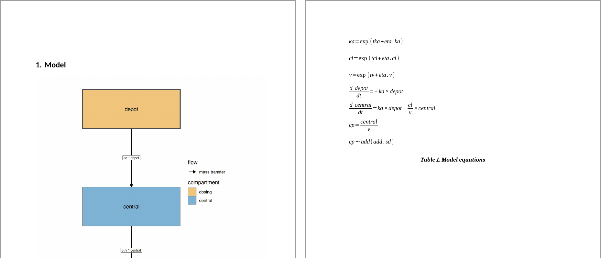

```{r setup, include=FALSE}
knitr::opts_chunk$set(echo = TRUE, message = FALSE, warning = FALSE,
                      fig.width = 7, fig.height = 4.5,
                      dpi = 110, out.width = "100%")
library(nlmixr2)
library(nlmixr2plot)
library(nlmixr2extra)
```

<div style="position:relative;padding-bottom:56.25%;height:0;overflow:hidden;max-width:100%;">
<iframe src="https://youtube.com/embed/TsfkmEdiT7o"
        title="Model diagrams and equations, straight from the code"
        style="position:absolute;top:0;left:0;width:100%;height:100%;border:0;"
        allow="accelerometer; autoplay; clipboard-write; encrypted-media; gyroscope; picture-in-picture"
        allowfullscreen></iframe>
</div>

[Watch on YouTube](https://youtu.be/TsfkmEdiT7o)

Many pharmacometric reports have the same two items near the
top of the methods section: a compartment diagram of the final model
and the equations that define it.  They are also two of the easiest
things to get wrong.

The diagram is usually drawn by hand in PowerPoint or Visio early in
the analysis.  The equations are typed into Word or LaTeX from the
control stream.  Then the model changes -- a transit compartment is
added, the effect goes from stimulation to inhibition, a covariate
moves -- and the code is updated but the figure and the math are not.
A reviewer who reads the equations in the report and the code in the
appendix will find two different models.

The fix is to generate both from the model itself.  `nlmixr2plot`
5.2.0 adds automatic compartment diagrams, and `nlmixr2extra` can
already turn a model into LaTeX equations.  Since both read the same
model object you fit, they cannot drift from it.

## Compartment diagrams with `modelDiagram()`

Take the classic two-compartment model with first-order absorption:

```{r two-cmt}
two.cmt <- function() {
  ini({
    tka <- log(1.5)
    tcl <- log(3)
    tv <- log(20)
    tq <- log(2)
    tvp <- log(40)
    eta.ka ~ 0.1
    eta.cl ~ 0.1
    add.sd <- 0.2
  })
  model({
    ka <- exp(tka + eta.ka)
    cl <- exp(tcl + eta.cl)
    v <- exp(tv)
    q <- exp(tq)
    vp <- exp(tvp)
    d/dt(depot) <- -ka * depot
    d/dt(central) <- ka * depot - cl / v * central - q / v * central +
      q / vp * periph
    d/dt(periph) <- q / v * central - q / vp * periph
    cp <- central / v
    cp ~ add(add.sd)
  })
}
```

One call draws it:

```{r two-cmt-diagram}
modelDiagram(two.cmt, engine = "ggplot2")
```

There is no layout information in the model.  `modelDiagram()` reads
the `d/dt()` equations, works out which terms move mass between
compartments, and places the compartments the way a pharmacometrician
would draw them by hand: the dosing compartment (heavy border) on top,
peripheral compartments to the left, elimination leaving the central
compartment downward.

For a methods section you often want the rate terms (the model
expressions that drive each flow) on the arrows too:

```{r two-cmt-labels}
modelDiagram(two.cmt, engine = "ggplot2", labels = TRUE)
```

`plot()` of an `rxode2` model object draws the same diagram, so
`plot(rxode2(two.cmt), engine = "ggplot2")` works as well.  (A fit
keeps its goodness-of-fit `plot()`; use `modelDiagram(fit)` for its
diagram.)

Behind the picture, `modelGraph()` returns the parsed compartments and
flows as data frames, which is handy for checking how the equations
were read, or for drawing them some other way.

In the development version of nlmixr2plot, these labels are colored
white, but this can still be immediately useful even if you don't
install the development version.

### Three engines, three kinds of report

The `engine` argument decides what you get back, and each one fits a
different reporting workflow:

- `"ggplot2"` returns an ordinary `ggplot` object.  Theme it to match
  the rest of your figures, save it with `ggsave()` at the resolution
  your publisher asks for, or put it side by side with a goodness-of-fit
  plot using `patchwork`.
- `"DiagrammeR"` (the default when 'DiagrammeR' is installed) gives an
  interactive Graphviz widget, handy in HTML reports and Quarto
  dashboards.
- `"dot"` returns the Graphviz DOT source as text.  When the automatic
  layout is 95% of the way there, this is the escape hatch: edit the
  DOT and render it with any Graphviz tool, rather than starting a
  drawing from scratch.

```{r dot}
cat(modelDiagram(two.cmt, engine = "dot"))
```

### Not just PK

The part that saves the most time is the pharmacodynamic side, where
hand-drawn diagrams are fiddliest.  Terms that *influence* a
compartment without moving mass into it -- effect compartments,
stimulation and inhibition of turnover -- are drawn as dashed or dotted arrows,
and the direction of the effect is read from the equation itself.
Here is an indirect response model where the drug inhibits production
of the response:

```{r turnover}
pk.turnover <- function() {
  ini({
    tktr <- log(1)
    tka <- log(1)
    tcl <- log(0.1)
    tv <- log(10)
    poplogit <- 2
    tec50 <- log(0.5)
    tkout <- log(0.05)
    te0 <- log(100)
    prop.err <- 0.1
    pdadd.err <- 10
  })
  model({
    ktr <- exp(tktr)
    ka <- exp(tka)
    cl <- exp(tcl)
    v <- exp(tv)
    emax <- expit(poplogit)
    ec50 <- exp(tec50)
    kout <- exp(tkout)
    e0 <- exp(te0)
    DCP <- center / v
    PD <- 1 - emax * DCP / (ec50 + DCP)
    effect(0) <- e0
    kin <- e0 * kout
    d/dt(depot) <- -ktr * depot
    d/dt(gut) <- ktr * depot - ka * gut
    d/dt(center) <- ka * gut - cl / v * center
    d/dt(effect) <- kin * PD - kout * effect
    cp <- center / v
    cp ~ prop(prop.err)
    effect ~ add(pdadd.err)
  })
}
modelDiagram(pk.turnover, engine = "ggplot2")
```

Nobody told it that `effect` is a turnover response, that `gut` is a
transit compartment, or that the drug is inhibitory.  It followed `PD`
back through `DCP` to `center`, saw that `PD` falls as the
concentration rises, and drew an inhibition.  If you later change the
model to a stimulatory effect, the diagram changes with it.

Target-mediated drug disposition works the same way; binding and
unbinding are recognized as mass moving from both partners into the
complex and back out again:

```{r tmdd}
tmdd <- rxode2::rxode2({
  d/dt(central) <- -kel * central - kon * central * target + koff * complex
  d/dt(target) <- ksyn - kdeg * target - kon * central * target +
    koff * complex
  d/dt(complex) <- kon * central * target - koff * complex - kint * complex
})
modelDiagram(tmdd, dosing = "central", engine = "ggplot2")
```

Before release, the diagrams were checked against all 3043 models in
[`nlmixr2lib`](https://nlmixr2.github.io/nlmixr2lib/), including large
QSP and PBPK models.  The [Automatic model diagrams
vignette](https://nlmixr2.github.io/nlmixr2plot/articles/model-diagrams.html)
covers the rest: how each term is classified, `lag()`/`f()`/`rate()`/`dur()`
annotations, `delay()`, `linCmt()` models, and the current limitations.

## Model equations with `knit_print()`

`nlmixr2extra` has a `knit_print()` method for `rxode2` model objects
created from a model function (`rxode2(fun)`) and for `nlmixr2` fits.  In practice that means that when a model or fit is
the last value of a chunk in R Markdown or Quarto, the chunk prints the
model as aligned LaTeX equations instead of as R code:

```{r eq-two-cmt}
rxode2::rxode2(two.cmt)
```

Each assignment becomes an aligned line, `d/dt(depot)` becomes
$\frac{d \: depot}{dt}$, `exp()` and `log()` become proper functions
with sized parentheses, divisions become fractions, and the residual
error line is kept as a $\sim$ statement.  Conditional logic survives
too (`==` is shown as $\equiv$), which matters for models with
covariate switches.  A character covariate can be compared to its
value directly, with no need to recode it as a number first, and the
string carries through to the equation:

```{r eq-if}
covmod <- function() {
  ini({
    tcl <- log(3)
    tv <- log(20)
    add.sd <- 0.2
  })
  model({
    if (SEX == "Female") {
      cl <- exp(tcl) * 0.8
    } else {
      cl <- exp(tcl)
    }
    v <- exp(tv)
    cp <- linCmt()
    cp ~ add(add.sd)
  })
}
rxode2::rxode2(covmod)
```

If you ever want the plain R printout back inside a knitted document,
call `print()` explicitly.  The raw LaTeX is also one call away, if you
want to paste it into a manuscript:

```{r eq-raw}
cat(knitr::knit_print(rxode2::rxode2(two.cmt)))
```

## Putting them together in a report

The real payoff is in the report template.  Fit the model once, and
let every description of it come from the fit.  Here is the familiar
one-compartment theophylline model:

```{r fit, results = "hide"}
one.cmt <- function() {
  ini({
    tka <- log(1.57)
    tcl <- log(2.72)
    tv <- log(31.5)
    eta.ka ~ 0.6
    eta.cl ~ 0.3
    eta.v ~ 0.1
    add.sd <- 0.7
  })
  model({
    ka <- exp(tka + eta.ka)
    cl <- exp(tcl + eta.cl)
    v <- exp(tv + eta.v)
    d/dt(depot) <- -ka * depot
    d/dt(central) <- ka * depot - cl / v * central
    cp <- central / v
    cp ~ add(add.sd)
  })
}
fit <- nlmixr2(one.cmt, nlmixr2data::theo_sd, est = "saem",
               control = saemControl(print = 0))
```

The model diagram (the dosing compartment comes from the dosing
records in the data the model was fit to):

```{r fit-diagram}
modelDiagram(fit, engine = "ggplot2", labels = TRUE)
```

The model equations:

```{r fit-equations}
fit
```

And, as usual, the parameter table:

```{r fit-table}
fit$parFixedDf
```

The diagram, the equations and the estimates all come from `fit`.  If
the final model changes during review, re-knitting updates all three,
and the report cannot describe one model while its tables report
another.  For regulatory work this also means that the QC of the
methods section is largely the QC of the code: there is no separate
hand-typed artifact to reconcile.

## An end-to-end report: Word, HTML and PDF from one file

Here is the whole workflow as a single R Markdown report.  It fits the
model, then writes a short methods and results section with the
diagram, the equations and the parameter table, and knits unchanged
to Word, HTML and PDF.  Save it as `model-report.Rmd` (or [download
the source](report/_model-report.Rmd)):

```{r report-source, eval = FALSE, code = readLines("report/_model-report.Rmd")}
```

Two details make the same source work in every format:

- **Equations.**  Pandoc silently drops a bare `\begin{align*}`
  environment when it writes a `.docx` file, so plain
  `knit_print()` output vanishes from Word documents.  Wrapped as
  `$$\begin{aligned} ... \end{aligned}$$` it becomes a native,
  editable Word equation, and it still renders in HTML and PDF.  For
  Word, the helper also drops the alignment points (`&`), so the Word
  equations are centered rather than aligned on the equals sign.  Word
  itself handles aligned equations, but LibreOffice garbles them, and
  a report is often opened in more than one of them.  The
  `modelEquations()` helper in the setup chunk does all of this, so one
  chunk serves all three formats.
- **Diagram.**  `engine = "ggplot2"` gives a static image that every
  output format can embed.  The interactive `"DiagrammeR"` widget only
  works in HTML.
- **Numbering.**  The `bookdown` versions of the output formats
  (`word_document2` and friends) number the figure and table in every
  format, so `\@ref(fig:diagram)` and `\@ref(tab:estimates)` work in
  the text.

Rendering all three is one call:

```{r render-report, eval = FALSE}
rmarkdown::render("model-report.Rmd", output_format = "all")
```

The PDF needs a LaTeX installation (for example
`tinytex::install_tinytex()`).  Here are the results:

- [Word report](report/model-report.docx)
- [HTML report](report/model-report.html)
- [PDF report](report/model-report.pdf)

This is how the first page of each looks, Word on the left (opened in
LibreOffice) and PDF on the right:


Your medical writers can open the Word version and edit the equations
like any other Word equation.  They can restyle the table too, and the
diagram is regenerated from the model rather than redrawn.  None of it
has to be re-typed from the control stream.

A couple of notes for your own report templates:

- **Variable names are the symbols.**  The equations use the names in
  your model, so `eta.cl` stays ${eta.cl}$; it is not turned into
  $\eta_{cl}$.
  Meaningful names in the code give readable equations in the report.
- **Swap in your own template.**  The report is ordinary R Markdown, so
  a company Word template (`reference_docx`) or a Quarto document works
  the same way.  The only Word-specific piece is the `modelEquations()`
  wrapper.

## Adding them to nlmixr2rpt reports

If your reports come from
[`nlmixr2rpt`](https://nlmixr2.github.io/nlmixr2rpt/), which builds Word
and PowerPoint documents from a fit using your organization's `onbrand`
templates, the diagram and the equations fit into the same workflow.
`nlmixr2rpt` reads its figures and tables from a YAML file, and each
one is just R code that has the fit available as `fit`.  So the model
diagram is one new figure, and the equations are one new table:

```{r rpt-yaml, eval = FALSE, code = readLines("nlmixr2rpt/model-additions.yaml")}
```

The diagram entry calls `modelDiagram()` directly.  The equations entry
uses a small helper, defined in `tabenv_preamble`, that splits the
`knit_print()` output into one equation per row of a `flextable`.
`flextable::as_equation()` then writes each row as a native, editable
equation in both Word and PowerPoint.  It needs the
[`equatags`](https://cran.r-project.org/package=equatags) package;
without it the cells come out blank.  Because each equation sits in
its own row, there are no alignment points, so Word and LibreOffice
show the Word report the same way.  (An `if`/`else` block takes a few
rows: one for the condition and one for each branch.)

In PowerPoint, the equations slide gets the same native math, and
PowerPoint uses single line spacing with tighter padding, since it
sizes the math itself.  There is no fallback image, though, so
LibreOffice Impress and some other viewers show that slide blank.

Merge these entries into a copy of the package's `report_fit.yaml`
(or paste them in by hand), and point `report_fit()` at it:

```{r rpt-run, eval = FALSE, code = local({x <- readLines("nlmixr2rpt/make-report.R"); x[grep("^## Start from", x):length(x)]})}
```

The model now opens the report, ahead of the parameter table and the
goodness-of-fit figures `nlmixr2rpt` already produces.  These are the
first two pages of the Word report:



Here are the generated [Word report](nlmixr2rpt/fit-report.docx) and
[PowerPoint deck](nlmixr2rpt/fit-report.pptx), with the
[YAML additions](nlmixr2rpt/model-additions.yaml) and the
[script](nlmixr2rpt/make-report.R) that built them.

## Try it

`modelDiagram()` and `modelGraph()` are in `nlmixr2plot` 5.2.0; the
`knit_print()` equations are in `nlmixr2extra`.  Point them at the
model you are writing up this week and see how close they get you to
the figure and equations you would have drawn by hand.  If a diagram
looks wrong, the [issue
tracker](https://github.com/nlmixr2/nlmixr2plot/issues) is the place
to tell us -- the model that trips up the parser is exactly the one we
want to see.
