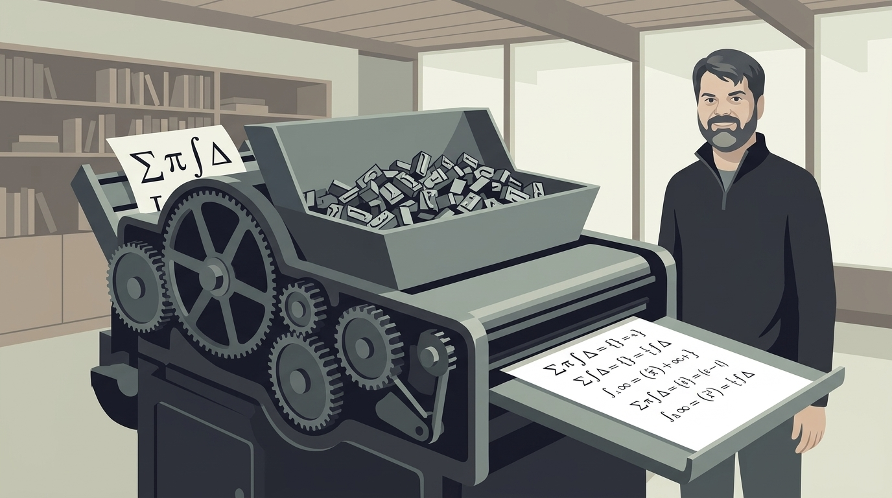
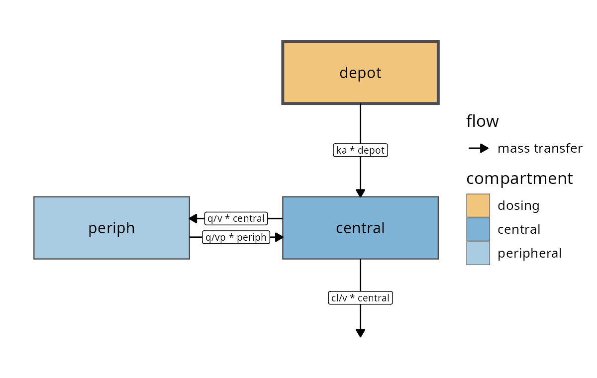
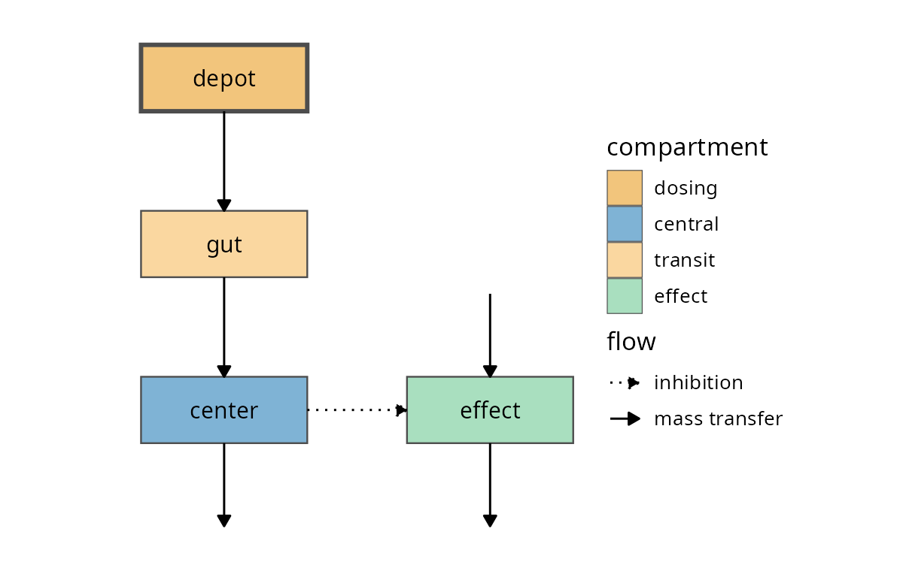
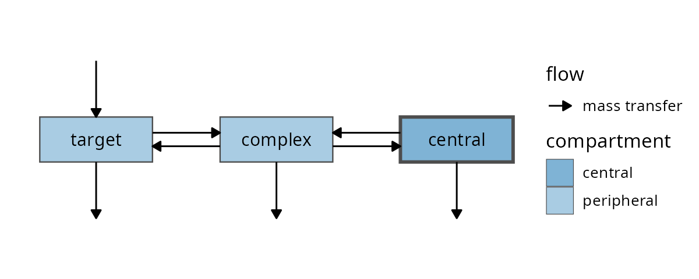
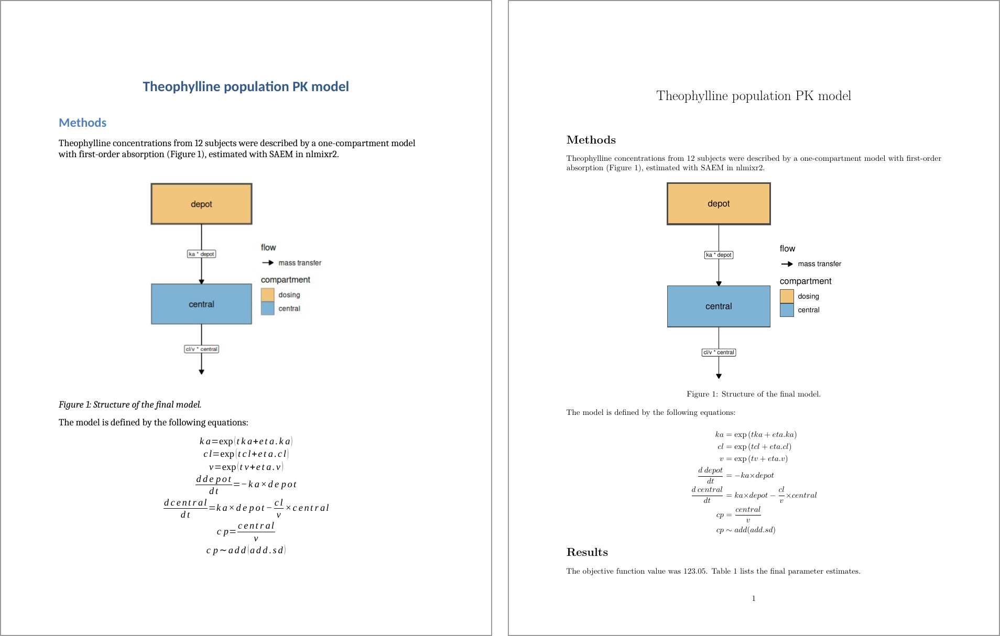

## This talk, in five pictures

::: figgrid
<figure>

<figcaption><b>1.</b> A report's diagram and equations are a second copy of the model</figcaption>
</figure>
<figure>

<figcaption><b>2.</b> The model draws its own diagram</figcaption>
</figure>
<figure>

<figcaption><b>3.</b> The model writes its own equations</figcaption>
</figure>
<figure>

<figcaption><b>4.</b> One source knits to three report formats</figcaption>
</figure>
<figure>

<figcaption><b>5.</b> nlmixr2rpt reports can open with the model</figcaption>
</figure>
:::

::: {.notes}
There are five parts to this talk.

First, why the diagram and the equations in a report are so easy to
get wrong.

Second, how nlmixr2 plot draws a compartment diagram for you.

Third, how nlmixr2 extra writes the model equations for you.

Fourth, putting it all together in one report that knits to Word,
HTML and PDF.

And fifth, adding the diagram and the equations to nlmixr2
reports.
:::

## 1. A report's diagram and equations are a second copy of the model {.sectionbreak}

{.nostretch fig-alt="Illustration: a hand-drawn diagram and typed page drifting away from code on a monitor"}

::: {.notes}
So let's start with the problem.
:::

## Hand-made diagrams and equations drift away from the model you actually ran

```{=html}
<svg class="dg" viewBox="0 0 1000 470" role="img"
     aria-label="Two ways to document a model. Left, maintained by hand: the model code is at run 7, while the hand-drawn diagram is still at run 2 and the typed equations at run 4, joined to the code by dashed red lines marked not equal, captioned updated when someone remembers. Right, generated: one fit at run 7 feeds the diagram, the equations and the estimates with solid arrows, all at run 7, captioned re-knit, and all three follow the model.">
  <defs>
    <marker id="ah" viewBox="0 0 10 10" refX="9" refY="5" markerWidth="8" markerHeight="8" orient="auto-start-reverse">
      <path d="M0,0 L10,5 L0,10 z" fill="#1f497d"/>
    </marker>
  </defs>

  <text class="lab" x="20" y="36">by hand</text>
  <rect x="140" y="60" width="220" height="90" rx="8" fill="#eef3f9" stroke="#1f497d" stroke-width="2"/>
  <text class="lab blue" x="250" y="98" text-anchor="middle">model code</text>
  <text class="t" x="250" y="128" text-anchor="middle">run 7</text>

  <rect x="20" y="290" width="200" height="100" rx="8" fill="#ffffff" stroke="#b40000" stroke-width="2"/>
  <text class="lab" x="120" y="330" text-anchor="middle">Visio diagram</text>
  <text class="t red" x="120" y="362" text-anchor="middle">run 2</text>
  <rect x="280" y="290" width="200" height="100" rx="8" fill="#ffffff" stroke="#b40000" stroke-width="2"/>
  <text class="lab" x="380" y="330" text-anchor="middle">Word equations</text>
  <text class="t red" x="380" y="362" text-anchor="middle">run 4</text>
  <line x1="200" y1="150" x2="130" y2="288" stroke="#b40000" stroke-width="3" stroke-dasharray="10 8"/>
  <line x1="300" y1="150" x2="370" y2="288" stroke="#b40000" stroke-width="3" stroke-dasharray="10 8"/>
  <text class="red" x="138" y="232" text-anchor="middle" font-size="40" font-weight="700">≠</text>
  <text class="red" x="362" y="232" text-anchor="middle" font-size="40" font-weight="700">≠</text>
  <text class="sm" x="250" y="440" text-anchor="middle">updated when someone remembers</text>

  <line x1="515" y1="30" x2="515" y2="450" stroke="#b40000" stroke-width="2" stroke-dasharray="14 5 3 5"/>

  <text class="lab" x="545" y="36">generated</text>
  <rect x="545" y="175" width="170" height="100" rx="8" fill="#eef3f9" stroke="#1f497d" stroke-width="2"/>
  <text class="lab blue" x="630" y="215" text-anchor="middle">fit</text>
  <text class="t" x="630" y="247" text-anchor="middle">run 7</text>
  <rect x="790" y="70" width="190" height="80" rx="8" fill="#ffffff" stroke="#1f497d" stroke-width="2"/>
  <text class="lab" x="885" y="105" text-anchor="middle">diagram</text>
  <text class="t grn" x="885" y="133" text-anchor="middle">run 7</text>
  <rect x="790" y="185" width="190" height="80" rx="8" fill="#ffffff" stroke="#1f497d" stroke-width="2"/>
  <text class="lab" x="885" y="220" text-anchor="middle">equations</text>
  <text class="t grn" x="885" y="248" text-anchor="middle">run 7</text>
  <rect x="790" y="300" width="190" height="80" rx="8" fill="#ffffff" stroke="#1f497d" stroke-width="2"/>
  <text class="lab" x="885" y="335" text-anchor="middle">estimates</text>
  <text class="t grn" x="885" y="363" text-anchor="middle">run 7</text>
  <line x1="715" y1="200" x2="786" y2="115" stroke="#1f497d" stroke-width="3" marker-end="url(#ah)"/>
  <line x1="715" y1="225" x2="786" y2="225" stroke="#1f497d" stroke-width="3" marker-end="url(#ah)"/>
  <line x1="715" y1="250" x2="786" y2="335" stroke="#1f497d" stroke-width="3" marker-end="url(#ah)"/>
  <text class="sm" x="762" y="440" text-anchor="middle">re-knit, and all three follow the model</text>
</svg>
```

::: {.notes}
Most pharmacometric reports have the same two things near the top of
the methods section: a compartment diagram of the final model, and the
equations that define it.

They're also two of the easiest things to get wrong. The diagram gets
drawn by hand early in the analysis. The equations are typed into Word
from the analysis scripts. Then the model changes. A transit compartment
gets added, or a covariate moves. The code is updated, but the figure
and the math are not.

A reviewer who reads the equations in the report, and the code in the
appendix, finds two different models.

The fix is to generate both from the model itself. If they come from
the same object you fit, they can't drift away from it.
:::

## 2. The model draws its own diagram {.sectionbreak}

{.nostretch fig-alt="Illustration: a machine turning a ribbon of symbols into a box-and-arrow diagram"}

::: {.notes}
Next, the diagram.
:::

## One call turns a model's differential equations into a compartment diagram

:::: columns
::: {.column width="42%"}
```r
library(nlmixr2plot)

modelDiagram(two.cmt,
             engine = "ggplot2",
             labels = TRUE)
```

::: rule
:::

- No layout information in the model
- Dosing compartment on top, with a heavy border
- Peripherals to the left, elimination down
:::

::: {.column width="58%"}
{.nostretch .plot fig-alt="Two-compartment diagram: depot above central, periph to the left, elimination down, arrows labeled with their rate terms"}
:::
::::

::: {.notes}
Here's a two compartment model with first order absorption. One call
to model diagram draws it.

There's no layout information anywhere in the model. Model diagram
reads the O-D-E equations, works out which terms move mass between
compartments, and then places both the compartments and arrows.

With labels set to true, each arrow also carries the model terms.
:::

## Each term in a d/dt equation is classified by what it does to mass

```{=html}
<svg class="dg" viewBox="0 0 1000 470" role="img"
     aria-label="The central compartment equation split into its four terms. ka times depot matches the loss from depot, so it is a transfer in from depot. cl over v times central contains central's own amount with no matching gain, so it is elimination. q over v times central is subtracted here and added to periph, so it is a transfer out to periph. q over vp times periph matches the loss from periph, so it is a transfer in from periph. A note below says a term that depends on another compartment without moving mass is drawn as a dashed interaction arrow, and that intermediate variables are followed and if/else blocks keep their conditions.">
  <rect x="10" y="40" width="230" height="56" rx="6" fill="#eef3f9" stroke="#1f497d" stroke-width="2"/>
  <text class="mono" x="125" y="75" text-anchor="middle">d/dt(central) &lt;-</text>

  <rect x="255" y="40" width="175" height="56" rx="6" fill="#ffffff" stroke="#4a7d18" stroke-width="3"/>
  <text class="mono" x="342" y="75" text-anchor="middle">ka*depot</text>
  <rect x="440" y="40" width="175" height="56" rx="6" fill="#ffffff" stroke="#b40000" stroke-width="3"/>
  <text class="mono" x="527" y="75" text-anchor="middle">- cl/v*central</text>
  <rect x="625" y="40" width="175" height="56" rx="6" fill="#ffffff" stroke="#1f497d" stroke-width="3"/>
  <text class="mono" x="712" y="75" text-anchor="middle">- q/v*central</text>
  <rect x="810" y="40" width="180" height="56" rx="6" fill="#ffffff" stroke="#e08836" stroke-width="3"/>
  <text class="mono" x="900" y="75" text-anchor="middle">+ q/vp*periph</text>

  <line x1="342" y1="96" x2="342" y2="140" stroke="#4a7d18" stroke-width="3"/>
  <line x1="527" y1="96" x2="527" y2="140" stroke="#b40000" stroke-width="3"/>
  <line x1="712" y1="96" x2="712" y2="140" stroke="#1f497d" stroke-width="3"/>
  <line x1="900" y1="96" x2="900" y2="140" stroke="#e08836" stroke-width="3"/>

  <rect x="255" y="140" width="175" height="150" rx="8" fill="#f2f7ec" stroke="#4a7d18" stroke-width="2"/>
  <text class="lab grn" x="342" y="172" text-anchor="middle">transfer in</text>
  <text class="t" x="342" y="204" text-anchor="middle">same term is</text>
  <text class="t" x="342" y="228" text-anchor="middle">lost from depot</text>
  <text class="sm" x="342" y="268" text-anchor="middle">depot → central</text>

  <rect x="440" y="140" width="175" height="150" rx="8" fill="#f7eeee" stroke="#b40000" stroke-width="2"/>
  <text class="lab red" x="527" y="172" text-anchor="middle">elimination</text>
  <text class="t" x="527" y="204" text-anchor="middle">own amount,</text>
  <text class="t" x="527" y="228" text-anchor="middle">no matching gain</text>
  <text class="sm" x="527" y="268" text-anchor="middle">central → out</text>

  <rect x="625" y="140" width="175" height="150" rx="8" fill="#eef3f9" stroke="#1f497d" stroke-width="2"/>
  <text class="lab blue" x="712" y="172" text-anchor="middle">transfer out</text>
  <text class="t" x="712" y="204" text-anchor="middle">same term is</text>
  <text class="t" x="712" y="228" text-anchor="middle">gained by periph</text>
  <text class="sm" x="712" y="268" text-anchor="middle">central → periph</text>

  <rect x="810" y="140" width="180" height="150" rx="8" fill="#fbf1e6" stroke="#e08836" stroke-width="2"/>
  <text class="lab" x="900" y="172" text-anchor="middle" fill="#b0601c">transfer in</text>
  <text class="t" x="900" y="204" text-anchor="middle">same term is</text>
  <text class="t" x="900" y="228" text-anchor="middle">lost from periph</text>
  <text class="sm" x="900" y="268" text-anchor="middle">periph → central</text>

  <line x1="10" y1="330" x2="990" y2="330" stroke="#b40000" stroke-width="2" stroke-dasharray="14 5 3 5"/>
  <line x1="30" y1="390" x2="130" y2="390" stroke="#0f243e" stroke-width="3" stroke-dasharray="10 7"/>
  <text class="t" x="150" y="384">A term that depends on another compartment <tspan font-weight="700">without moving mass</tspan></text>
  <text class="t" x="150" y="412">(an effect compartment, a stimulated or inhibited turnover) is an <tspan font-weight="700">interaction</tspan>.</text>
  <text class="sm" x="150" y="448">Intermediate variables like cp &lt;- central/v are followed; if/else blocks keep their conditions.</text>
</svg>
```

::: {.notes}
How does it know? Every ODE equation is split into its terms, and
each term is classified by what it does to mass.

The central compartment has mass transfer between depot, central and
peripheral compartments, and so arrows are drawn to represent that action.

Terms depending on another compartment without moving any mass, like either an effect
compartment or a drug effect on turnover, are
drawn as a dashed or dotted arrow.
:::

## The direction of a drug effect is read from the equation, not declared

:::: {.columns .codemid}
::: {.column width="44%"}
```r
DCP <- center/v
PD  <- 1 - emax*DCP/(ec50 + DCP)
kin <- e0*kout
d/dt(depot)  <- -ktr*depot
d/dt(gut)    <-  ktr*depot - ka*gut
d/dt(center) <-  ka*gut - cl/v*center
d/dt(effect) <-  kin*PD - kout*effect
```

::: rule
:::

- `PD` falls as `center` rises, so the arrow is an **inhibition**
- `gut` is recognized as a transit compartment
:::

::: {.column width="56%"}
{.nostretch .plot fig-alt="Turnover diagram: depot, gut and center stacked, with a dotted inhibition arrow from center to effect"}
:::
::::

::: {.notes}
Pharmacodynamic models are where this saves the most time.

This is an indirect response model where the drug inhibits production
of the response. It followed P D back through the concentration to the
center compartment as an inhibition without mass transfer, so it drew the dotted
arrow. The diagram would be different if it was a stimulatory effect.
:::

## Binding and unbinding are mass transfer, so a TMDD model draws itself

{.nostretch .plot fig-alt="TMDD diagram: target and central both exchange mass with complex, each with its own elimination"}

```r
d/dt(central) <- -kel*central - kon*central*target + koff*complex
d/dt(target)  <-  ksyn - kdeg*target - kon*central*target + koff*complex
d/dt(complex) <-  kon*central*target - koff*complex - kint*complex
```

[Checked against all 3043 models in [nlmixr2lib]{.nlmixr}, including large QSP and PBPK models]{style="font-size: 0.75em;"}

::: {.notes}
Target mediated drug disposition works the same way. The mass transfer
drives all the arrows.

Before release, the diagrams were checked against all three thousand
forty three models in nlmixr2 lib, including large Q S P and P B P K
models.
:::

## Three engines give three kinds of report figure

::: bigtable
| `engine =` | returns | use it for |
|:--|:--|:--|
| `"ggplot2"` | a `ggplot` object | Word and PDF reports; theme it, `ggsave()` it, combine it with other plots |
| `"DiagrammeR"` | an interactive Graphviz widget | HTML reports and dashboards (the default when installed) |
| `"dot"` | Graphviz DOT source text | hand-tuning the last 5% of a layout |
:::

::: rule
:::

`modelGraph()` returns the parsed compartments and flows as data frames, to check how the equations were read

::: {.notes}
The same graph can be drawn three ways, and each fits a different kind
of report.

The plot engine gives you an ordinary plot object. You can theme it to
match your other figures, save it at whatever resolution your
publisher wants, or put it next to a goodness of fit plot. That's the
one to use in Word and PDF reports.

Diagrammer gives you an interactive Graphviz widget, which is nice in
HTML reports and dashboards.

And dot gives you the Graphviz source as text. This allows tweaking
the diagram instead of starting a drawing from scratch.

If you want to see how the equations were read, model graph gives
you the compartments and flows as data frames.
:::

## 3. The model writes its own equations {.sectionbreak}

{.nostretch fig-alt="Illustration: a typesetting press turning loose type into aligned equations"}

::: {.notes}
Now for the equations.
:::

## A model that ends a chunk prints as aligned LaTeX instead of R code

:::: columns
::: {.column width="40%"}
```r
library(nlmixr2extra)

rxode2::rxode2(two.cmt)
```

::: rule
:::

- `knit_print()` method in `nlmixr2extra`
- Works on models built from a function, and on `nlmixr2` fits
- `print()` still gives the R code
:::

::: {.column width="60%" .eqs}
$$
\begin{aligned}
{ka} & = \exp\left({tka}+{eta.ka}\right) \\
{cl} & = \exp\left({tcl}+{eta.cl}\right) \\
{v} & = \exp\left({tv}\right) \\
{q} & = \exp\left({tq}\right) \\
{vp} & = \exp\left({tvp}\right) \\
\frac{d \: depot}{dt} & = -{ka} {\times} {depot} \\
\frac{d \: central}{dt} & = {ka} {\times} {depot}-\frac{{cl}}{{v}} {\times} {central}-\frac{{q}}{{v}} {\times} {central}+\frac{{q}}{{vp}} {\times} {periph} \\
\frac{d \: periph}{dt} & = \frac{{q}}{{v}} {\times} {central}-\frac{{q}}{{vp}} {\times} {periph} \\
{cp} & = \frac{{central}}{{v}} \\
{cp} & \sim add({add.sd})
\end{aligned}
$$
:::
::::

::: {.notes}
nlmixr2 has a knit print method for model objects and for fits.
In practice, that means when a model or a fit is the last thing in an
R Markdown or Quarto chunk, the chunk prints the model as aligned
latex equations instead of as R code.

Each assignment becomes an aligned line. The d d t lines become proper
derivatives, divisions become fractions, and the residual error line
is kept.

If you want the R code back, call print explicitly.
:::

## Covariate switches survive the translation, even on character values

:::: columns
::: {.column width="44%"}
```r
model({
  if (SEX == "Female") {
    cl <- exp(tcl) * 0.8
  } else {
    cl <- exp(tcl)
  }
  v <- exp(tv)
  cp <- linCmt()
  cp ~ add(add.sd)
})
```

The `model()` block of `covmod`, printed with `rxode2::rxode2(covmod)`
:::

::: {.column width="56%" .eqs .eqsbig}
$$
\begin{aligned}
\mathrm{if} & \left({SEX}{\equiv}\text{"Female"}\right) \{ \\
& {cl}  = \exp\left({tcl}\right) {\times} {0.8} \\
\}  \quad & \mathrm{else} \: {cl}  = \exp\left({tcl}\right) \\
{v} & = \exp\left({tv}\right) \\
{cp} & = linCmt() \\
{cp} & \sim add({add.sd})
\end{aligned}
$$

::: rule
:::

Character covariates compare directly: no recoding `SEX` as 0/1

Variable names are the symbols: `eta.cl` stays ${eta.cl}$, so name them well
:::
::::

::: {.notes}
Conditional logic survives too, which matters for models with
covariate switches. Here, the clearance depends on sex, and sex is
compared to the word female directly. Character covariates work in the
model as they are, so there's no need to recode them as numbers first.
The if and else branches come through as they're written, the double
equals shows up as an equivalence sign, and female shows up as text.

One thing to keep in mind is that the variable names are the symbols.
Names aren't turned into Greek letters: what you type is what the equation shows. So
meaningful names in your code give readable equations in the report.
:::

## 4. One source knits to three report formats {.sectionbreak}

{.nostretch fig-alt="Illustration: one manuscript fanning out into a report, a web page and a PDF"}

::: {.notes}
Finally, let's put it all together.
:::

## The diagram, the equations and the estimates all come from one fit

```{=html}
<svg class="dg" viewBox="0 0 1000 470" role="img"
     aria-label="A model function, one.cmt, is fit with nlmixr2. The fit feeds three calls: modelDiagram of fit gives the figure, modelEquations of fit gives the equations, and fit dollar parFixedDf gives the table. All three flow into one report. A red loop from the report back to the model says that when the model changes, re-knitting updates all three.">
  <defs>
    <marker id="ah2" viewBox="0 0 10 10" refX="9" refY="5" markerWidth="8" markerHeight="8" orient="auto-start-reverse">
      <path d="M0,0 L10,5 L0,10 z" fill="#1f497d"/>
    </marker>
    <marker id="ahr2" viewBox="0 0 10 10" refX="9" refY="5" markerWidth="8" markerHeight="8" orient="auto-start-reverse">
      <path d="M0,0 L10,5 L0,10 z" fill="#b40000"/>
    </marker>
  </defs>
  <rect x="10" y="165" width="160" height="90" rx="8" fill="#eef3f9" stroke="#1f497d" stroke-width="2"/>
  <text class="lab blue" x="90" y="203" text-anchor="middle">model</text>
  <text class="mono" x="90" y="233" text-anchor="middle">one.cmt</text>
  <line x1="170" y1="210" x2="221" y2="210" stroke="#1f497d" stroke-width="3" marker-end="url(#ah2)"/>
  <rect x="225" y="165" width="160" height="90" rx="8" fill="#eef3f9" stroke="#1f497d" stroke-width="2"/>
  <text class="lab blue" x="305" y="203" text-anchor="middle">fit</text>
  <text class="mono" x="305" y="233" text-anchor="middle">nlmixr2()</text>

  <rect x="460" y="50" width="300" height="80" rx="8" fill="#ffffff" stroke="#1f497d" stroke-width="2"/>
  <text class="mono" x="610" y="84" text-anchor="middle">modelDiagram(fit)</text>
  <text class="sm" x="610" y="112" text-anchor="middle">figure</text>
  <rect x="460" y="170" width="300" height="80" rx="8" fill="#ffffff" stroke="#1f497d" stroke-width="2"/>
  <text class="mono" x="610" y="204" text-anchor="middle">modelEquations(fit)</text>
  <text class="sm" x="610" y="232" text-anchor="middle">equations</text>
  <rect x="460" y="290" width="300" height="80" rx="8" fill="#ffffff" stroke="#1f497d" stroke-width="2"/>
  <text class="mono" x="610" y="324" text-anchor="middle">fit$parFixedDf</text>
  <text class="sm" x="610" y="352" text-anchor="middle">table</text>
  <line x1="385" y1="195" x2="456" y2="95" stroke="#1f497d" stroke-width="3" marker-end="url(#ah2)"/>
  <line x1="385" y1="210" x2="456" y2="210" stroke="#1f497d" stroke-width="3" marker-end="url(#ah2)"/>
  <line x1="385" y1="225" x2="456" y2="325" stroke="#1f497d" stroke-width="3" marker-end="url(#ah2)"/>

  <rect x="835" y="130" width="155" height="160" rx="8" fill="#f2f7ec" stroke="#4a7d18" stroke-width="2"/>
  <text class="lab grn" x="912" y="200" text-anchor="middle">report</text>
  <text class="sm" x="912" y="228" text-anchor="middle">.Rmd / .qmd</text>
  <line x1="760" y1="90" x2="831" y2="170" stroke="#1f497d" stroke-width="3" marker-end="url(#ah2)"/>
  <line x1="760" y1="210" x2="831" y2="210" stroke="#1f497d" stroke-width="3" marker-end="url(#ah2)"/>
  <line x1="760" y1="330" x2="831" y2="250" stroke="#1f497d" stroke-width="3" marker-end="url(#ah2)"/>

  <path d="M 912 290 C 912 450, 90 450, 90 259" fill="none" stroke="#b40000" stroke-width="3" marker-end="url(#ahr2)"/>
  <text class="t red" x="500" y="425" text-anchor="middle">the model changes in review → re-knit → all three update</text>
</svg>
```

::: {.notes}
The real payoff is in the report template.

Fit the model once, and let every description of it come from the
fit. Model diagram of the fit gives the figure, and it takes the
dosing compartment from the data the model was fit to. The equations
come from the same fit, through a small helper called model equations
that I'll show next, and so does the parameter table.

If the final model changes during review, you render the report
again, and all three update. The report can't describe one model while its tables report
another. For regulatory work, that also means the Q C of the methods
section is mostly the Q C of the code. There's no separate hand-typed
copy to reconcile.
:::

## Word needs one small wrapper, because pandoc drops a bare `align*` block

:::: {.columns .codemid}
::: {.column width="58%"}
```r
modelEquations <- function(x) {
  eq <- knitr::knit_print(x)
  if (knitr::pandoc_to("docx")) {
    # centered lines: LibreOffice
    # garbles aligned Word math
    eq <- gsub("(?<!\\\\)&", "", eq, perl = TRUE)
  }
  eq <- sub("\\begin{align*}", "$$\n\\begin{aligned}",
            eq, fixed = TRUE)
  eq <- sub("\\end{align*}", "\\end{aligned}\n$$",
            eq, fixed = TRUE)
  knitr::asis_output(eq)
}
```
:::

::: {.column width="42%"}
- Bare `\begin{align*}`: **silently dropped** from `.docx`
- Wrapped as `$$\begin{aligned}…$$`: a **native, editable** Word equation
- Still renders in HTML and PDF, so one chunk serves all three

::: rule
:::

- Diagram: `engine = "ggplot2"`, a static image every format can embed
:::
::::

::: {.notes}
There's one catch, and it's Word.

Pandoc silently drops a bare align environment when it writes a Word
file. So if you just print the model, the equations simply vanish from
the Word document, with no error.

Wrapped as display math with an aligned block, pandoc turns it into a
native Word equation that your medical writers can edit. And it still
renders in HTML and PDF, so one helper serves all three formats.

For Word, the helper also drops the alignment points. Word handles
aligned equations, but LibreOffice garbles them, and a report often
gets opened in both.

For the diagram, use the plot engine, so it's a static image
that every format can embed.
:::

## The same file knits to Word, PDF and HTML, with numbered figures and tables

{.nostretch .plot fig-alt="First page of the Word report and the PDF report, each with the methods text, model diagram and model equations"}

```r
rmarkdown::render("model-report.Rmd", output_format = "all")
```

::: {.notes}
Here's the result. One R Markdown file fits the model and writes a
short methods and results section, with the diagram, the equations and
the parameter table.

One render call with output format all gives you Word, HTML and PDF.
On the left is the Word version, opened in LibreOffice, and on the
right the PDF. The bookdown
versions of the output formats number the figure and table in every
format, so the text can refer to Figure one and Table one.

The full source and all three rendered reports are linked from the
blog post.
:::

## 5. nlmixr2rpt reports can open with the model {.sectionbreak}

{.nostretch fig-alt="Illustration: a bookbinding machine turning loose diagram, equation and table pages into a bound report and a stack of slides"}

::: {.notes}
If your reports already come from the nlmixr2 report package, the diagram and the
equations fit right in.
:::

## Two YAML entries put the diagram and equations into every nlmixr2rpt report

:::: {.columns .codemid}
::: {.column width="46%"}
```yaml
figures:
  model_diagram:
    caption: "Model structure"
    cmd: |-
      p_res <- nlmixr2plot::modelDiagram(
        fit, engine = "ggplot2",
        labels = TRUE)
tables:
  model_equations:
    caption: "Model equations"
    cmd: |-
      t_res <- list(ft = list(
        modelEquationTable(fit, obnd)))
```

Abridged: the full entries (with `title:` and `orientation:`) are in the blog post.  Then list both first under `docx:` and `pptx:` content
:::

::: {.column width="54%"}
{.nostretch .plot fig-alt="The first two pages of the nlmixr2rpt Word report: the model diagram under a Model heading, then the model equations as Table 1"}
:::
::::

::: {.notes}
The nlmixr2 report package builds Word and PowerPoint reports from a fit, using your
organization's templates. It reads its figures and tables from a configuration file, and each one is just R code that has the fit available.

So the model diagram is one new figure that calls model diagram. The
equations are one new table. Then you list them first in the document
content, and the model opens the report, ahead of the parameter table
and the goodness of fit figures that the nlmixr2 report package already makes.

On the right are the first two pages of the Word report it produced.
:::

## One equation per table row becomes native, editable Word and PowerPoint math

:::: {.columns .codesm}
::: {.column width="62%"}
```r
modelEquationTable <- function(fit, obnd) {
  requireNamespace("nlmixr2extra", quietly = TRUE)
  eq <- as.character(knitr::knit_print(fit))
  eq <- sub("^\\s*\\\\begin\\{align\\*\\}\\s*", "", eq)
  eq <- sub("\\s*\\\\end\\{align\\*\\}\\s*$", "", eq)
  eq <- strsplit(eq, " \\\\\n", fixed = TRUE)[[1]]
  eq <- gsub("(?<!\\\\)&", "", eq, perl = TRUE)
  ft <- flextable::flextable(data.frame(eq = eq))
  ft <- flextable::delete_part(ft, part = "header")
  ft <- flextable::border_remove(ft)
  ft <- flextable::compose(ft, j = "eq",
    value = flextable::as_paragraph(
      flextable::as_equation(eq)))
  word <- identical(obnd$rpttype, "Word")
  ft <- flextable::line_spacing(ft, space = if (word) 2 else 1)
  if (!word) ft <- flextable::padding(ft, padding.top = 1,
                                      padding.bottom = 1)
  flextable::width(ft, width = 6)
}
```
:::

::: {.column width="38%"}
- Defined once, in the YAML's `tabenv_preamble`
- `as_equation()` writes **native, editable** math in Word and PowerPoint
- One equation per row: no alignment points, so Word and LibreOffice agree
- No fallback image: LibreOffice Impress shows the PowerPoint slide blank

::: rule
:::

- Needs the `equatags` package, or the cells come out blank
:::
::::

::: {.notes}
The equations table uses a small helper, defined once in the configuration file's table preamble.

It takes the same knit print output, and splits it into one equation
per row of a flex table. Then flex table's as equation function writes
each row as a native equation, in Word and in PowerPoint, so it can be
edited like any other equation.

Because each equation sits in its own row, there are no alignment
points, so Word and LibreOffice show the report the same way. In the
PowerPoint deck, the equations render natively too. There's no
fallback image, though, so LibreOffice Impress shows that slide blank.

It needs one extra package, shown on the slide. Without it, the
cells come out blank.
:::

## Both tools are ready for the model you are writing up this week

:::: columns
::: {.column width="50%"}
- `modelDiagram()` and `modelGraph()`: [nlmixr2plot]{.nlmixr} 5.2.0
- `knit_print()` equations: [nlmixr2extra]{.nlmixr}
- Word and PowerPoint reports: add two entries to your [nlmixr2rpt]{.nlmixr} YAML
- White arrow-label backgrounds: development version (nlmixr2plot#77)
- The [model diagrams
  vignette](https://nlmixr2.github.io/nlmixr2plot/articles/model-diagrams.html)
  covers every rule and limitation
- A diagram looks wrong? [Open an
  issue](https://github.com/nlmixr2/nlmixr2plot/issues)
:::

::: {.column width="50%" .checks}
- The diagram matches the model you ran
- The equations match the model you ran
- Re-knit, and both follow the model
:::
::::

::: {.notes}
Model diagram and model graph are in nlmixr2 plot five point two. The
equations are in nlmixr2 extra. The model diagrams vignette covers
every rule for how terms are read, and the current limitations.

And for Word and PowerPoint reports, add two entries to your configuration file.

So point them at the model you're writing up this week, and see how
close they get you to the figure and equations you would have drawn by
hand. If a diagram looks wrong, please open an issue. The model that
trips up the parser is exactly the one we want to see.
:::

## Thank you {.thanks}

::: {.credit}
Section illustrations are Gemini Nano Banana-generated artwork
:::

::: {.notes}
Thank you.
:::
