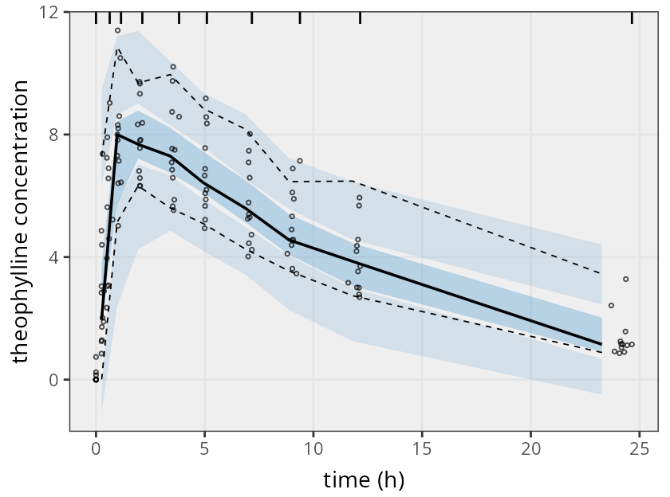
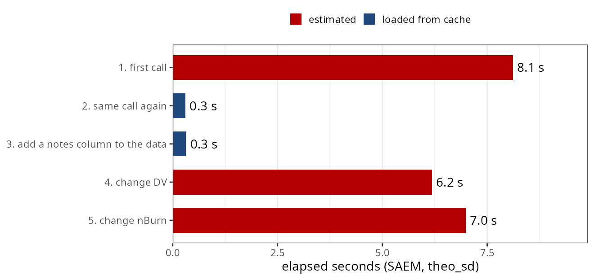

---
# No `title:` on purpose.  Quarto puts its generated title slide first, and
# the package animation has to open the talk, so the title slide below is
# written by hand with the same #title-slide id the theme styles.
pagetitle: "nlmixr2save"
format:
  nlmixr2-revealjs:
    embed-resources: false
    # MathJax stays enabled -- math is fine in the SLIDE BODIES.  Keep it OUT
    # of the ::: {.notes} blocks: the notes are the spoken script, and a
    # `$\gamma$` there is read aloud as backslash-gamma.
    include-in-header:
      text: |
        <style>
        svg.dg {
          display: block;
          width: 100%;
          height: auto;
          max-height: 545px;
          margin: 0.2em auto 0 auto;
          font-family: "Calibri", "Carlito", "Segoe UI", sans-serif;
        }
        svg.dg text { fill: #0f243e; }
        svg.dg .t   { font-size: 19px; }
        svg.dg .lab { font-size: 19px; font-weight: 700; }
        svg.dg .sm  { font-size: 15px; fill: #5a6b80; }
        svg.dg .mono { font-family: "Courier New", "Liberation Mono", monospace; font-size: 17px; }
        svg.dg .red  { fill: #b40000; }
        svg.dg .blue { fill: #1f497d; }
        svg.dg .grn  { fill: #4a7d18; }

        /* section-break slides: one captioned illustration */
        .reveal section.sectionbreak img {
          display: block; margin: 0.35em auto 0 auto;
          max-height: 510px; max-width: 100%;
          width: auto !important; height: auto !important;
          object-fit: contain; border-radius: 6px;
        }
        /* evidence figures rendered by make-figures.R */
        .reveal img.plot {
          display: block; margin: 0.2em auto 0 auto;
          max-height: 520px; max-width: 100%;
          width: auto !important; height: auto !important;
        }
        /* outline slide: the section figures, captioned */
        .reveal .figgrid {
          display: grid; grid-template-columns: repeat(2, 1fr);
          gap: 0.3em 0.9em; margin: 0.2em auto 0 auto; width: 78%;
        }
        .reveal .figgrid figure { margin: 0; }
        .reveal .figgrid img {
          width: 100%; display: block; border-radius: 4px;
          aspect-ratio: 16 / 9; object-fit: cover;
        }
        .reveal .figgrid figcaption {
          font-size: 0.5em; line-height: 1.2; margin-top: 0.15em;
          color: #17375d;
        }

        /* Quarto's .columns is inline-block, so `gap` does nothing; pad
           the columns instead. */
        .reveal .columns > .column {
          box-sizing: border-box;
          padding: 0 0.7em;
        }
        .reveal .columns > .column:first-child { padding-left: 0; }
        .reveal .columns > .column:last-child  { padding-right: 0; }

        /* data tables: readable at distance */
        .reveal .bigtable table { font-size: 24px; }
        .reveal .bigtable th,
        .reveal .bigtable td { padding: 0.3em 0.55em; }

        /* long model code shown side by side */
        .reveal .codecols pre code {
          font-size: 17px; line-height: 1.25;
        }
        </style>
---

## {background-video="video/nlmixr2save.mp4" background-video-muted="false" background-video-loop="false" background-size="contain"}

<!-- The package animation opens the talk.  No speaker notes on purpose: a
     background-video slide with no clip keeps the film's own audio in the
     rendered video (see render_presentation.js). -->

## {#title-slide}

::: {.title}
[nlmixr2save]{.nlmixr}: fits you can read, runs you don't repeat
:::

::: {.quarto-title-authors}
Matthew Fidler
:::

::: {.institute}
On behalf of the [nlmixr2]{.nlmixr} team · ACoP 2026 poster
:::

::: {.notes}
Hi. This talk goes with our nlmixr2save poster at ACoP this year. It's
about two everyday problems: keeping a fit you can still open years from
now, and not rerunning a model when nothing has changed.
:::

## This talk, in four pictures

::: figgrid
<figure>

<figcaption><b>1.</b> A saved fit should outlive the packages that made it</figcaption>
</figure>
<figure>

<figcaption><b>2.</b> Change <code>&lt;-</code> to <code>:=</code> and a model runs only when something changed</figcaption>
</figure>
<figure>

<figcaption><b>3.</b> Caches that behave in projects and reports</figcaption>
</figure>
<figure>

<figcaption><b>4.</b> Sharing a model without sharing the data</figcaption>
</figure>
:::

::: {.notes}
There are four parts to this talk.

First, saving a fit in a form that outlasts the packages that made it.

Second, the colon equals operator, which reruns a model only when
something changed.

Third, how the cache behaves inside a project or a rendered report.

And fourth, sharing a model when you can't share the data behind it.
:::

## 1. A saved fit should outlive the packages that made it {.sectionbreak}

{.nostretch}

::: {.notes}
So let's start with saving a fit.
:::

## A binary fit is only as durable as the serializer inside it

```{=html}
<svg class="dg" viewBox="0 0 1000 440" role="img"
     aria-label="A timeline of how nlmixr2 compressed fit objects. First the qs package, which was later removed from CRAN. Then qs2, a change that broke backward compatibility for saved fits. Then base R serialization, which can read qs2 fits only when qs2 is still installed. Each step is marked with a red break symbol showing that an rds file saved earlier depends on a package that may no longer be available.">
  <defs>
    <marker id="ah1" viewBox="0 0 10 10" refX="9" refY="5" markerWidth="8" markerHeight="8" orient="auto-start-reverse">
      <path d="M0,0 L10,5 L0,10 z" fill="#1f497d"/>
    </marker>
  </defs>
  <line x1="40" y1="170" x2="960" y2="170" stroke="#1f497d" stroke-width="3" marker-end="url(#ah1)"/>

  <circle cx="160" cy="170" r="14" fill="#1f497d"/>
  <text class="lab blue" x="160" y="120" text-anchor="middle">qs</text>
  <text class="t" x="160" y="225" text-anchor="middle">fits compressed</text>
  <text class="t" x="160" y="252" text-anchor="middle">with qs</text>
  <text class="t red" x="160" y="290" text-anchor="middle">removed from CRAN</text>

  <circle cx="500" cy="170" r="14" fill="#1f497d"/>
  <text class="lab blue" x="500" y="120" text-anchor="middle">qs2</text>
  <text class="t" x="500" y="225" text-anchor="middle">nlmixr2est 5.0</text>
  <text class="t red" x="500" y="290" text-anchor="middle">old saved fits break</text>

  <circle cx="840" cy="170" r="14" fill="#1f497d"/>
  <text class="lab blue" x="840" y="120" text-anchor="middle">base R</text>
  <text class="t" x="840" y="225" text-anchor="middle">qs2 fits load only</text>
  <text class="t" x="840" y="252" text-anchor="middle">if qs2 is installed</text>

  <g stroke="#b40000" stroke-width="5" stroke-linecap="round">
    <line x1="315" y1="150" x2="345" y2="190"/><line x1="345" y1="150" x2="315" y2="190"/>
    <line x1="655" y1="150" x2="685" y2="190"/><line x1="685" y1="150" x2="655" y2="190"/>
  </g>

  <line x1="40" y1="345" x2="960" y2="345" stroke="#b40000" stroke-width="2" stroke-dasharray="14 5 3 5"/>
  <text class="lab" x="500" y="400" text-anchor="middle">saveRDS(fit) stores the internals, so it inherits every one of these changes</text>
</svg>
```

::: {.notes}
Nonlinear mixed effects models can take minutes, or weeks, to fit. Once
one is done, you want to keep it.

The usual way is save R D S. But that stores the fit's internals, and
the internals changed.

nlmixr2 compressed fits with the Q S package. Q S was removed from
CRAN, so nlmixr2 moved to Q S two, and that broke older saved fits.
Later it moved to base R serialization, and now the Q S two fits load
only if Q S two is still installed.

A file that depends on how one package version stored its internals
isn't really an archive.
:::

## saveFit() writes the fit as R source and CSV you can open anywhere

:::: columns
::: {.column width="42%"}
```r
fit <- nlmixr2(one.cmt, theo_sd,
               est = "focei")
saveFit(fit)      # fit.zip

fit2 <- loadFit("fit")
```

::: rule
:::

`install.packages("nlmixr2save")`
:::

::: {.column width="58%"}
```{=html}
<svg class="dg" viewBox="0 0 580 470" role="img"
     aria-label="A fit object on the left splits into a zip file on the right. The zip holds R source files for the model and the estimated model, and CSV files for the parameter estimates, the objective function table, the eta table, the parameter history and the original data.">
  <defs>
    <marker id="ah2" viewBox="0 0 10 10" refX="9" refY="5" markerWidth="8" markerHeight="8" orient="auto-start-reverse">
      <path d="M0,0 L10,5 L0,10 z" fill="#1f497d"/>
    </marker>
  </defs>
  <rect x="10" y="185" width="130" height="90" rx="8" fill="#eef3f9" stroke="#1f497d" stroke-width="2"/>
  <text class="lab blue" x="75" y="237" text-anchor="middle">fit</text>
  <line x1="140" y1="230" x2="205" y2="230" stroke="#1f497d" stroke-width="3" marker-end="url(#ah2)"/>

  <rect x="210" y="15" width="360" height="440" rx="10" fill="#ffffff" stroke="#1f497d" stroke-width="2"/>
  <text class="lab" x="390" y="50" text-anchor="middle">fit.zip</text>

  <text class="sm" x="235" y="90">R source</text>
  <rect x="230" y="100" width="320" height="38" rx="5" fill="#f7eeee"/>
  <text class="mono red" x="245" y="126">fit.R</text>
  <rect x="230" y="144" width="320" height="38" rx="5" fill="#f7eeee"/>
  <text class="mono red" x="245" y="170">fit-ui.R</text>

  <text class="sm" x="235" y="215">CSV</text>
  <rect x="230" y="225" width="320" height="34" rx="5" fill="#eef5e6"/>
  <text class="mono grn" x="245" y="248">fit-parFixed.csv</text>
  <rect x="230" y="264" width="320" height="34" rx="5" fill="#eef5e6"/>
  <text class="mono grn" x="245" y="287">fit-objDf.csv</text>
  <rect x="230" y="303" width="320" height="34" rx="5" fill="#eef5e6"/>
  <text class="mono grn" x="245" y="326">fit-etaObf.csv</text>
  <rect x="230" y="342" width="320" height="34" rx="5" fill="#eef5e6"/>
  <text class="mono grn" x="245" y="365">fit-parHistData.csv</text>
  <rect x="230" y="381" width="320" height="34" rx="5" fill="#eef5e6"/>
  <text class="mono grn" x="245" y="404">fit-origData.csv</text>
  <text class="sm" x="390" y="440" text-anchor="middle">... one file per fit component</text>
</svg>
```
:::
::::

::: {.notes}
nlmixr2save takes a different approach. Save fit breaks the fit into
its parts.

The models, including the final estimated model, are written as
R source code. The tables, meaning the estimates, the
objective function, the etas, the parameter history, and the data, are
written as CSV.

Everything goes into one zip file. Unzip it, and you can read nearly all
of the fit in a text editor, a spreadsheet, or another language.

Load fit rebuilds it in R. It's on CRAN now.
:::

## A loaded fit is a working fit, not a snapshot

:::: columns
::: {.column width="45%"}
```r
fit2 <- loadFit("fit")
vpcPlot(fit2)
fit3 <- fit2 |>
  model(ka <- exp(tka)) |>
  nlmixr2(est = "focei")
```

::: {.checks}
- Diagnostic plots and VPCs
- Model piping starts the next run
- Warns if `nlmixr2est` or `rxode2` versions differ
:::
:::

::: {.column width="55%"}
{.nostretch .plot}
:::
::::

::: {.notes}
And the fit that comes back isn't just a record. It's a working fit.

On the right is a VPC made from a fit that was just loaded from the
zip file. Diagnostic plots work too, and you can pipe it into a model
change and use it as the starting point for the next run.

The saved fit also records which package versions produced it. If you load it later with different versions installed,
you get a warning that explains why a rerun might not match exactly.
:::

## 2. Change `<-` to `:=` and a model runs only when something changed {.sectionbreak}

{.nostretch}

::: {.notes}
Now the part you'll probably use every day.
:::

## Swapping the assignment operator is the only change

::: bigtable
```r
fit <- nlmixr2(one.cmt, theo_sd, est = "saem")   # runs every time
fit := nlmixr2(one.cmt, theo_sd, est = "saem")   # runs once, then loads fit.zip
```
:::

```{=html}
<svg class="dg" viewBox="0 0 1000 330" role="img"
     aria-label="A script sourced three times in a row. With the arrow operator, each of the three runs is a long red estimation bar. With the colon equals operator, the first run is a long red estimation bar, and the second and third are short navy bars that load fit.zip.">
  <text class="sm" x="330" y="30" text-anchor="middle">source 1</text>
  <text class="sm" x="570" y="30" text-anchor="middle">source 2</text>
  <text class="sm" x="810" y="30" text-anchor="middle">source 3</text>

  <text class="mono" x="20" y="100">fit &lt;-</text>
  <rect x="220" y="70" width="220" height="50" rx="6" fill="#b40000"/>
  <text class="lab" x="330" y="103" text-anchor="middle" style="fill:#ffffff">estimate</text>
  <rect x="460" y="70" width="220" height="50" rx="6" fill="#b40000"/>
  <text class="lab" x="570" y="103" text-anchor="middle" style="fill:#ffffff">estimate</text>
  <rect x="700" y="70" width="220" height="50" rx="6" fill="#b40000"/>
  <text class="lab" x="810" y="103" text-anchor="middle" style="fill:#ffffff">estimate</text>

  <line x1="20" y1="160" x2="980" y2="160" stroke="#b40000" stroke-width="2" stroke-dasharray="14 5 3 5"/>

  <text class="mono" x="20" y="230">fit :=</text>
  <rect x="220" y="200" width="220" height="50" rx="6" fill="#b40000"/>
  <text class="lab" x="330" y="233" text-anchor="middle" style="fill:#ffffff">estimate + save</text>
  <rect x="460" y="200" width="40" height="50" rx="6" fill="#1f497d"/>
  <text class="t blue" x="510" y="233">load</text>
  <rect x="700" y="200" width="40" height="50" rx="6" fill="#1f497d"/>
  <text class="t blue" x="750" y="233">load</text>
  <text class="t" x="600" y="300" text-anchor="middle">reruns only when the model, the data, or the settings change</text>
</svg>
```

::: {.notes}
During development you source a script, or render a Quarto or R
Markdown report, again and again. Every time, every nlmixr2 call runs
again, even when nothing about it changed.

The fix is one operator. Change the arrow to colon equals.

With colon equals, the call runs when the model, the data or the
settings changed, and otherwise it loads the saved fit. The cache file
is named after the variable on the left, so this one is fit dot zip.
:::

## The cache key is a hash of everything the estimate depends on

```{=html}
<svg class="dg" viewBox="0 0 1000 450" role="img"
     aria-label="Four inputs, the model, the estimation-relevant data columns, the estimation method, and the control and table options, feed into a hash. The hash is compared with the saved cache file. If it matches, the fit is loaded from disk. If not, nlmixr2 runs and the result is saved with the new hash.">
  <defs>
    <marker id="ah3" viewBox="0 0 10 10" refX="9" refY="5" markerWidth="8" markerHeight="8" orient="auto-start-reverse">
      <path d="M0,0 L10,5 L0,10 z" fill="#1f497d"/>
    </marker>
  </defs>
  <g>
    <rect x="20" y="30"  width="260" height="70" rx="8" fill="#eef3f9" stroke="#1f497d" stroke-width="2"/>
    <text class="lab blue" x="150" y="73" text-anchor="middle">model</text>
    <rect x="20" y="130" width="260" height="70" rx="8" fill="#eef3f9" stroke="#1f497d" stroke-width="2"/>
    <text class="lab blue" x="150" y="160" text-anchor="middle">data</text>
    <text class="sm" x="150" y="186" text-anchor="middle">only columns used in estimation</text>
    <rect x="20" y="230" width="260" height="70" rx="8" fill="#eef3f9" stroke="#1f497d" stroke-width="2"/>
    <text class="lab blue" x="150" y="273" text-anchor="middle">est method</text>
    <rect x="20" y="330" width="260" height="70" rx="8" fill="#eef3f9" stroke="#1f497d" stroke-width="2"/>
    <text class="lab blue" x="150" y="373" text-anchor="middle">control and table</text>
  </g>
  <g stroke="#1f497d" stroke-width="3" fill="none">
    <path d="M280 65 C 340 65, 340 215, 385 215" marker-end="url(#ah3)"/>
    <path d="M280 165 C 330 165, 340 215, 385 215" marker-end="url(#ah3)"/>
    <path d="M280 265 C 330 265, 340 215, 385 215" marker-end="url(#ah3)"/>
    <path d="M280 365 C 340 365, 340 215, 385 215" marker-end="url(#ah3)"/>
  </g>
  <rect x="390" y="165" width="200" height="100" rx="50" fill="#ffffff" stroke="#b40000" stroke-width="3"/>
  <text class="lab red" x="490" y="210" text-anchor="middle">hash</text>
  <text class="sm" x="490" y="238" text-anchor="middle">matches fit.zip?</text>

  <line x1="590" y1="195" x2="690" y2="110" stroke="#1f497d" stroke-width="3" marker-end="url(#ah3)"/>
  <text class="t" x="610" y="130">yes</text>
  <rect x="695" y="60" width="285" height="100" rx="8" fill="#eef3f9" stroke="#1f497d" stroke-width="2"/>
  <text class="lab blue" x="837" y="103" text-anchor="middle">load from disk</text>
  <text class="t" x="837" y="133" text-anchor="middle">under a second</text>

  <line x1="590" y1="235" x2="690" y2="320" stroke="#b40000" stroke-width="3" marker-end="url(#ah3)"/>
  <text class="t red" x="615" y="315">no</text>
  <rect x="695" y="270" width="285" height="100" rx="8" fill="#f7eeee" stroke="#b40000" stroke-width="2"/>
  <text class="lab red" x="837" y="313" text-anchor="middle">run nlmixr2()</text>
  <text class="t" x="837" y="343" text-anchor="middle">save with the new hash</text>
</svg>
```

::: {.notes}
Here's how it decides.

Colon equals computes a hash of the model, the data, the estimation
method, and the control and table options.

If a saved fit with that hash exists, it loads it from disk. If not, it
runs nlmixr2 and saves the result with the new hash.

The data part is deliberately narrow. Only the columns that affect
estimation go into the hash: the standard columns, the covariates in
the model, and any columns you asked to keep.
:::

## Only changes that matter to the estimate trigger a refit

{.nostretch .plot}

::: {.notes}
This is five calls in a row, timed, with SAEM on a simple one compartment model.

The first call estimates. The same call again loads from the cache in
about a third of a second.

Adding a notes column to the data still loads, because that column
doesn't affect the estimate.

Changing the dependent variable refits. And changing a setting, here
the number of burn in iterations, refits too.

With a real model, the difference is minutes or hours instead of a few
seconds.
:::

## `:=` works on any function, and simulations restore the random seed

:::: columns
::: {.column width="50%"}
```r
set.seed(42)
sim := rxSolve(fit, nStud = 10)
# 1st source: simulates
# re-source:  loads sim.rds
```

::: rule
:::

- Not a fit? Cached as `.rds` with the hash
- Register your own stochastic function with `saveFitRandom("mySimulate")`
:::

::: {.column width="50%"}
```{=html}
<svg class="dg" viewBox="0 0 480 400" role="img"
     aria-label="Two timelines of the random number stream. In the top one the simulation runs and moves the seed from state A to state B, and the next line of the script continues from B. In the bottom one the simulation is loaded from the cache, and nlmixr2save moves the seed from A to B anyway, so the next line of the script sees the same random numbers.">
  <defs>
    <marker id="ah4" viewBox="0 0 10 10" refX="9" refY="5" markerWidth="8" markerHeight="8" orient="auto-start-reverse">
      <path d="M0,0 L10,5 L0,10 z" fill="#1f497d"/>
    </marker>
  </defs>
  <text class="lab" x="10" y="35">run</text>
  <circle cx="60" cy="90" r="24" fill="#eef3f9" stroke="#1f497d" stroke-width="2"/>
  <text class="lab blue" x="60" y="97" text-anchor="middle">A</text>
  <line x1="84" y1="90" x2="300" y2="90" stroke="#b40000" stroke-width="3" marker-end="url(#ah4)"/>
  <text class="t red" x="192" y="75" text-anchor="middle">simulate</text>
  <circle cx="330" cy="90" r="24" fill="#eef3f9" stroke="#1f497d" stroke-width="2"/>
  <text class="lab blue" x="330" y="97" text-anchor="middle">B</text>
  <line x1="354" y1="90" x2="460" y2="90" stroke="#1f497d" stroke-width="3" marker-end="url(#ah4)"/>
  <text class="sm" x="400" y="130" text-anchor="middle">rest of script</text>

  <line x1="10" y1="180" x2="470" y2="180" stroke="#b40000" stroke-width="2" stroke-dasharray="14 5 3 5"/>

  <text class="lab" x="10" y="225">load</text>
  <circle cx="60" cy="280" r="24" fill="#eef3f9" stroke="#1f497d" stroke-width="2"/>
  <text class="lab blue" x="60" y="287" text-anchor="middle">A</text>
  <line x1="84" y1="280" x2="300" y2="280" stroke="#1f497d" stroke-width="3" stroke-dasharray="8 6" marker-end="url(#ah4)"/>
  <text class="t blue" x="192" y="265" text-anchor="middle">restore seed</text>
  <circle cx="330" cy="280" r="24" fill="#eef3f9" stroke="#1f497d" stroke-width="2"/>
  <text class="lab blue" x="330" y="287" text-anchor="middle">B</text>
  <line x1="354" y1="280" x2="460" y2="280" stroke="#1f497d" stroke-width="3" marker-end="url(#ah4)"/>
  <text class="sm" x="400" y="320" text-anchor="middle">same random numbers</text>
  <text class="sm" x="192" y="370" text-anchor="middle">different starting seed? it simulates again</text>
</svg>
```
:::
::::

::: {.notes}
Colon equals isn't limited to nlmixr2. It works on any function. A
result that isn't a fit is cached as an R D S file along with its hash.

Simulations need one more thing, the random seed. For random calls like
rxSolve, the starting seed has to match too, so the cache loads when you
source the script again from the same seed. When the result loads from
the cache, the seed is moved to where the simulation would have left it.
So the rest of your script sees the same random numbers it would have
seen if the simulation had actually run.

You can register your own stochastic function with save fit random.

One note: you have to run against the long running call directly. If
you wrap it in a different function, the call runs before the cache can
be calculated correctly.
:::

## 3. Caches that behave in projects and reports {.sectionbreak}

{.nostretch}

::: {.notes}
The third part is using the cache inside a real project.
:::

## Five options put the cache where your project wants it

::: bigtable
| option | default | what it does |
|:---|:---|:---|
| `nlmixr2save.dir` | `"."` | directory for cache files |
| `nlmixr2save.prefix` | `""` | prefix for file names, e.g. one per report |
| `nlmixr2save.check` | `TRUE` | `FALSE` trusts an existing cache; runs only when it is missing |
| `nlmixr2save.data` | `TRUE` | `FALSE` leaves the original data out of saved fits |
| `nlmixr2save.checkVersion` | `TRUE` | warn, or ask, when a cache came from other package versions |
:::

::: rule
:::

`nlmixr2saveInvalidate()` deletes **every** file in the directory that starts with the prefix

::: {.notes}
Version zero point two adds five options.

The directory and prefix options keep caches together, for example one
prefix per report.

Setting check to false trusts any cache that exists and runs only when
the file is missing. That's what you want when the cache is committed
to version control, because the report then renders the same way on
every machine.

The data option leaves the original data out of saved fits, and the
version check warns you when a cache was made with different package
versions.

When you do want to rerun everything, nlmixr2save invalidate deletes
every file in the cache directory that starts with the prefix. So give
the cache its own directory or prefix first.
:::

## A cache made by other package versions tells you before you trust it

:::: columns
::: {.column width="50%"}
**Interactive**

```
The cached fit was run with
nlmixr2est 7.0.2 (installed 7.1.0).

1: Reload the cached fit as-is
2: Rerun the fit with the installed packages
```
:::

::: {.column width="50%"}
**Scripts, rendering**

```
Warning: the cached fit was run with
nlmixr2est 7.0.2 (installed 7.1.0);
loading the cached fit
```
:::
::::

::: rule
:::

`loadFit()` has no call to rerun, so it warns

::: {.notes}
Because colon equals has the original call, it can offer to rerun when
the package versions changed.

In an interactive session, it asks whether to reload the cached fit or
rerun it with the installed packages.

In a script, or while rendering a document, there's no one to
ask, so it loads the cached fit and warns.

Load fit has no call to rerun, so it only warns.
:::

## 4. Sharing a model without sharing the data {.sectionbreak}

{.nostretch}

::: {.notes}
And the last part, sharing.
:::

## nlmixr2saveShare() strips what you can't share and leaves the original alone

::: bigtable
| | `fit-noData.zip` | `fit-noData-noFit.zip` |
|:---|:---:|:---:|
| model, estimates, objective function, omega | kept | kept |
| eta table, parameter history | kept | kept |
| per-observation predictions and residuals | kept | **removed** |
| original dataset | **removed** | **removed** |
:::

```r
nlmixr2saveShare("fit")                # fit-noData.zip
nlmixr2saveShare("fit", noFit = TRUE)  # fit-noData-noFit.zip
```

::: {.notes}
Often you can share a model but not the subject level data behind it.

nlmixr2save share takes a saved fit and writes a smaller copy next to
it. The original isn't touched.

The first copy removes the data and keeps the predictions and
residuals. The second copy also removes the per observation table,
leaving the model, the estimates, the objective function, the eta
table, and the parameter history.

Anything that needs the data won't work on the copy. That includes
VPCs and refitting.
:::

## Two tools make NLME work reproducible without rerunning it

:::: columns
::: {.column width="50%" .checks}
- `saveFit()` / `loadFit()`: R source and CSV that stay readable
- `fit := nlmixr2(...)`: rerun only when something changed
- Seeds restored for simulations
- Share a fit without the data
:::

::: {.column width="50%"}
```r
install.packages("nlmixr2save")
```

::: rule
:::

- [nlmixr2.github.io/nlmixr2save](https://nlmixr2.github.io/nlmixr2save/)
- Poster at ACoP 2026, October 11–14
:::
::::

::: {.notes}
So, to sum up.

Save fit and load fit keep fits as R source and CSV that stay readable.

Colon equals reruns a model only when something changed, and it keeps
simulations reproducible.

And you can share a fit without the data.

If you source scripts over and over, or render reports with fits in
them, try changing the arrow to colon equals. And if you're at ACoP,
come find the poster.
:::

## Thank you {.thanks}

::: {.credit}
Section illustrations are Gemini Nano Banana-generated artwork
:::

::: {.notes}
Thank you.
:::

## {background-video="video/nlmixr2save.mp4" background-video-muted="false" background-video-loop="false" background-size="contain"}

<!-- The package animation.  No speaker notes on purpose: a slide carrying
     data-background-video and no clip keeps the film's own audio in the
     rendered video (see render_presentation.js). -->
