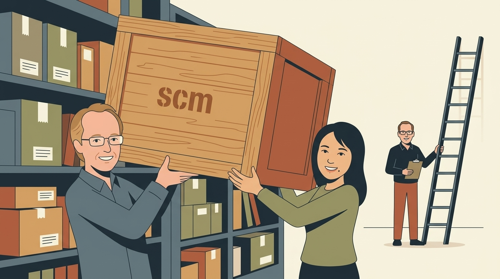
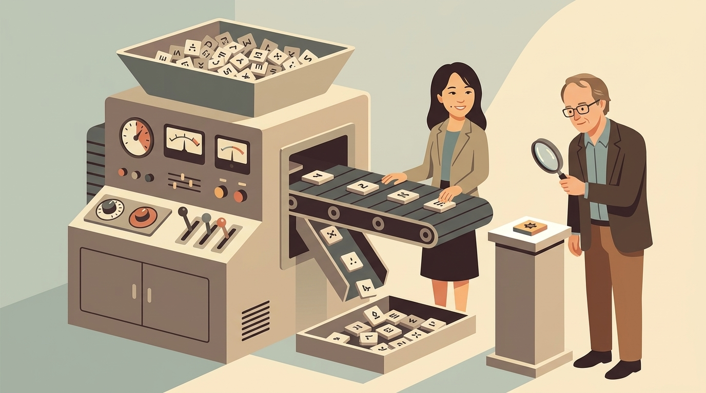

## {background-video="video/nlmixr2scm.mp4" background-video-muted="false" background-video-loop="false" background-size="contain"}

<!-- The package animation opens the talk.  reveal always puts the YAML
     title slide first, so this is slide 1; render_presentation.js moves an
     unnarrated background video at index 1 ahead of the title.  No speaker
     notes on purpose: with no clip the film keeps its own audio. -->

## This talk, in four pictures

::: figgrid
<figure>

<figcaption><b>1.</b> The PsN scm search now runs on an nlmixr2 fit</figcaption>
</figure>
<figure>

<figcaption><b>2.</b> Forward inclusion, then stricter backward elimination</figcaption>
</figure>
<figure>

<figcaption><b>3.</b> A warfarin search: six candidates, one survivor</figcaption>
</figure>
<figure>

<figcaption><b>4.</b> Built for searches with hundreds of fits</figcaption>
</figure>
:::

::: {.notes}
There are four parts to this talk.

First, what nlmixr2 S C M is, and where it comes from.

Second, how a stepwise covariate search works.

Third, a small worked example with the warfarin data.

And fourth, the features that matter when a real search fits hundreds
of models.
:::

## 1. The PsN scm search now runs on an nlmixr2 fit {.sectionbreak}

{.nostretch fig-alt="Illustration: Justin and Yaping lift a large crate marked scm onto a shelf of packages while Matt steadies a ladder"}

::: {.notes}
So let's start with what the package is.
:::

## The same Jonsson and Karlsson search, without control streams or config files

```{=html}
<svg class="dg" viewBox="0 0 1000 470" role="img"
     aria-label="Two routes to a stepwise covariate search. Left, PsN with NONMEM: a control stream and an scm configuration file both feed the scm command, which runs NONMEM for every candidate. Right, nlmixr2scm: an nlmixr2 fit object feeds a single runSCM call, which returns the forward and backward fits as ordinary nlmixr2 fit objects. Both follow Jonsson and Karlsson 1998.">
  <defs>
    <marker id="ah" viewBox="0 0 10 10" refX="9" refY="5" markerWidth="8" markerHeight="8" orient="auto-start-reverse">
      <path d="M0,0 L10,5 L0,10 z" fill="#1f497d"/>
    </marker>
  </defs>

  <text class="lab" x="20" y="36">PsN + NONMEM</text>
  <rect x="20" y="70" width="200" height="80" rx="8" fill="#ffffff" stroke="#1f497d" stroke-width="2"/>
  <text class="lab" x="120" y="105" text-anchor="middle">control stream</text>
  <text class="mono" x="120" y="133" text-anchor="middle">run1.mod</text>
  <rect x="260" y="70" width="200" height="80" rx="8" fill="#ffffff" stroke="#1f497d" stroke-width="2"/>
  <text class="lab" x="360" y="105" text-anchor="middle">scm config</text>
  <text class="mono" x="360" y="133" text-anchor="middle">scm.conf</text>
  <rect x="140" y="215" width="200" height="80" rx="8" fill="#eef3f9" stroke="#1f497d" stroke-width="2"/>
  <text class="mono" x="240" y="262" text-anchor="middle">scm -config_file</text>
  <line x1="120" y1="150" x2="200" y2="211" stroke="#1f497d" stroke-width="3" marker-end="url(#ah)"/>
  <line x1="360" y1="150" x2="280" y2="211" stroke="#1f497d" stroke-width="3" marker-end="url(#ah)"/>
  <rect x="140" y="355" width="200" height="70" rx="8" fill="#ffffff" stroke="#1f497d" stroke-width="2"/>
  <text class="t" x="240" y="397" text-anchor="middle">NONMEM output files</text>
  <line x1="240" y1="295" x2="240" y2="351" stroke="#1f497d" stroke-width="3" marker-end="url(#ah)"/>

  <line x1="505" y1="30" x2="505" y2="450" stroke="#b40000" stroke-width="2" stroke-dasharray="14 5 3 5"/>

  <text class="lab" x="540" y="36">nlmixr2scm</text>
  <rect x="540" y="70" width="200" height="80" rx="8" fill="#ffffff" stroke="#1f497d" stroke-width="2"/>
  <text class="lab" x="640" y="105" text-anchor="middle">your fit</text>
  <text class="mono" x="640" y="133" text-anchor="middle">fit_base</text>
  <rect x="525" y="215" width="230" height="80" rx="8" fill="#eef3f9" stroke="#1f497d" stroke-width="2"/>
  <text class="mono" x="640" y="262" text-anchor="middle">runSCM(fit_base, …)</text>
  <line x1="640" y1="150" x2="640" y2="211" stroke="#1f497d" stroke-width="3" marker-end="url(#ah)"/>
  <rect x="540" y="355" width="200" height="70" rx="8" fill="#f2f7ec" stroke="#4a7d18" stroke-width="2"/>
  <text class="t grn" x="640" y="397" text-anchor="middle">nlmixr2 fit objects</text>
  <line x1="640" y1="295" x2="640" y2="351" stroke="#1f497d" stroke-width="3" marker-end="url(#ah)"/>
  <text class="t" x="770" y="250">no files to write</text>
  <text class="t" x="770" y="278">or keep in sync</text>
  <text class="t" x="770" y="385">same plots and</text>
  <text class="t" x="770" y="413">diagnostics as usual</text>
</svg>
```

```r
install.packages("nlmixr2scm")
```

::: {.notes}
If you've built covariate models in NONMEM, you've probably used S C M
in Perl speaks NONMEM. You write a control stream, then a
configuration file that lists the parameters and covariates, and P S N
runs NONMEM for each candidate.

nlmixr2 S C M follows the same approach, from the original
paper, but it starts from a fit you already have. You
pass the fit to run S C M, and what comes back are ordinary nlmixr2
fit objects. So there are no control streams or configuration files to
write, and you can use the same plots and diagnostics you always do.

And it's on CRAN, so install packages is all you need.
:::

## 2. Forward inclusion, then stricter backward elimination {.sectionbreak}

{.nostretch fig-alt="Illustration: Justin climbs a staircase placing blocks on each step while Yaping walks down weighing blocks on a balance scale"}

::: {.notes}
Next, how the search works.
:::

## Each phase is a likelihood-ratio test, and the way out is stricter than the way in

```{=html}
<svg class="dg" viewBox="0 0 1000 470" role="img"
     aria-label="The objective function value falls step by step during forward inclusion as each significant relationship is added, with a drop of at least 3.84 needed for p below 0.05. Forward stops when no candidate passes. Backward elimination then removes each relationship in turn; a relationship whose removal raises the objective function by less than 6.63, p of 0.01, is dropped.">
  <defs>
    <marker id="ah2" viewBox="0 0 10 10" refX="9" refY="5" markerWidth="8" markerHeight="8" orient="auto-start-reverse">
      <path d="M0,0 L10,5 L0,10 z" fill="#1f497d"/>
    </marker>
    <marker id="ahr2" viewBox="0 0 10 10" refX="9" refY="5" markerWidth="8" markerHeight="8" orient="auto-start-reverse">
      <path d="M0,0 L10,5 L0,10 z" fill="#b40000"/>
    </marker>
  </defs>

  <text class="lab blue" x="20" y="36">forward inclusion</text>
  <text class="sm" x="20" y="60">add the largest significant drop, repeat</text>
  <rect x="40"  y="90"  width="120" height="56" rx="6" fill="#eef3f9" stroke="#1f497d" stroke-width="2"/>
  <text class="t" x="100" y="125" text-anchor="middle">base</text>
  <rect x="170" y="170" width="120" height="56" rx="6" fill="#eef3f9" stroke="#1f497d" stroke-width="2"/>
  <text class="t" x="230" y="205" text-anchor="middle">+ cov 1</text>
  <rect x="300" y="250" width="120" height="56" rx="6" fill="#eef3f9" stroke="#1f497d" stroke-width="2"/>
  <text class="t" x="360" y="285" text-anchor="middle">+ cov 2</text>
  <rect x="300" y="350" width="120" height="56" rx="6" fill="#ffffff" stroke="#1f497d" stroke-width="2" stroke-dasharray="6 5"/>
  <text class="t" x="360" y="385" text-anchor="middle">none pass</text>
  <line x1="130" y1="146" x2="175" y2="166" stroke="#1f497d" stroke-width="3" marker-end="url(#ah2)"/>
  <line x1="260" y1="226" x2="305" y2="246" stroke="#1f497d" stroke-width="3" marker-end="url(#ah2)"/>
  <line x1="360" y1="306" x2="360" y2="346" stroke="#1f497d" stroke-width="3" marker-end="url(#ah2)"/>
  <text class="lab blue" x="40" y="440">OFV must drop ≥ 3.84</text>
  <text class="sm" x="270" y="440">p &lt; 0.05, 1 df</text>

  <line x1="490" y1="30" x2="490" y2="450" stroke="#b40000" stroke-width="2" stroke-dasharray="14 5 3 5"/>

  <text class="lab red" x="520" y="36">backward elimination</text>
  <text class="sm" x="520" y="60">remove each one in turn from the forward model</text>
  <rect x="540" y="100" width="200" height="56" rx="6" fill="#eef3f9" stroke="#1f497d" stroke-width="2"/>
  <text class="t" x="640" y="135" text-anchor="middle">cov 1 + cov 2</text>
  <rect x="540" y="230" width="200" height="56" rx="6" fill="#f2f7ec" stroke="#4a7d18" stroke-width="2"/>
  <text class="t" x="640" y="265" text-anchor="middle">− cov 1: OFV +26</text>
  <rect x="770" y="230" width="210" height="56" rx="6" fill="#f7eeee" stroke="#b40000" stroke-width="2"/>
  <text class="t" x="875" y="265" text-anchor="middle">− cov 2: OFV +5</text>
  <line x1="620" y1="156" x2="620" y2="226" stroke="#1f497d" stroke-width="3" marker-end="url(#ah2)"/>
  <line x1="700" y1="156" x2="830" y2="226" stroke="#1f497d" stroke-width="3" marker-end="url(#ah2)"/>
  <text class="lab grn" x="640" y="320" text-anchor="middle">retained</text>
  <text class="lab red" x="875" y="320" text-anchor="middle">dropped</text>
  <text class="sm" x="875" y="345" text-anchor="middle">can't hold the stricter test</text>
  <text class="lab red" x="520" y="440">OFV must rise ≥ 6.63 to keep</text>
  <text class="sm" x="810" y="440">p &lt; 0.01, 1 df</text>
</svg>
```

::: {.notes}
S C M searches in two phases, and both use likelihood ratio tests.

Forward inclusion starts from the base model and tests every candidate
parameter covariate relationship. The one with the largest significant
drop in objective function is added, and the search repeats until
nothing else passes. By default that threshold is p less than point
oh five, which for one parameter is a drop of three point eight four.

Backward elimination then starts from the final forward model and takes
each relationship out, one at a time. If removing it doesn't raise the
objective function enough to pass a stricter threshold, p less than
point oh one, or six point six three, it's dropped.

The stricter way out is deliberate. Forward inclusion is generous, and
backward elimination removes what can't hold up.
:::

## runSCM() writes each candidate into the model from the raw data

```{=html}
<svg class="dg" viewBox="0 0 1000 440" role="img"
     aria-label="The original untransformed data columns feed runSCM. Continuous weight is centered at its median by default, or at a fixed reference such as 70 kilograms with centers equals c wt equals 70, and tried in each requested shape such as power and linear. Categorical sex is expanded into an indicator column, sex female. Each prepared covariate is written into the model body on the parameter being tested, such as clearance or volume.">
  <defs>
    <marker id="ah3" viewBox="0 0 10 10" refX="9" refY="5" markerWidth="8" markerHeight="8" orient="auto-start-reverse">
      <path d="M0,0 L10,5 L0,10 z" fill="#1f497d"/>
    </marker>
  </defs>
  <text class="lab" x="20" y="36">original data</text>
  <rect x="20" y="70" width="180" height="70" rx="8" fill="#ffffff" stroke="#1f497d" stroke-width="2"/>
  <text class="mono" x="110" y="112" text-anchor="middle">wt</text>
  <rect x="20" y="260" width="180" height="70" rx="8" fill="#ffffff" stroke="#1f497d" stroke-width="2"/>
  <text class="mono" x="110" y="302" text-anchor="middle">sex</text>

  <text class="lab" x="300" y="36">prepared for you</text>
  <rect x="270" y="55" width="330" height="100" rx="8" fill="#eef3f9" stroke="#1f497d" stroke-width="2"/>
  <text class="t" x="435" y="88" text-anchor="middle">centered at the median</text>
  <text class="sm" x="435" y="115" text-anchor="middle">or fixed: centers = c(wt = 70)</text>
  <text class="sm" x="435" y="140" text-anchor="middle">shapes = c("power", "lin")</text>
  <rect x="270" y="245" width="330" height="100" rx="8" fill="#eef3f9" stroke="#1f497d" stroke-width="2"/>
  <text class="t" x="435" y="280" text-anchor="middle">expanded to indicators</text>
  <text class="mono" x="435" y="315" text-anchor="middle">sex_female</text>
  <line x1="200" y1="105" x2="266" y2="105" stroke="#1f497d" stroke-width="3" marker-end="url(#ah3)"/>
  <line x1="200" y1="295" x2="266" y2="295" stroke="#1f497d" stroke-width="3" marker-end="url(#ah3)"/>

  <text class="lab" x="700" y="36">written into model()</text>
  <rect x="680" y="140" width="300" height="120" rx="8" fill="#f2f7ec" stroke="#4a7d18" stroke-width="2"/>
  <text class="mono" x="830" y="185" text-anchor="middle">cl &lt;- exp(tcl + eta.cl</text>
  <text class="mono grn" x="830" y="215" text-anchor="middle">+ covariate term)</text>
  <text class="sm" x="830" y="245" text-anchor="middle">one candidate per fit</text>
  <line x1="600" y1="105" x2="676" y2="180" stroke="#1f497d" stroke-width="3" marker-end="url(#ah3)"/>
  <line x1="600" y1="295" x2="676" y2="225" stroke="#1f497d" stroke-width="3" marker-end="url(#ah3)"/>

  <text class="t" x="500" y="405" text-anchor="middle">Pass the <tspan font-weight="700">untransformed</tspan> data; no hand-built covariate columns</text>
</svg>
```

::: {.notes}
You don't write the covariate terms yourself. Run S C M takes the
original, untransformed data, and does the preparation.

Continuous covariates like weight are centered at the median, or at a
reference value you choose, and tried in each shape you ask for, like
power or linear. If you fix the center, say weight at seventy
kilograms, the coefficients keep the same reference across datasets.

Categorical covariates, like sex, are expanded into indicator columns.

Then each candidate is written into the model body, on the parameter
being tested, and fit.
:::

## 3. A warfarin search: six candidates, one survivor {.sectionbreak}

{.nostretch fig-alt="Illustration: Yaping runs a sorting machine that discards most tiles while Justin inspects the one kept tile with a magnifying glass"}

::: {.notes}
Now let's look at an example.
:::

## One call tests weight and sex on clearance and volume

:::: {.columns .codemid}
::: {.column width="58%"}
```r
scm <- runSCM(
  fit        = fit_base,
  data       = pkdata,
  varsVec    = c("cl", "v"),
  covarsVec  = "wt",
  catvarsVec = "sex",
  shapes     = c("power", "lin"),
  pVal       = list(fwd = 0.05,
                    bck = 0.01),
  saveModels = FALSE
)
```
:::

::: {.column width="42%"}
- `fit_base`: one-compartment warfarin PK model, fit with `focei`
- `data`: needed, because the base model doesn't use `wt` or `sex`
- 2 parameters × (2 weight shapes + sex) = **6 candidates**

::: rule
:::

- `pairsVec`: test only the pairs you list
- `includedRelations`: force known ones in, like allometric weight on clearance
:::
::::

::: {.notes}
We start from a one compartment warfarin P K model.

Here we test body weight, as either a power or a linear relationship,
and sex, on both clearance and volume. That's six candidates. The data
has to be passed in, because the base model doesn't use weight or sex.

If you don't want the whole grid, pairs vec lists exactly the
relationships to test. And included relations forces known
relationships into the model, like allometric weight on clearance.
:::

## Forward inclusion added weight on volume, then weight on clearance, then stopped

```{=html}
<svg class="dg" viewBox="0 0 1000 470" role="img"
     aria-label="Drop in OFV for each candidate in the three forward steps, with the 3.84 threshold marked. Step 1: weight power on V 25.98, added; weight linear on V 25.08; sex on V 16.67; weight power on CL 4.89; weight linear on CL 4.38; sex on CL 0.92. Step 2: weight power on CL 6.43, added; weight linear on CL 4.96; sex on V 0.75; sex on CL 0.13. Step 3: sex on V 2.18 and sex on CL 1.16, neither passes, so forward inclusion stops.">
  <!-- x scale: 0..30 OFV drop -> 330..930 px, 20 px per unit -->
  <line x1="330" y1="40" x2="330" y2="430" stroke="#0f243e" stroke-width="2"/>
  <line x1="407" y1="40" x2="407" y2="430" stroke="#b40000" stroke-width="2" stroke-dasharray="8 6"/>
  <text class="sm red" x="412" y="35">3.84</text>
  <text class="sm" x="930" y="455" text-anchor="end">drop in OFV</text>

  <text class="lab blue" x="20" y="62">step 1</text>
  <text class="mono" x="320" y="68" text-anchor="end">wt power ~ v</text>
  <rect x="330" y="52" width="520" height="20" fill="#1f497d"/>
  <text class="t" x="858" y="69">26.0 added</text>
  <text class="mono" x="320" y="94" text-anchor="end">wt lin ~ v</text>
  <rect x="330" y="78" width="502" height="20" fill="#9fb3cc"/>
  <text class="sm" x="840" y="94">25.1</text>
  <text class="mono" x="320" y="120" text-anchor="end">sex ~ v</text>
  <rect x="330" y="104" width="333" height="20" fill="#9fb3cc"/>
  <text class="sm" x="671" y="120">16.7</text>
  <text class="mono" x="320" y="146" text-anchor="end">wt power ~ cl</text>
  <rect x="330" y="130" width="98" height="20" fill="#9fb3cc"/>
  <text class="sm" x="436" y="146">4.9</text>
  <text class="mono" x="320" y="172" text-anchor="end">wt lin ~ cl</text>
  <rect x="330" y="156" width="88" height="20" fill="#9fb3cc"/>
  <text class="sm" x="426" y="172">4.4</text>
  <text class="mono" x="320" y="198" text-anchor="end">sex ~ cl</text>
  <rect x="330" y="182" width="18" height="20" fill="#c9d3df"/>
  <text class="sm" x="356" y="198">0.9</text>

  <text class="lab blue" x="20" y="242">step 2</text>
  <text class="mono" x="320" y="248" text-anchor="end">wt power ~ cl</text>
  <rect x="330" y="232" width="129" height="20" fill="#1f497d"/>
  <text class="t" x="467" y="249">6.4 added</text>
  <text class="mono" x="320" y="274" text-anchor="end">wt lin ~ cl</text>
  <rect x="330" y="258" width="99" height="20" fill="#9fb3cc"/>
  <text class="sm" x="437" y="274">5.0</text>
  <text class="mono" x="320" y="300" text-anchor="end">sex ~ v</text>
  <rect x="330" y="284" width="15" height="20" fill="#c9d3df"/>
  <text class="sm" x="353" y="300">0.8</text>
  <text class="mono" x="320" y="326" text-anchor="end">sex ~ cl</text>
  <rect x="330" y="310" width="3" height="20" fill="#c9d3df"/>
  <text class="sm" x="341" y="326">0.1</text>

  <text class="lab blue" x="20" y="370">step 3</text>
  <text class="mono" x="320" y="376" text-anchor="end">sex ~ v</text>
  <rect x="330" y="360" width="44" height="20" fill="#c9d3df"/>
  <text class="sm" x="382" y="376">2.2</text>
  <text class="mono" x="320" y="402" text-anchor="end">sex ~ cl</text>
  <rect x="330" y="386" width="23" height="20" fill="#c9d3df"/>
  <text class="sm" x="361" y="402">1.2</text>
  <text class="t red" x="520" y="392">nothing passes: forward stops</text>
</svg>
```

::: {.notes}
Here's the forward search.

In step one, five of the six candidates pass the threshold, but only
the largest is added: weight on volume as a power, with a drop of
about twenty six.

Step two retests what's left, against the new model. Sex on volume,
which looked strong in step one, now explains almost nothing, because
weight already did that work. Weight on clearance passes, at six point
four, and is added.

In step three, neither sex relationship passes, so forward inclusion
stops with two covariates.
:::

## Backward elimination removed weight on clearance: it could not hold p < 0.01

```{=html}
<svg class="dg" viewBox="0 0 1000 440" role="img"
     aria-label="Objective function value through the search. Base 475.1. Forward step 1 adds weight on V, 449.1. Forward step 2 adds weight on CL, 442.7. Backward step 1 removes weight on CL: OFV rises 5.62 to 448.3, less than 6.63, so it is removed. Backward step 2 tests removing weight on V: OFV would rise 26.2 to 474.5, so it is retained. Final model: weight on V, OFV 448.3.">
  <defs>
    <marker id="ah4" viewBox="0 0 10 10" refX="9" refY="5" markerWidth="8" markerHeight="8" orient="auto-start-reverse">
      <path d="M0,0 L10,5 L0,10 z" fill="#1f497d"/>
    </marker>
    <marker id="ahr4" viewBox="0 0 10 10" refX="9" refY="5" markerWidth="8" markerHeight="8" orient="auto-start-reverse">
      <path d="M0,0 L10,5 L0,10 z" fill="#b40000"/>
    </marker>
  </defs>
  <!-- y scale: OFV 440..480 -> 380..60 px, 8 px per unit -->
  <text class="sm" x="40" y="66" text-anchor="end">480</text>
  <text class="sm" x="40" y="226" text-anchor="end">460</text>
  <text class="sm" x="40" y="386" text-anchor="end">440</text>
  <line x1="50" y1="60" x2="50" y2="380" stroke="#0f243e" stroke-width="2"/>
  <text class="sm" x="20" y="420">OFV</text>

  <circle cx="110" cy="100" r="9" fill="#1f497d"/>
  <text class="lab" x="110" y="80" text-anchor="middle">base</text>
  <text class="sm" x="110" y="130" text-anchor="middle">475.1</text>

  <circle cx="300" cy="307" r="9" fill="#1f497d"/>
  <text class="t" x="300" y="290" text-anchor="middle">+ wt ~ v</text>
  <text class="sm" x="300" y="337" text-anchor="middle">449.1</text>

  <circle cx="490" cy="358" r="9" fill="#1f497d"/>
  <text class="t" x="490" y="340" text-anchor="middle">+ wt ~ cl</text>
  <text class="sm" x="490" y="395" text-anchor="middle">442.7  forward final</text>

  <circle cx="700" cy="314" r="11" fill="#4a7d18"/>
  <text class="lab grn" x="700" y="350" text-anchor="middle">448.3  final</text>
  <text class="t red" x="700" y="385" text-anchor="middle">− wt ~ cl: +5.6</text>
  <text class="sm" x="700" y="407" text-anchor="middle">less than 6.63: removed</text>

  <circle cx="900" cy="104" r="9" fill="#ffffff" stroke="#b40000" stroke-width="3"/>
  <text class="t" x="900" y="50" text-anchor="middle">− wt ~ v: +26.2</text>
  <text class="sm" x="900" y="78" text-anchor="middle">far above 6.63: retained</text>

  <polyline points="110,100 300,307 490,358" fill="none" stroke="#1f497d" stroke-width="3"/>
  <line x1="490" y1="358" x2="686" y2="318" stroke="#b40000" stroke-width="3" marker-end="url(#ahr4)"/>
  <line x1="700" y1="314" x2="890" y2="112" stroke="#b40000" stroke-width="3" stroke-dasharray="8 6" marker-end="url(#ahr4)"/>
</svg>
```

::: {.notes}
Then backward elimination.

Taking weight on clearance back out raises the objective function by
five point six. That passed the forward test, but it isn't enough for
the stricter backward test, so it's removed.

Taking weight on volume out of what's left would raise the objective
function by twenty six, so it stays.

The final model has one covariate, weight on volume, with an objective
function of four forty eight point three, down almost twenty seven
from the base model.
:::

## summary() puts the base, forward and backward models side by side

::: bigtable
| Model | OFV | ΔOFV | AIC | BIC | Params | Covariates |
|:--|--:|--:|--:|--:|--:|:--|
| Base | 475.1 | 0 | 950.4 | 975.1 | 7 | none |
| Forward final | 442.7 | −32.4 | 922.0 | 953.7 | 9 | wt: V, CL |
| Backward final | 448.3 | −26.8 | 925.6 | 953.8 | 8 | **wt: V** |
:::

::: rule
:::

:::: columns
::: {.column width="50%"}
- `summary(scm)`: options, this table, and every step and candidate
- `scm$summaryTable`: one row per candidate, as a data frame
:::

::: {.column width="50%"}
- `scm$resBck[[1]]`: the final model, an ordinary nlmixr2 fit
- Weight exponent on V: 0.87 (95% CI 0.61 to 1.13)
:::
::::

::: {.notes}
Printing the result gives a short overview. Summary gives the full
picture: the options the search ran with, this comparison of the base,
forward, and backward models, and the step by step and all candidate
tables.

Underneath, the result is a list. Summary table has one row per
candidate. And res B C K, the final backward model, is an ordinary
nlmixr2 fit, so you can use your usual diagnostics and plots. Here
the weight exponent on volume is about point eight seven.
:::

## 4. Built for searches with hundreds of fits {.sectionbreak}

{.nostretch fig-alt="Illustration: Yaping at a control console and Justin filing cards from many parallel machines, while Matt checks a gauge"}

::: {.notes}
That example fit only a handful of models. Real searches are much
bigger.
:::

## Every candidate fit is saved, so an interrupted search resumes where it stopped

```{=html}
<svg class="dg" viewBox="0 0 1000 400" role="img"
     aria-label="A search runs steps 1, 2 and 3, saving every candidate fit and step table to outputDir. The run is interrupted during step 3. Calling runSCM again with the same outputDir loads steps 1 and 2 from disk and continues step 3. restart equals TRUE starts from scratch instead.">
  <defs>
    <marker id="ah5" viewBox="0 0 10 10" refX="9" refY="5" markerWidth="8" markerHeight="8" orient="auto-start-reverse">
      <path d="M0,0 L10,5 L0,10 z" fill="#1f497d"/>
    </marker>
  </defs>
  <text class="lab" x="20" y="60">first run</text>
  <rect x="160" y="35" width="200" height="45" rx="6" fill="#eef3f9" stroke="#1f497d" stroke-width="2"/>
  <text class="t" x="260" y="64" text-anchor="middle">step 1</text>
  <rect x="380" y="35" width="200" height="45" rx="6" fill="#eef3f9" stroke="#1f497d" stroke-width="2"/>
  <text class="t" x="480" y="64" text-anchor="middle">step 2</text>
  <rect x="600" y="35" width="110" height="45" rx="6" fill="#eef3f9" stroke="#1f497d" stroke-width="2"/>
  <text class="t" x="655" y="64" text-anchor="middle">step 3</text>
  <text class="red" x="735" y="70" font-size="34" font-weight="700">✕</text>
  <text class="t red" x="775" y="66">interrupted</text>

  <rect x="160" y="150" width="550" height="70" rx="8" fill="#ffffff" stroke="#4a7d18" stroke-width="2"/>
  <text class="mono" x="435" y="182" text-anchor="middle">outputDir/</text>
  <text class="sm" x="435" y="206" text-anchor="middle">every candidate fit and step table</text>
  <line x1="260" y1="80" x2="260" y2="146" stroke="#4a7d18" stroke-width="3" marker-end="url(#ah5)"/>
  <line x1="480" y1="80" x2="480" y2="146" stroke="#4a7d18" stroke-width="3" marker-end="url(#ah5)"/>
  <line x1="655" y1="80" x2="655" y2="146" stroke="#4a7d18" stroke-width="3" marker-end="url(#ah5)"/>

  <text class="lab" x="20" y="320">run again</text>
  <rect x="160" y="295" width="420" height="45" rx="6" fill="#f2f7ec" stroke="#4a7d18" stroke-width="2"/>
  <text class="t grn" x="370" y="324" text-anchor="middle">steps 1, 2 loaded from disk</text>
  <rect x="600" y="295" width="200" height="45" rx="6" fill="#eef3f9" stroke="#1f497d" stroke-width="2"/>
  <text class="t" x="700" y="324" text-anchor="middle">step 3 continues</text>
  <line x1="370" y1="220" x2="370" y2="291" stroke="#4a7d18" stroke-width="3" marker-end="url(#ah5)"/>
  <text class="sm" x="160" y="385">same outputDir resumes; restart = TRUE starts over</text>
</svg>
```

::: {.notes}
Real world S C M runs often fit hundreds of candidate models, and
something will eventually interrupt one.

With save models set to true, which is the default, every candidate
fit and step table is saved to the output directory. If the run is
interrupted, call run S C M again with the same output directory, and
it picks up where it stopped. If you do want to start over, set
restart to true.
:::

## Candidates within a step fit in parallel, checked against your core count

:::: {.columns .codemid}
::: {.column width="55%"}
```r
runSCM(fit_base, data = pkdata,
       varsVec   = c("cl", "v"),
       covarsVec = "wt",
       workers   = 4,
       rxThreads = 1)
```
:::

::: {.column width="45%"}
- `workers`: candidates fit at once, through `future`
- `rxThreads`: `rxode2` threads per worker
- `workers × rxThreads` is checked against the physical cores **before** the search starts
:::
::::

```{=html}
<svg class="dg" viewBox="0 0 1000 170" role="img"
     aria-label="One step's candidates split across four workers, each with one rxode2 thread, using four of the machine's physical cores.">
  <text class="lab" x="20" y="30">one step, 4 workers</text>
  <rect x="20"  y="50" width="230" height="44" rx="6" fill="#eef3f9" stroke="#1f497d" stroke-width="2"/>
  <text class="t" x="135" y="79" text-anchor="middle">wt power ~ cl</text>
  <rect x="265" y="50" width="230" height="44" rx="6" fill="#eef3f9" stroke="#1f497d" stroke-width="2"/>
  <text class="t" x="380" y="79" text-anchor="middle">wt lin ~ cl</text>
  <rect x="510" y="50" width="230" height="44" rx="6" fill="#eef3f9" stroke="#1f497d" stroke-width="2"/>
  <text class="t" x="625" y="79" text-anchor="middle">wt power ~ v</text>
  <rect x="755" y="50" width="225" height="44" rx="6" fill="#eef3f9" stroke="#1f497d" stroke-width="2"/>
  <text class="t" x="867" y="79" text-anchor="middle">wt lin ~ v</text>
  <rect x="20" y="115" width="960" height="36" rx="6" fill="#f2f7ec" stroke="#4a7d18" stroke-width="2"/>
  <text class="t grn" x="500" y="140" text-anchor="middle">4 workers × 1 thread = 4 cores in use, within the machine's physical cores</text>
</svg>
```

::: {.notes}
Within each step, the candidates don't depend on each other, so
workers fits them in parallel through the future package. R x threads
sets how many r x o d e 2 threads each worker uses.

Before the search starts, run S C M checks workers times r x threads
against your physical core count, so it doesn't quietly max out your
computer.
:::

## Stalled and implausible candidate fits are refit, not trusted

```{=html}
<svg class="dg" viewBox="0 0 1000 440" role="img"
     aria-label="Each candidate fit is checked twice. If it stalled at the zero-effect initial estimate, which happens sometimes with ODE models, a quick one-dimensional profile finds a starting value and it is refit. If it landed on an implausible OFV, it is retried from perturbed initial estimates and the best attempt is kept. A p-value that underflows to zero counts as implausible by default; retryOnUnderflow equals FALSE skips those retries. Both checks are on by default.">
  <defs>
    <marker id="ah6" viewBox="0 0 10 10" refX="9" refY="5" markerWidth="8" markerHeight="8" orient="auto-start-reverse">
      <path d="M0,0 L10,5 L0,10 z" fill="#1f497d"/>
    </marker>
  </defs>
  <rect x="20" y="180" width="200" height="70" rx="8" fill="#eef3f9" stroke="#1f497d" stroke-width="2"/>
  <text class="lab blue" x="120" y="222" text-anchor="middle">candidate fit</text>

  <rect x="300" y="60" width="300" height="100" rx="8" fill="#fbf1e6" stroke="#e08836" stroke-width="2"/>
  <text class="lab" x="450" y="95" text-anchor="middle">stalled at zero effect?</text>
  <text class="sm" x="450" y="122" text-anchor="middle">covariate never moved from its</text>
  <text class="sm" x="450" y="142" text-anchor="middle">initial estimate (seen with ODEs)</text>
  <rect x="300" y="270" width="300" height="100" rx="8" fill="#f7eeee" stroke="#b40000" stroke-width="2"/>
  <text class="lab red" x="450" y="305" text-anchor="middle">implausible OFV?</text>
  <text class="sm" x="450" y="332" text-anchor="middle">includes a p-value underflowing</text>
  <text class="sm" x="450" y="352" text-anchor="middle">to zero (ΔOFV beyond about 70)</text>
  <line x1="220" y1="200" x2="296" y2="125" stroke="#1f497d" stroke-width="3" marker-end="url(#ah6)"/>
  <line x1="220" y1="230" x2="296" y2="305" stroke="#1f497d" stroke-width="3" marker-end="url(#ah6)"/>

  <rect x="680" y="60" width="300" height="100" rx="8" fill="#f2f7ec" stroke="#4a7d18" stroke-width="2"/>
  <text class="t" x="830" y="98" text-anchor="middle">1-D profile finds a start,</text>
  <text class="t" x="830" y="126" text-anchor="middle">then refit</text>
  <rect x="680" y="270" width="300" height="100" rx="8" fill="#f2f7ec" stroke="#4a7d18" stroke-width="2"/>
  <text class="t" x="830" y="308" text-anchor="middle">retry from perturbed inits,</text>
  <text class="t" x="830" y="336" text-anchor="middle">keep the best attempt</text>
  <line x1="600" y1="110" x2="676" y2="110" stroke="#1f497d" stroke-width="3" marker-end="url(#ah6)"/>
  <line x1="600" y1="320" x2="676" y2="320" stroke="#1f497d" stroke-width="3" marker-end="url(#ah6)"/>

  <text class="t" x="500" y="425" text-anchor="middle">Both on by default; trust very strong effects? <tspan class="mono">retryOnUnderflow = FALSE</tspan></text>
</svg>
```

::: {.notes}
With hundreds of fits, some will go wrong, and a bad fit can steer the
whole search.

Some candidates stall at the zero effect initial estimate. This
happens sometimes with O D E models. Run S C M detects these, finds a
better starting value with a quick one dimensional profile, and refits.

Candidates that land on an implausible objective function are retried
from perturbed initial estimates, and the best attempt is kept.

By default, a p value that underflows to zero also counts as
implausible, so very strong effects, a drop of more than about seventy
for one parameter, get retried too. If you trust those, retry on
underflow set to false saves the extra fits.
:::

## nlmixr2scm is on CRAN, ready for your next covariate search

:::: columns
::: {.column width="55%"}
- `install.packages("nlmixr2scm")`
- `vignette("runSCM", package = "nlmixr2scm")`: every argument, and a longer example
- Bugs and feature requests: [github.com/nlmixr2/nlmixr2scm](https://github.com/nlmixr2/nlmixr2scm)

::: rule
:::

::: {style="font-size: 0.6em; line-height: 1.3;"}
Written by **Justin Wilkins** and **Yaping Liu** with Matthew Fidler; contributions from Bill Denney, Vipul Mann, Vishal Sarsani and Christian Bartels. Design after the PsN `scm` by Lindbom, Jonsson, Pihlgren, Karlsson, Hooker, Harling, Nordgren and Freiberga.
:::
:::

::: {.column width="45%" .checks}
- Starts from the fit you already have
- Forward and backward, as in PsN
- Resumes, runs in parallel, and refits bad fits
:::
::::

::: {.notes}
nlmixr2 S C M is on CRAN now. The vignette has the full argument
reference and a longer worked example, and bug reports and feature
requests go on GitHub.

Justin Wilkins and Yaping Liu wrote most of this package, and I
helped. It also has contributions from many others. And the design
owes a great deal to the original P S N package, and the people who
built it.

So try it on the next model where you need a covariate search.
:::

## Thank you {.thanks}

::: {.credit}
Section illustrations are Gemini Nano Banana-generated artwork, drawn from photos of Justin Wilkins, Yaping Liu and Matthew Fidler
:::

::: {.notes}
Thank you.
:::

## {background-video="video/nlmixr2scm.mp4" background-video-muted="false" background-video-loop="false" background-size="contain"}

<!-- The package animation closes the talk.  No speaker notes on purpose:
     with no clip the film keeps its own audio. -->
